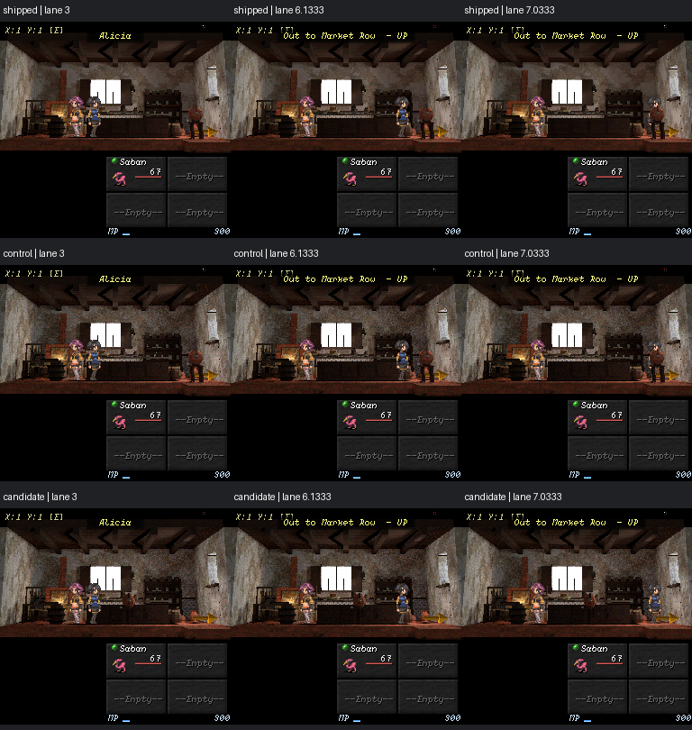
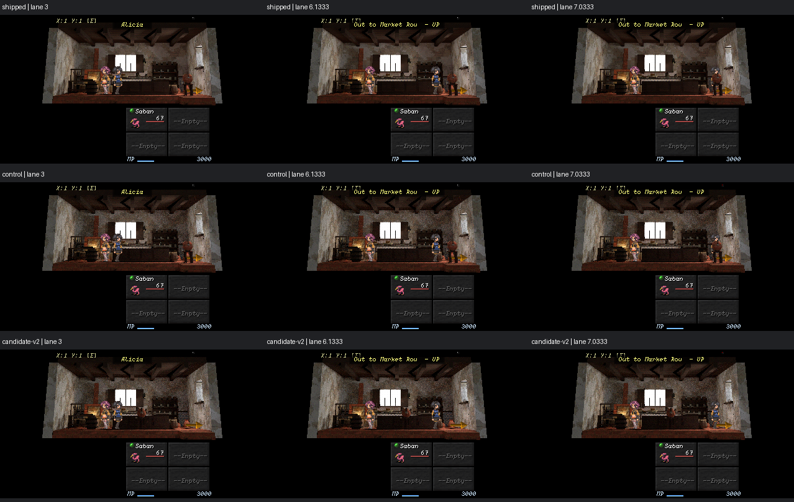

# Blender authoring follow-through: discovery, relationships and the bakery

This records a concrete follow-through to the two assessments and their
[cross-audit](blender-authoring-cross-audit-2026-10-04.md), starting from main
`72458508`. It describes the reviewed branch state and the evidence collected
on 4 October 2026. GitHub Issues remain the delivery record. No lower-reasoning
agent trial or owner PLAYED acceptance is claimed.

## Make the existing vocabulary discoverable

The [generated furnishings catalogue](../../tools/blender/recipes/FURNISHINGS.md)
covers all **47 public builders**, with an individual illustration, signature,
parameter defaults, measured XYZ dimensions, materials, placement requirements
and variation handles for each. The two private helper functions are not public
assets. Wall fittings, wall treatments and service assemblies remain visibly
different kinds of construction; they are not all described as interchangeable
floor props.

The generator reads the API with Python's AST. Required preview inputs live in
a small fixture record; shapes execute the existing `Interior` and furnishing
builders inside pinned Blender. Evaluated mesh vertices determine measurements.
Context walls are excluded. Custom material bindings are explicit examples.
There is no parallel implementation of furnishing geometry.

This distinction matters for the bakery: `water_stand(height=0.55)` produces a
**1.239 m** assembly once its crock and dipper are included. Its measured
footprint is **0.597 × 0.616 m**. An agent treating the height argument as the
complete object's height would plan the wrong silhouette and clearance.

Discovery also works without opening Blender or reading 1,204 lines of Python:

```text
python tools/blender/furnishings_catalogue.py --find water
python tools/blender/furnishings_catalogue.py --check
```

Search prioritizes matching builder names and also reads descriptions,
placement notes and materials. It returns dimensions, the callable signature
and the catalogue anchor. An integrity check runs before search, so stale
measurements do not become apparently authoritative advice.

The check rejects changed inputs, uncovered public builders, missing docs,
unknown fixture parameters, missing or orphaned images, changed image hashes,
inconsistent dimensions and edited generated prose. Dependency fingerprints
normalize text line endings; image hashes retain exact bytes. A required
Blender integration rebuilds every preview and compares measured geometry and
material membership with the committed catalogue. It does not compare GPU
pixels across hosts.

The images are fitted orthographic flat-colour illustrations. They establish
construction and discovery, not native camera composition, texture fidelity or
lighting quality. The existing remote asset library is unchanged; publishing
all furnishings there remains a separate choice.

## Make tool roles explicit

[SCRIPTS.json](../../tools/blender/SCRIPTS.json) classifies every top-level
Python and JavaScript tool, and generates [SCRIPTS.md](../../tools/blender/SCRIPTS.md).
The branch has **94 classified files**: **26 production entry points**,
**34 implementation modules/workers**, **23 studies** and **11 one-shot edits**.
The helper role prevents a Python module that has no author-facing command
from being presented as another way to perform the same task.

The short [authoring routes](../../tools/blender/README.md) link to this index
and the catalogue. Adding an unclassified top-level script, duplicating an
entry, using an unknown role or leaving the generated index stale fails a test.
Studies and recorded source surgery retain their original paths and bytes.
The manifest covers the top-level tool surface; nested bridge and recipe
directories retain their own entry points.

This implements the routing part of #1342. It does not resolve the orphan-list
or duplicate-exporter work in that Issue. Those remain explicit rather than
being silently counted as done. The useful result is a smaller supported menu,
not an arbitrary reduction in retained history.

## Put relationships over measured construction

The [serving-corner example](../../tools/blender/recipes/examples/README.md)
is a small JSON scaffold with a counter, bread, scales and customer water.
`compile_room_spec.py` dispatches to the existing shell and public furnishing
builders. It inspects their signatures, binds semantic materials and retains
the existing source-save overwrite guard.

Its first three placements are deliberately bounded:

| Relationship | Resolved fact | Mechanical rejection |
|---|---|---|
| `at: [x,y]` | Explicit floor placement; measured bottom at Z=0 | Invalid inputs and entry into protected space |
| `on: counter` | One actual horizontal rectangular top face; child offsets from its centre | Ambiguous/missing support face, footprint overhang, missing/forward reference |
| `beside: counter` | Measured bounds, named X/Y side and explicit gap | Unknown target, invalid side/axis/gap, protected-space overlap |

A bounding box around a service assembly does not become a pretend continuous
tabletop. The support operation requires one measured rectangular face at the
highest surface. This conservative contract can reject a useful complex
assembly; the remedy is to author a clearer support relationship, not silently
assume that the empty gaps between its components support an object.

The declared `exit_sightline` protects a near-band volume. It is an authoring
readability constraint, not runtime collision. Positive overlap fails; touching
the boundary is allowed. Existing shell checks remain in force. General mesh
intersection, physical reach, artistic balance and light motivation are not
inferred from these boxes.

Errors name the furnishing and relationship. The Blender probe exercises actual
builders and checks a supported basket and the water-to-counter gap. Negative
controls cover an overhanging basket, the old water placement, a misspelled
parameter and an unknown support.

The example is a distinct reference scaffold. It does not reconstruct or
replace Alicia's adopted `.blend`. Named openings, wall-relative placement,
variant patches, semantic light roles and full-room migration remain in
#1346/#1347. Calling this pilot their complete implementation would hide the
remaining authoring burden.

## Apply the rules to the adopted bakery

The source edit opens `alicias_padaria.blend` directly. It translates the
existing `water` mesh to the customer-facing side of `counter`, with a measured
**0.16 m gap**. Its mesh vertices and material membership remain unchanged;
the other **53 objects** retain their measured transform/data snapshot,
including the lights. The source is never regenerated from its recipe.

| Source-space fact | Before | After |
|---|---|---|
| Water X extent | −1.167 to −0.570 m | −0.597 to 0.000 m |
| Water Y extent | −3.416 to −2.800 m | −0.808 to −0.192 m |
| Water Z extent | 0 to 1.239 m | 0 to 1.239 m |
| Relationship | Near the exit's lateral line | Public −X side of the counter |

The first candidate placed it at the counter's +Y end. Native frames showed
that this cleared the exit but hid the crock behind Alicia. The retained
candidate uses −X instead: the stand reads in front of the counter, Alicia
remains visible, and the spawn-to-exit segment does not pass behind it. This
is an example of why a geometric check is necessary but insufficient.

The 3D package retains the packed 1024 atlas and Cycles at 24 samples. Actual
denoising and texel alignment are both `none`, explicitly held constant between
control and candidate; the shared profile's defaults are recorded separately
from these effective overrides. Only the source, OBJ and atlas are promoted
into the review branch. Collision, anchors, camera, events and material-library
bytes retain their existing authority.

### Native review and rebake control

The canonical stage captures map 28 at lane positions **1, 3, 6, 6.1333 and
7.0333**, on Classic, 4:3, Wide and a desktop device-aspect surface. Each row
below is actual runtime output: shipped package, unchanged-source control
export, then the retained relocation candidate. Images retain native pixels.





The control matters. At Classic spawn, the unchanged-source rebake changes
21,005 pixels, with a mean absolute RGB-channel difference of **2.205/255**.
Control-to-candidate changes 23,570 pixels, with a mean difference of
**3.528/255**. Both deltas span the room. Consequently, the final package is
not presented as a pixel-local edit: UV packing, exported normal indexing and
the full atlas are regenerated, and there is existing exporter drift even
before moving the water. The source edit itself remains one object translation.
The paired native pictures let a reviewer assess that distinction.

The control export took **20.264 s**, and the final candidate **24.724 s** on
this machine. Both carry 1,934 vertices and 3,208 triangles. These are observed
local durations, not hosted budgets or weaker-agent performance results.

### Actual movement and transfer

The retained [runtime probe](blender-authoring-follow-through-2026-10-04/walk.lua)
loads map 28 normally at spawn Y=6.1333, uses `bounded_lane.update` at 60 Hz
to walk toward Y=3, then walks back to the exit. It reaches Y=6.9833 inside
the doorway radius, resolves the real exit event and sends its authored command
list through `interpreter.runImmediate`. The session arrives on **map 18,
Market Row**, at Y=13.125. Positions are not assigned to manufacture reachability.

That proves the exercised runtime movement and transfer. It does not claim
human play, dialogue acceptance or a physical phone run. The bakery's lane
already had no blocked ranges: the original complaint was reproduced as a
visual obstruction, not a new collision defect.

### Preserve the separate retained plate

The current 450×240 plate shows a materially different arrangement from the
3D source, including an oven and stair on the opposite side. Its manifest and
the adopted-source basis still describe the historical shared-source relation.
Later image/framing routes exist, but their presence alone does not establish
the current plate's exact byte lineage. [Issue #1362](https://github.com/JosephSerUSP/Second-Rite/issues/1362)
records the evidence and asks for that reconciliation.

The plate is preserved. Replacing it with a fresh source render merely to keep
an old provenance assertion apparently true would discard authored work and
broaden this placement fix. The source check currently verifies a listed
adopted source exists; it does not prove that a particular image was rendered
from that source. This is a remaining authority gap, not a green-check claim.

## Verification and next evidence

Focused verification passed: nine catalogue/index tests, including the complete
pinned-Blender rebuild; four pure placement tests; the real Blender scaffold
probe with four negative controls; source-record checks; G1 `VALIDATE OK`;
staged units `ALL UNIT TESTS OK`; all three native capture runs; and the actual
walk/transfer probe. The staged unit run explicitly reported **seven native
Effekseer world-effect assertions unavailable** because its shim was absent.
That coverage is not claimed.

Full required-Blender discovery passed locally (**481 tests, 585.603 s**);
the final focused search test also passed in the nine-test catalogue suite.
Hosted Linux subsequently passed **482 tests, 432.793 s**, plus the read-only
32-source item compilation and curated library checks.

The branch then integrated current main `0f850bae`. Its hosted courtyard
stage exposed three pre-existing MPD assertions that still expected a walking
charge after #1332 made ordinary movement free; the same failures were observed
on main run [37210613159](https://github.com/JosephSerUSP/Second-Rite/actions/runs/37210613159).
[Issue #1364](https://github.com/JosephSerUSP/Second-Rite/issues/1364) records the
evidence. The walking assertions now test the explicit authored rule; MPD
queries and battle Strain checks remain effective. Both ordinary and courtyard
current-main staged units passed. G4 also identified the stale scene rows from
the merged Actor Change work; the canonical state capture regenerated those
rows and G4 passed. No gameplay mechanic changed in this reconciliation.
Native frames and the walk/transfer probe were refreshed against current main.
G2 passed all three battle fixtures. G3 remains red for current main's starting
MP change (900 versus the 3000 reference) and missing Actor Change scene log;
these are also documented in
[Issue #1365](https://github.com/JosephSerUSP/Second-Rite/issues/1365).
The golden logs were preserved. Their reconciliation needs the owner approval
required by AGENTS.md; this branch is not represented as merge-green. The
latest hosted rerun remains a separate check of the final head.

Catalogue integrity/search and tool-index checks took **434 / 405 / 305 ms**
respectively on their recorded cold local runs. The focused catalogue rebuild
suite took **12.437 s**, and the scaffold integration **5.919 s**. No committed
golden was recaptured. This work changes neither battle nor editor rendering;
native room evidence supplies the placement review that their fixtures cannot.

The useful next experiment is a fresh author receiving only the catalogue,
example and a room brief. Record active authoring time, bespoke scripts,
failed checks, repair rounds and visual-review results. Compare a coordinate
recipe with the relational scaffold under the same brief, materials, camera
and export settings. A lower-effort condition should be measured explicitly;
this implementation makes that experiment possible but does not substitute
for its result. Extend the relational language where those failures occur,
instead of creating more room-specific corrective scripts.

Machine evidence, source hashes, bake settings, movement results and every
surface's pixel deltas are retained in
[evidence.json](blender-authoring-follow-through-2026-10-04/evidence.json).

Agent-Signature:
  platform: Codex
  model: platform-selected/unknown
  role: implementation
  task: Blender authoring follow-through
  base: 72458508920982a199e91d22e686f60367cee6db
