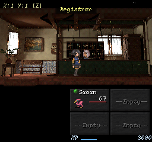
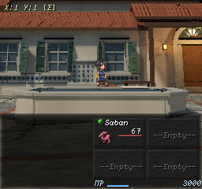
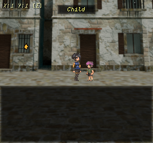

# Blender environment authoring assessment

## Purpose and main recommendation

This assessment is for the owner and future contributors to Hichaukitoden. It examines the current Blender tooling, reusable content, source ownership, export and review workflow, and environment packages selected by the game. Its purpose is to increase expressive range while making competent authoring possible with less reasoning, less repository archaeology, and fewer custom scripts.

The strongest next investment is a small, explicit authoring interface over the existing builders and runtime contracts. The repository already knows how to build varied architecture, meaningful furnishings, trees, ground cover, portable materials, and compact baked environments. Much of that knowledge is available only as Python functions, special-purpose runners, historical reports, and conventions that an agent must assemble correctly. Better packaging, composition operations, preflight, and feedback would make this existing capacity much more usable.

The desired change is to move routine decisions from agent inference into authored choices, executable contracts, and visible feedback. Artistic decisions should remain open. An agent should choose the character of a space and its important relationships; the tools should derive coordinate transforms, source roles, export preparation, and review requirements from the owning authorities.

This is a dated assessment and proposal, not an implementation-status authority or delivery checklist. Proposed interfaces below do not exist unless explicitly identified as current tools. The recommendations are architectural judgments grounded in this audit; improvements for lower-reasoning agents have not yet been measured in a controlled benchmark.

## Evidence and limits

The audit began at commit `963602631863fc8e7f7a9d07805871a19511c7a9`, dated 2026-10-04. The shared checkout contained modified runtime files and extensive St. Maria candidate work. Other work continued during the assessment. Counts and source inspections therefore describe a bounded checkout snapshot, while new native frames describe the disposable stage exported during this task. They are not an assertion that every capture comes from pristine HEAD.

I inspected the generated engine state, relevant specification sections, current Python and JavaScript entry points, source manifests, package manifests, map bindings, asset listings, tests, CI workflows, retained review evidence, and live GitHub issues. I opened all ten saved environment sources in an isolated Blender 5.2.2 process with automatic execution disabled and Python network connections denied. The inspection measured saved scene structure and checked source hashes before and after opening. It did not save or regenerate a source.

Fresh checks passed source-status/package-reference validation, the local asset-library listing check, vendored material hashes and Blender dependency inspection, shared-core synchronization, staged G1 validation, and two focused test invocations totaling 239 tests. Those tests cover the house grammar, interior grammar, architectural assemblies, capture restoration, source manifests, library integrity, and locator behavior. They do not establish gameplay acceptance, complete bake correctness, or the usability of a lower-effort agent workflow.

The material-library check failed on the unregistered `foliage_card` semantic ID, already recorded as [#1326](https://github.com/JosephSerUSP/Second-Rite/issues/1326). A generic native capture initially timed out because the canonical stage lacked its review probe. A stage-only diagnostic exposed the exact missing module; adding the existing probe to that disposable stage allowed review to proceed. This prerequisite and the inadequate error are recorded as [#1340](https://github.com/JosephSerUSP/Second-Rite/issues/1340).

No shipping source, package, map, recipe, runtime implementation, or canonical golden was changed by this assessment. Its writes are the report, report evidence, document artifacts, disposable staging and diagnostic files, and two concrete follow-up issues. No full rebake of every environment, absolute G5/G6 comparison, campaign playthrough, physical-device test, or lower-model authoring trial was performed.

## What the repository can already express

### The architecture is substantially stronger than a primitive generator

The house grammar is an ordinary Python semantic layer with typed recipes, validation, deterministic mesh records, and a Blender emitter. It includes wall courses, projecting and inset bands, piers, wings, roof sections, openings, reveals, balconies, canopies, stairs, and plan/roof intersections. Its library exposes narrow townhouse, L-plan, T-plan, and canopy/steps compositions. The emitter preserves structure and records provenance instead of making Blender invent the meaning of an exported mesh. [E3]

The interior vocabulary already provides pierced walls, alcoves, side openings, platforms, partitions, foreground elements, thresholds, windows, and localized lights. Rooms can differ in depth, width, ceiling, and spatial subdivision. The existing mechanism can express considerably more than a rectangular room with different furniture. The source code and tests explicitly address that earlier visual repetition. [E4]

There is also a newer construction path built around connected volumes and architectural assemblies. `courtyard_scene.py` distinguishes fine source construction from coarse receivers, uses coherent building shells, and records volume/opening intent on source objects. `architectural_assemblies.py` models rebated windows, glazing targets, adjustable shutter hinges, joinery, and reveal depth. `opening_families.py` supplies reusable doors and windows with structural receivers. These are valuable authored operations, though their public use remains fragmented across hosts. [E5]

The right expressive unit is often a relationship: an opening belongs to a wall, a shutter rotates about a hinge, a roof covers a volume, and a service counter divides public access from a working area. The newer tools move in this direction. Packaging those relationships would yield more than adding another hundred independent decorative meshes.

### Furnishings already carry narrative meaning

`furnishings.py` contains 47 public furnishing builders. Its range includes beds, chests, tables, cabinets, jars, ledgers, bound volumes, record bays, service screens, counters, seals, bread ovens, baskets, forge equipment, quench tubs, bellows, tool rails, scrap heaps, grindstones, and fine-work benches. [E4]

The strongest builders explain why the object exists. Laura's scrap heap is recovered material awaiting a decision; the fine bench catches valuable filings; the grindstone distinguishes sharpening from forging; records and a waiting bench establish the passage office's social function. These meanings are an unusually good basis for environmental storytelling. They should become searchable composition vocabulary, rather than remain discoverable only by reading function docstrings.

The cultural vocabulary is also specific: whitewashed masonry, waist-high azulejo, dark hardwood, wrought iron, terracotta, panelled joinery, and suitable proportions. This is more useful than a generic collection tagged “old town.” Future variation should preserve those relationships while allowing differences in use, wealth, upkeep, and occupation.

### Vegetation and materials have useful foundations

The tree laboratory now calls the same branch and foliage meshers used by placement. The older September audit's warning about a separate Skin-modifier mesher is no longer current. Keeping the lab and shipping path aligned is a positive example of removing redundancy without removing expression. [E6]

`SR_GroundCover` exposes terrain, card sources, painted density, keep-out collections and margins, slope limits, height variation, lean, seed, and a tuft limit. The controlling terrain and cards remain visible Blender objects. This is an appropriate Geometry Nodes use: repeated placement can remain editable through a small interface, while important exceptions remain explicit. Adoption into the approved Praça source is still a separate open commitment under [#1270](https://github.com/JosephSerUSP/Second-Rite/issues/1270); the node group's existence does not prove that integration. [E6]

The curated vendor library contains three selected materials: Bricks Cobblestone, Clay, and Fabric Linen. Immutable upstream downloads, hashes, declared licenses, and dependency checks are separated from project adaptations. Builds do not acquire assets. The original library and the project library remain separate. This is a sound foundation for expanding a deliberately selected palette. [E7]

### Rendering and review have important safeguards

`render_profiles.py` centralizes maintained quality: Cycles at neutral exposure, 64 samples for draft/lookdev/export, 128 for review, a default 1024 atlas, fixed seed, and explicit device selection. The pipeline supports evaluated-source batching, atlas allocation by camera contribution, guarded texel alignment, chart-isolated denoising, alpha handling, and sampled receiver correspondence. [E8]

The source and runtime have different jobs. Fine construction can bake into a texture, while important silhouette and depth remain geometry. Native captures, source beauty, source clay, runtime clay, atlas inspection, and component inspection can reveal different defects. The tools already acknowledge that a convincing gameplay frame may conceal missing roofs, bad culling, or a misdirected bake.

The opt-in live bridge also has a useful shape for ordinary agent work: bounded operations, fresh fingerprints, explicit targets, rollback, undo history, and no implicit save. It is a safer and easier interface for routine source edits than composing an unrestricted script from scratch. Its protocols should be expanded through meaningful operations where justified, while preserving its ownership boundary. [E9]

## Content inventory and actual shipping selection

### Counts describe different populations

| Population in the inspected checkout | Count | What the count establishes |
| --- | --- | --- |
| Python files under tools/blender | 205 | Includes helpers, recipes, tests, and toolkit files |
| Python scripts directly under tools/blender | 85 | A large discovery surface, not 85 independent supported workflows |
| Python files in tools/blender/tests | 71 | Includes probes as well as test modules |
| Public furnishing builders | 47 | Reusable code vocabulary |
| Catalogued assets in the project Blender library | 1 | SR_GroundCover only |
| Selected assets in the curated vendor material library | 3 | Cobblestone, clay, and linen |
| Registered environment blend sources | 10 | Four adopted, four scaffold, two reference |
| Per-item authoritative blend sources | 32 | Individually editable production item documents |
| Item OBJ files | 208 | Runtime model population; not a one-to-one source migration count |
| Environment package manifests | 19 | Retained Project packages, including two not directly selected by a map |
| Maps binding environment packages | 17 | Thirteen select layered plates; four select mesh presentation |
| Geometry asset records and depth blend sources | 16 and 15 | Separate relief/surface content populations |
| Tracked blend files across the repository | 135 | Includes sources, references, toolkit and fixture content |

These numbers should not be added together as an asset-quality score. A builder is not a catalogued asset; an OBJ file is not evidence of an editable source; a fixture copy is not a separate artistic achievement; and a package on disk is not necessarily the path selected by the game. [E2]

### The town uses both layered plates and mesh environments

Maps 28 and 29 select the baked mesh bakery and smithy. Map 32 selects the Passage House arrival courtyard. Map 33 selects the adopted passage office. These are the four current map bindings using the mesh presentation path. Maps 16–27 and 31 account for the thirteen bindings selecting layered plates. [E2]

The Praça package is especially important to read correctly. It contains a real mesh, a 2048 atlas, collision, and source provenance, but also a `preRendered` layered-plate record. Map 17 uses this package's plate presentation. The retained mesh is useful content, but counting it as currently displayed mesh work would exaggerate the shipped result.

There are nineteen package manifests, of which fifteen have `preRendered` data and five have a non-stub render mesh; Praça belongs to both sets. The `gate` and `lauras_smith` packages are not directly selected by current map environment bindings. This is bounded reference analysis, not a license to delete them: other references, generator purposes, and retained history require their own review.

| Retained mesh package | Recorded triangles | Atlas dimensions | Current map selection |
| --- | --- | --- | --- |
| Passage House arrival courtyard | 6,137 | 1024 by 1024 | Mesh on map 32 |
| Passage office | 7,888 | 1024 by 1024 | Mesh on map 33 |
| Modelled Praça | 5,842 | 2048 by 2048 | Layered plate on map 17 |

These are manifest statistics, inspected in this audit, not newly measured GPU costs or freshly reproduced export timings. The older bakery and smithy packages do not expose the same `stats` record. A generated inventory should make missing measurements visible rather than manufacture comparable numbers.

### Source richness and runtime cost are separate

The saved courtyard contains 2,506 scene objects, including 2,460 mesh objects and 40 empties, while its shipping package records 6,137 triangles. The passage office contains 98 objects, including 93 meshes and one empty, with 7,888 exported triangles. The adopted modelled Praça contains 88 objects, including 65 meshes and 21 empties. [E2]

The courtyard is therefore evidence that rich source construction can compile to a modest runtime envelope. It also exposes an authoring cost: an agent or human must navigate thousands of objects to make a small change. Source grouping, meaningful roots, role isolation, and selective evaluation deserve attention independently of runtime optimization. Object counts alone do not establish a Blender performance bottleneck; no edit-latency profile was measured here.

No object in these ten environment scenes is marked as a Blender object asset. The project library's single asset listing is consistent with that limited catalogue. The repository has reusable knowledge but little reusable environment content presented as browsable assets with previews and placement contracts.

### Source ownership is already explicit but the prose is uneven

The adopted environment sources are Alicia's padaria, Laura's smithy, modelled Praça, and passage office. The two spatial/reference documents are reference-only. The simple Praça source, Passage House corridor, Room 3, and courtyard are registered as scaffolds. Notably, the courtyard scaffold is also the approved source of a shipping package. [E2]

That last fact reveals a documentation flaw. `environment_sources.py` still describes scaffold as a state from which nothing shipped is baked, while its actual `PACKAGE_SOURCE_STATUSES` allows scaffold and adopted. The manifest explicitly records courtyard approval and shipping. The implementation and current record agree; the module's prose can still mislead the next agent.

Likewise, `Interior` describes every recipe-written blend as source authority, while the manifest distinguishes regenerable scaffold from adopted source. `ENVIRONMENT-RENDERING.md` still calls the Registry source rejected evidence without distinguishing the older rejected revisions from approved r13, which is adopted and selected by map 33. These statements should be reconciled at their entry points. Requiring a weaker agent to resolve contradictions from chronology defeats the purpose of concise guidance. [E4, E8, E10]

## Current flaws and why they raise authoring effort

### Hidden prerequisites turn small tasks into investigations

There is no top-level `tools/blender/README.md` directing an author to the maintained task routes. Useful instructions are spread across rendering guidance, map-export guidance, library guidance, live-bridge guidance, design briefs, tool docstrings, and past reports. Twelve root-level Python filenames contain `registry`; several are narrow scene-edit operations rather than a reusable workflow. [E2]

The capture failure provides a reproduced example. `capture_environment.py` is described as reusable, but it replaces a runtime call with `require('tests.environment_frames')` without ensuring that module is staged. The special Registry stager copies it; the canonical exporter does not. The result was a 120-second timeout on an interactive LÖVE error instead of an immediate missing-dependency report. A fully capable agent eventually diagnoses it; a lower-effort agent is likely to misclassify the renderer, try arbitrary flags, or stop. [#1340](https://github.com/JosephSerUSP/Second-Rite/issues/1340)

### Asset integrity does not yet guarantee useful discovery

The local library has strong hashes and metadata checks, but its public asset set contains only ground cover. Furnishings, openings, and composition builders have no shared task catalogue. `asset_library.py` defaults to the online Essentials listing; repository-local browsing requires a deliberate URL. That is appropriate for a general browser, but it is an awkward default for a project authoring entry point.

An agent asking for a waiting area should receive a few relevant compositions, their dimensions, preview images, and editable handles. Today it must read builders, choose proportions, construct dependencies, decide where to put the pieces, and then discover the right exporter. The difference between code reuse and practical authorability is substantial.

### Reusable architectural meaning is split across hosts

The house grammar, older interior shell, exterior vocabulary, newer connected-volume builder, and two opening modules expose related operations through different APIs. Some differences are legitimate: an interior cutaway, a connected courtyard volume, and a street façade have different requirements. Others are adapter friction. The newer courtyard builder still embeds room-specific portals, names, materials, and placements alongside reusable construction logic. [E3–E5]

The priority is to identify shared facts such as aperture dimensions, hinge origin, source/receiver roles, and material slots, then adapt those facts to the host. A universal “do everything” geometry schema would add more concepts than it removes. Consolidation should follow demonstrated overlap and include fixtures from more than one host.

### Coordinate and camera reasoning remain too expensive

The authoring frame uses positive X for depth and negative Y for screen right; interior export reflects Y into runtime space and repairs winding. Older interior helpers and house-grammar staging carry related projection arithmetic in separate implementations, justified historically because one imports `bpy`. The pure arithmetic can be shared without forcing ordinary tests into Blender. [E3, E4]

More seriously, current maps differ in their authored projection frames, profiles, offsets, and tracking. The design brief's fixed measurements are not a universal replacement for resolving the owning map's camera. [#1298](https://github.com/JosephSerUSP/Second-Rite/issues/1298) already records this drift. [#1338](https://github.com/JosephSerUSP/Second-Rite/issues/1338) records a measured orthographic preview calibration defect. Neither should be solved by scattering new compensation constants into scenes.

An author should work in named frames such as lane distance, height above the authored floor, depth behind the actor plane, and façade-local opening coordinates. The adapter should perform conversion once. Displaying raw coordinates remains useful for expert work, but deriving them should not be the ordinary creative task.

### Source visibility and bake contribution can disagree

The maintained baker makes source collections visible and controls object visibility partly through receiver roles. An object's appearance in the ordinary source viewport does not therefore fully describe its bake contribution. [#1085](https://github.com/JosephSerUSP/Second-Rite/issues/1085) remains open for explicit source-owned participation, including shadow-only contributors and excluded retired geometry. [E8]

This is an expressive limitation as well as a correctness risk. Authors need to know whether an element defines appearance, retained silhouette, receiver geometry, shadow contribution, preview scale, or collision. An ambiguous role makes detailed source modeling unpredictable. Adding more samples cannot fix the wrong contributor or receiver.

### Dependency checks cover different truths

Source-status checks pass, yet `source_dependencies.assert_available()` reports four missing used actor images in the adopted modelled Praça. Child and Laura image filenames exist under a different directory; Registrar and Weaponsmith references require deliberate reconciliation. The source includes preview actors, so this finding does not prove missing beauty-bake textures. It does prove that generic source review fails its used-image preflight. [#1339](https://github.com/JosephSerUSP/Second-Rite/issues/1339)

The source-status checker validates filenames, statuses, and package references without opening Blender. Vendor integrity checks validate their own material population. The material-library semantic check fails separately on `foliage_card`; it also reports ten untextured semantic IDs. An untextured ID may be a deliberate flat material, so that list should be classified rather than treated as ten missing deliverables. [E7]

These scopes should appear together in one preflight result. A single green badge concealing them would make weaker-agent behavior worse.

### Technical success can leave the composition weak

The courtyard history records approved shipping alongside an unresolved foreground refinement in [#1308](https://github.com/JosephSerUSP/Second-Rite/issues/1308). The retained evidence shows how a low camera can make a basin read flat and how a continuous near wall can consume the lower frame. This is not evidence that the approved map should be withdrawn; it is evidence that export correctness and compositional acceptance are different decisions. [E10]

The corresponding architectural bake issue, [#1301](https://github.com/JosephSerUSP/Second-Rite/issues/1301), concerns sampled correspondence and visible seams. The implementation offers an opt-in geometric binding check, not an exhaustive pixel-by-pixel transfer proof. A new assembly should bring its receiver expectations with it so an agent does not have to author that second contract independently.

## High benefit areas for expressive growth

### Build reusable compositions above the prop level

The first reusable assets should be service bays, waiting areas, hearth workspaces, domestic sleeping corners, sheltered thresholds, window bays, and small wash courts. Each composition should express arrangement and purpose while exposing a few meaningful dimensions. A service bay could expose public frontage, working depth, visual permeability, queue space, and left/right access; its shelves, counter, screens, and ledger remain ordinary editable parts.

This would let a lower-effort agent say “a cramped registry with a visible public waiting strip” and work with an existing composition instead of inventing a box room and scattering desk props. A different choice of access and depth could produce an open civic office, a guarded archive, or an improvised counter without a new pipeline.

Start with a few compositions made from approved vocabulary. Give each a native-size preview, a source-clay view, placement frame, footprint, material slots, declared dependencies, export roles, and a short explanation of what is free to change. These should be derived views of existing semantic builders or adopted reusable sources, not a second handwritten geometry implementation.

### Add spatial relationships that create different places

The highest-value additions are likely connected alcoves, angled or stepped fronts, covered passages, courtyards framed by several volumes, partial-height partitions, shelves with genuine recesses, and coherent changes in floor datum. These change where attention goes and how a place is used. They increase expressive range more directly than another decorative texture.

Prioritize capabilities by a scene the present grammar cannot conveniently express. For example, a bakery where customers see the hearth through a partial screen exercises visibility and occupation; a registry with a recessed records bay exercises public/service separation; a courtyard connecting two elevated landings exercises construction against a map-owned ground profile. The improvement must survive several native camera poses, not merely make an appealing source render.

Visual geometry must never infer passability, event identity, or transfer destinations. Floor and threshold construction should consume the authored map profile, while gameplay remains in the existing event and traversal authorities. An assembly's proposed interaction socket is a placement aid until the map author deliberately binds it.

### Make variation meaningful and constrained

Variation should have independent axes: plan shape, depth ordering, aperture rhythm, degree of enclosure, occupation, upkeep, and material distribution. Width and height sliders alone can produce many parameter combinations with nearly identical readings. Random clutter can produce visual noise without a different place.

A practical first set could include maintained civic joinery, repaired domestic joinery, and heavily used workshop joinery, while retaining the same cultural construction vocabulary. A waiting area could vary from exposed bench to protected side bay. A window family could vary opening, recess, grille, and shutter angle, with receiver construction following the choice.

Use fixed seeds for repeatability where distribution is procedural. Expose deliberate exceptions as named objects or exclusions. Do not bake a house's identity into a global seed that reorders every small prop when an unrelated setting changes.

### Expand materials through tested visual functions

The current semantic vocabulary has good local character, but it is not a comprehensive visual library. Select new materials for roles the scenes need: whitewash at several maintenance levels, edge-worn hardwood, damp masonry at footings, glazed versus unglazed terracotta, restrained cloth, readable paper, and iron at distinct scales of wear. Preserve upstream and adaptation provenance.

A material's catalogue preview should include a plane, a corner, and an actual native environment crop. The important result is how it reads after baking and nearest sampling at the game's size. A beautiful high-resolution sphere is weak evidence for that use. Provide useful physical scale and repetition guidance so lower-effort agents do not make every wall the same texture frequency.

Material variation should help organize attention: broad quiet surfaces, a few readable accents, and detailed zones around function. High-frequency noise across every surface can erase the silhouette and role of the objects that the geometry pipeline successfully preserved.

### Treat low resolution as an authoring tool

Show projected height, width, and visible contribution from the actual map camera alongside dimensions in metres. An agent should know when a latch becomes subpixel, a shutter remains a readable silhouette, and a basin lip collapses into a line. Existing staging predicates and runtime camera records are useful foundations, but they need to follow the resolved owning map contract. [E3, E8]

A useful preview alternates the whole frame with UI, world without UI, source clay, and retained runtime geometry. Coverage and projection measurements should be advisory where they concern composition. They can detect a missing roof or a blocked actor envelope; they cannot declare an evocative place finished.

Use separated foreground masses with gaps and depth where intermittent occlusion is intended. Treat the translucent-menu rows as part of the visual composition while keeping gameplay positions out of them. The tool should make that envelope visible and measurable without dictating that every scene fill it with the same hedge, wall, or basin.

### Bring the item and surface libraries into environment discovery

The 32 editable item documents, procedural item toolkit, and relief/depth content are related resources, not interchangeable representations. Some can supply workshop goods, shelves, shrine objects, or architectural surface motifs, provided their frame, scale, silhouette, and export behavior are appropriate. A shared discovery view can reveal these connections without making the environment exporter consume every item representation unchanged. [E11]

Promote a resource only after testing its environmental role. An item intended to orbit close to the camera may have a material pass that does not survive a combined environment bake. A metric height field, an image-generation depth guide, and a Blender inspection mesh carry different authority. The asset-language contract already distinguishes them, and explicitly states that runtime consumption is deferred. A catalogue must show those limits rather than imply automatic gameplay integration. [E11]

## Make routine authoring accessible with less reasoning

### A small task router should hide orchestration complexity

A proposed project entry point should expose a short set of tasks: inspect an environment, create a scaffold, edit a named source composition, validate its dependencies and roles, produce a draft package, review it natively, and prepare a shipping change for review. It should route to the maintained tools rather than replace them.

The entry point should identify the Project, map, source status, current package, selected presentation, and the permitted operation before doing work. A source file path without those relationships is insufficient context. It should distinguish scaffold creation from adopted-source editing and show a concrete proposed diff before a shipping change.

For ordinary work, the agent should supply map/source identity, the requested composition or edit, and an output location. Map camera, ground profile, package source, export quality, and review poses should be resolved from their authorities. Expert overrides can remain available but should be explicit and recorded. A lower-effort agent should not need to enter reflection centers, arbitrary anchor numbers, and ceiling constants simply to review an existing room.

### Generate one compact context record

The proposed context record should expose five kinds of information: ownership, available capabilities, spatial constraints, current evidence, and the next supported operation. It should be generated from manifests, schema/builders, package records, authored map data, and current tool availability.

For map 33, this would identify the adopted passage office source, selected mesh package, Registrar interaction, lane bounds, resolved camera, source hash, material/dependency status, and last review evidence. It would explain that the source is edited directly and that interactions are authored in the map event list. It would not carry a manually duplicated camera or another command tree.

Keep the record bounded. Return only the relevant family parameters, nearby targets, explicit failures, and evidence links for the task. Offer deeper inspection on demand. Hundreds of object names and every historical report should not be the default response to “move the waiting bench.”

### Use semantic operations and preserve editable handles

Useful source operations include moving a composition along the lane, setting a sill relative to the local floor, changing a shutter angle around its authored hinge, extending a service bay, replacing a material slot, or adjusting a density exclusion. Each should name its exact targets and show the source effects.

The live bridge already has fingerprints, bounded geometry operations, reversible history, and validated placement. It can host selected semantic operations after their ownership is defined. The same builder semantics can also serve headless scaffold creation. An unrestricted live scripting tool remains useful for unusual investigations, but ordinary edits should have a much smaller interface.

Keep constructive handles after scaffold creation: hinge empties, volume roots, profile curves, guide surfaces, density groups, and meaningful material slots. Hide detailed receiver and bake scaffolding from the ordinary selection view without making it inaccessible. The courtyard's thousands of pieces demonstrate why this matters.

When a source is adopted, the blend remains the authority. A recipe or external brief cannot become a parallel source that periodically overwrites it. New operation metadata should describe the actual adopted source or drive an explicit source edit; it must not quietly resurrect generator ownership.

### Make failures instructive and bounded

Each failure should identify an error code, owning file or object, the failed invariant, and the smallest supported next action. Missing image paths should name the images and their consumed role. A receiver failure should identify the receiver, sampled face, allowed sources, and offending hit. A stale live fingerprint should request fresh inspection rather than retry the same mutation.

A preflight should produce separate results for source authority, dependencies, source roles, receiver UVs, sampled correspondence, map bindings, native capture, and visual review. Existing checks remain authoritative within their scopes. This makes it possible for a low-effort agent to fix one boundary without mistaking the rest for a broad green guarantee.

Automatically derive values where there is an authority; fail when a required authored decision is absent. Do not invent a collision mesh, event destination, material identity, or accepted visual result to make a workflow appear easy.

### Offer templates with visible freedoms

Templates should demonstrate a successful operation rather than prescribe identical rooms. Each example should show a minimal variant, a more expressive variant, and a clearly different composition using the same primitive vocabulary. Mark the parts that can change freely and the constraints that come from the host camera or gameplay.

For instance, a window example can compare shallow panelled domestic joinery with a deeply recessed, grilled civic opening. A room example can compare a central service counter with a lateral records bay. These examples teach what the system can say; a single polished reference teaches only what to copy.

## Reduce noise and redundancy without erasing useful work

Keep one supported entry point and a generated capability index. Classify each tool as maintained reusable API, maintained task runner, diagnostic, scene-specific source edit, historical reproduction, or fixture. Preserve the files and provenance; reduce their prominence in normal task routing. Do not rename or relocate adopted documents merely to make the directory look cleaner.

Reconcile current guidance at the entry points. The source manifest governs ownership; live render profiles govern quality; authored maps and resolved camera records govern composition; runtime rendering governs final pixels. Historical measurements remain valuable when marked with their source hash, package hash, and effective settings. A date alone is not enough to determine which experiment a report describes.

Extract proven shared arithmetic into a pure module and call it from Blender adapters and ordinary Python tests. Likewise, share aperture facts and role definitions before attempting to merge every room/street builder. Delete a parallel implementation only after its intended behavior is represented and tested by the surviving authority.

Generate review pages from an explicit evidence record. A previous report's HTML can be retained as history, but a new run should declare its source hash, export options, map contract, camera records, presentation surface, actor/UI mode, and limitations. Reusing a fixed camera with a new map can make a false comparison look persuasive.

Avoid interpreting duplicated fixtures, source/package pairs, or plate/mesh alternatives as redundant art. Those populations may serve distinct validation and presentation purposes. Consolidation should target duplicate semantics and discovery noise first. Deletion or archive retirement would be a separate preservation task.

## Recommended order of investment

| Order | Concrete investment | Benefit and risk | Observable outcome |
| --- | --- | --- | --- |
| First | Repair capture prerequisite and immediate error reporting | High benefit, bounded implementation | Canonical stage captures work or fail promptly with the exact reason |
| First | Reconcile source lifecycle and camera guidance | High benefit, low technical cost | One author can identify the correct source and operation without report archaeology |
| Next | Generate a project inventory and task context | High benefit, moderate scope | Map selection, source status, dependencies, and evidence are visible in one record |
| Next | Catalogue existing furnishings and openings with previews | High benefit, moderate content work | A waiting area or window bay can be found and placed through documented parameters |
| Next | Package several semantic compositions | Highest expressive gain, requires art review | Distinct places emerge from reusable relationships rather than prop scatter |
| In parallel with new assemblies | Make source contribution and receiver expectations explicit | High correctness benefit, careful migration | Excluded and shadow-only contributors behave as authored; new families carry bake proofs |
| After the workflow baseline | Share camera arithmetic and resolve orthographic parity | Reduces inference and duplicated logic | Adapters reproduce the owning camera across relevant aspects |
| After measurement | Expand camera-envelope atlas allocation and cache derived stages | Potential quality and speed gain, greater complexity | Lower measured waste and repeat cost without lost surfaces or stale results |
| After a pilot proves reuse | Expand curated materials and further assembly families | High long-term expressive gain | New scenes reuse tested assets while retaining distinct character |

These priorities are recommendations, not assignments or commitments. Existing issues cover much of the correctness work. The new findings are #1339 and #1340. A task implementing one item should not absorb the whole roadmap.

## Performance improvements that also reduce agent effort

Measure human/agent discovery time, edit-to-preview latency, full export time, and runtime frame cost separately. The saved courtyard object count describes source complexity; its triangle count describes a product; neither measures native frame time. Likewise, a 1024 atlas alone says little about useful texel allocation or bake correctness.

Retained r13 Registry evidence records an approximately 39.7-second export and about 126.7 seconds across its entire runner, including staging, UI/world captures, source views, and validation. The courtyard consolidation report records a single 58.5-second export. These are historical observations from their named sources, not freshly repeated performance claims. They show why task-level time matters: making the bake faster would not remove every review cost. [E10]

Useful optimizations include sharing one immutable canonical stage among compatible gates, opening a source once for several diagnostic views, avoiding evaluation of irrelevant source detail during a small edit, and caching derived results only when their dependencies are explicit. Cache keys must cover source data, used images, semantic/exporter versions, camera contract, effective profile, and relevant bake options. A source filename and modification time are insufficient.

Keep a cheap feedback tier that uses geometry, role/dependency checks, and native-scale draft inspection. Escalate to final bake and owner-bound visual gates when the change needs them. Different quality tiers must identify themselves; a draft result must never be represented as final. The present draft and export profiles both use 64 samples, so a faster tier would require measured evidence and a distinct contract rather than a label change.

Runtime improvements should follow profiling on target hardware. Candidate areas include draw submission, alpha overdraw, texture memory, and package loading, but this audit did not isolate a runtime bottleneck. Prioritizing compact atlases by actual camera demand may improve both visual clarity and memory use; extending that allocation over a richer view envelope is already [#877](https://github.com/JosephSerUSP/Second-Rite/issues/877).

## Evaluate the result with deliberately modest authoring effort

The proposed pilot should compare the current route with the improved route on the same starting state. Use bounded tasks: add a waiting alcove to a new scaffold, edit a window in an adopted source without regeneration, create ground cover around protected paths, review an exported room on Classic and Wide, and diagnose a missing source dependency.

Keep the underlying authored source, camera, materials, and visual target matched. Vary only the authoring interface. A human reviewer should judge whether the spaces are legible and meaningfully distinct, while mechanical checks judge ownership, dependencies, role correctness, receiver behavior, and map binding. A lower-reasoning agent's successful run must produce inspectable source changes and native evidence, not just a plausible explanation.

Measure completion rate, time to first useful preview, number of custom scripts, number of undocumented numeric choices, incorrect authority selections, recovery attempts, review omissions, and changes outside the requested scope. Record model/settings only when running that explicit benchmark. Repeat enough to distinguish a route that is easier from one fortunate run.

The initial target should be a substantial reduction in custom orchestration and undocumented decisions while preserving editable construction and visual variety. Exact percentages should be set after a baseline exists. Do not award success solely for fewer tokens or fewer tool calls if the result loses source handles, ignores UI composition, or omits necessary review.

## Native review examples

The images accompanying this report are audit evidence, not new art proposals. Fresh captures use the exported checkout stage and existing shipping package bindings. They illustrate why the catalogue must say which presentation is selected and why native-size review with UI matters. They are not canonical goldens or owner acceptance.

The passage office uses a public/service division, joinery, records, and a waiting area. Its source vocabulary carries the function of the place. This makes it a useful basis for a reusable service composition, while its adopted document remains protected from recipe regeneration.

The courtyard's detailed source compiles to a compact package. The near basin and lower-frame paving show why component detail and full-frame composition must be reviewed separately. Foreground refinement remains an explicit owner-facing follow-up.

Praça illustrates the difference between a retained Blender-derived mesh package and the current layered-plate path. An inventory that says only “3D source exists” would hide the player-visible selection.

## Evidence map and verification record

| Reference | Current sources and why they matter |
| --- | --- |
| E1 | AGENTS.md, docs/ENGINE-STATE.md, docs/SPEC.md; authority, staging, event ownership and visual-gate rules |
| E2 | Project data/maps/index.json and traversal.environmentPackage; assets/environments manifests; environment-sources.json; audit inventory.json and source-inspection.json |
| E3 | tools/blender/recipes/house_grammar/{recipe,library,records,staging,emit_blender}.py and focused grammar tests |
| E4 | tools/blender/recipes/{interior,furnishings,exterior}.py; interior grammar tests; St. Maria authoring briefs |
| E5 | tools/blender/recipes/{courtyard_scene,architectural_assemblies,opening_families,shell_geometry}.py |
| E6 | tools/blender/{ground_cover,tree_generator,tree_mesh}.py; recipes/tree_lab.py; asset-library/_v1/asset-index.json |
| E7 | tools/blender/{asset_library,build_asset_library,material_library,vendor_assets}.py; vendor-library/README.md and provenance.json |
| E8 | ENVIRONMENT-RENDERING.md; render_profiles.py; town_environment_pipeline.py; both environment exporters; atlas and correspondence helpers |
| E9 | tools/blender/live_bridge/{README,protocol,client,server}.py or md; bounded mutation and ownership contracts |
| E10 | Passage office integration and workflow reports; out/registry-workflow/r13/evidence.json and promotion-evidence.json; courtyard consolidation and revision18 evidence |
| E11 | Editable item source README; compile_item_blends.py; item toolkit; docs/asset-pipeline/BLENDER_CORE.md and ASSET_CONTRACT.md; tools/asset-language/contract.json |

The report evidence folder retains a compact machine-readable census and audit metadata. Full task-local diagnostics are under `out/blender-assessment-2026-10-04/`. Paths in the evidence map are repository-relative unless explicitly under that task directory. Counts refer to the game Project, not fixture duplication, except the separately labelled repository-wide blend count.

Verification commands successfully completed: `environment_sources.py --check`, `build_asset_library.py --check`, `vendor_assets.py check` with the pinned Blender, `sync_asset_core.py --check`, canonical staging, staged `check-validate.ps1`, and the focused test groups. An initial test invocation named a nonexistent module; that invocation was red because of my command error, then corrected invocations passed. A material-check invocation initially used the wrong CLI syntax; the corrected `material_library.py check` produced the real #1326 failure.

The focused green groups ran 148 and 91 tests. They exclude a full item-source recompile and the entire Blender suite. The canonical stage initially did not support the generic capture probe; #1340 records both the timeout and stage-only missing-module diagnosis. Adding the existing probe was a diagnostic preparation step, not a repository tool fix. The prepared stage then produced 28 review frames across the office, courtyard, and selected Praça presentation on four nominal surfaces, plus four unobstructed Praça frames. These are successful diagnostic captures, not gameplay or physical-device acceptance.

Relevant currently open commitments include #877, #928, #1085, #1270, #1298, #1301, #1308, #1322, #1326, #1338, #1339, and #1340. Older issue bodies may describe an earlier revision. Current code, map selection, source records, and evidence must be checked before adopting their historical factual claims.

For external capability context, the official [Blender API change log](https://docs.blender.org/api/current/change_log.html) documents asset import-preference metadata in 5.2. The official [Asset Browser manual](https://docs.blender.org/manual/en/3.6/editors/asset_browser.html) describes tags and custom previews; that reference is an older manual, so proposed project integration must be checked against the pinned 5.2.2 API. The recommendations here primarily use capabilities already demonstrated by this checkout rather than assuming a newer Blender feature will solve the workflow.
