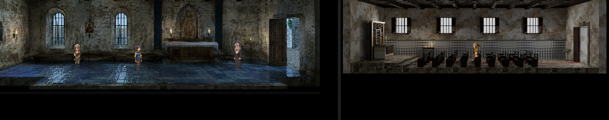
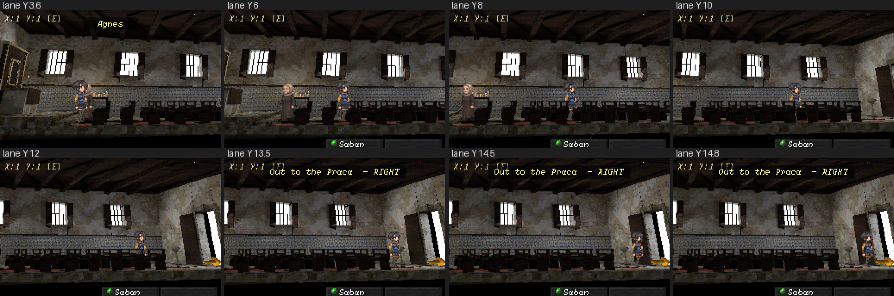
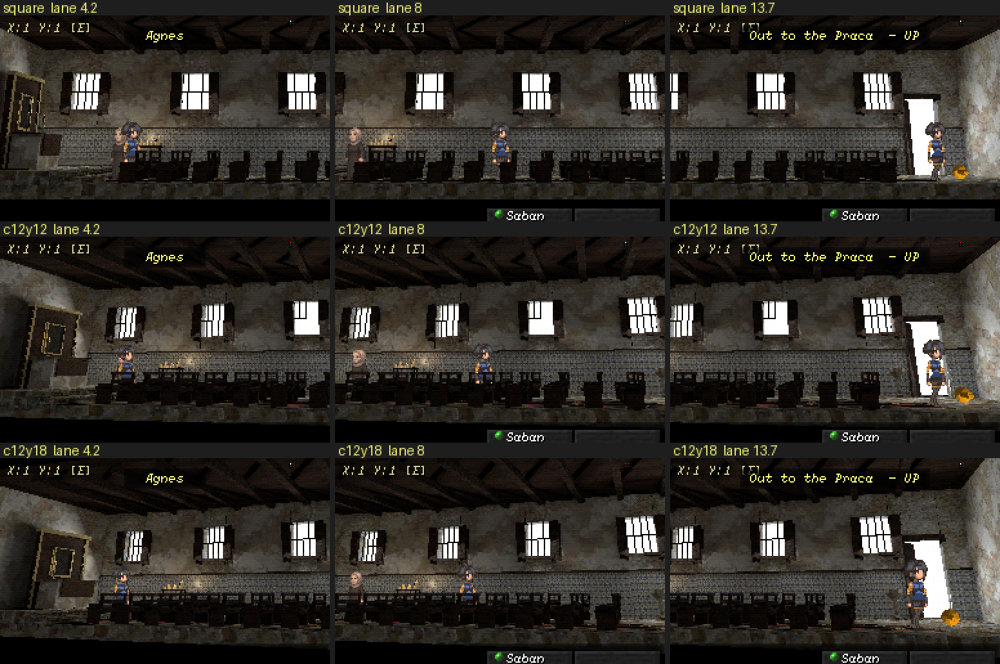
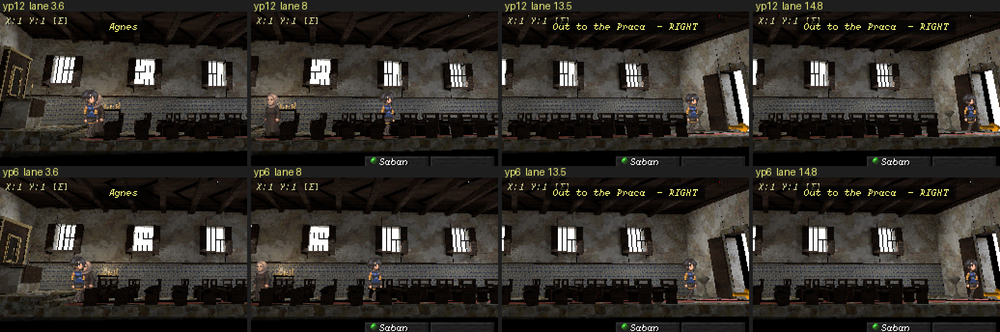

# Blender field test: authoring the Chapel through the documented route

On 4 October 2026 a new St. Maria interior, Sister Agnes's chapel (map 22),
was authored end to end by following only the documented route: the modeling
skill, `tools/blender/README.md`, the interior brief and the furnishings
catalogue. The aim was to test the tooling the way a weaker agent would meet
it, and to record every place it got in the way. This is a report, not status.

Result: a registered **scaffold** source (`st_maria_chapel.blend`, recipe
`tools/blender/recipes/st_maria_chapel.py`), seven new or extended reusable
furnishings, one new semantic material, an architectural reference sheet, and
a package reviewed in the real runtime along its whole scrolling lane on all
four surfaces. Map 22 still ships its 2D plate. Promoting the 3D room onto it
is an owner decision and was not done.

## The room

Every element comes from authored text or a reference: map 22's intro
("Blue tiles, cold wax, and a door that is never locked"), Agnes's lines on
map 1 ("repairing the chapel steps", "brushes stone dust from her sleeves"),
and [the reference sheet](../design/references/st-maria-chapel.md), whose
model room is Nossa Senhora do Rosario, Cidade Velha (Cape Verde, 1495).

It went through four owner directions:

1. **End view → side view.** The first version was a self-contained
   Classic-width room seen from the end. The owner asked for a side view of a
   long hall with half the seating in front of the player and half behind. It
   is now a 16 m nave, the aisle as the lane, the altar on a two-step chancel
   at screen left, nine rows of pews in a foreground and a background bank.
2. **A more creative camera.** The square, centred view became a closer,
   wider camera yawed 12 degrees off the lane (below).
3. **Carpet and door.** A red carpet runs down the aisle, and the way out
   became a door, not a tongue of floor toward the camera.
4. **The main door opposite the altar.** The first door went into the long
   far wall; very few churches have their main entrance there. It is now an
   open door in a stone frame in the end wall opposite the altar, and the
   aisle and carpet lead straight to it.

The axis spent is the **platform**: the chancel step, under repair (a lifted
stone, fresh mortar, a tub of lime with a trowel, stone dust), with Agnes
beside it. The retable's recess is deliberately empty.

The shipped 2D plate (left) beside the whole hall from the stager's
`--full-map` render (right):

The real runtime at Classic with the chosen camera, lane Y 3.6 (the chancel,
Agnes) to 14.8 (at the main door):

## The camera study

Measured in the runtime, not reasoned (these frames predate the move of the
door to the end wall):

- **Yaw alone does almost nothing.** At the calibrated 18.667 m with a 28
  degree lens the view is nearly orthographic; -12 and -20 degrees looked
  like the square view, and -20 cropped Agnes.
- **Closer and wider gives the oblique read** of the references (5, 6): the
  floor edge, beams and pew rows run diagonally and the altar end recedes.
  The character stays 48 px at the target only while
  `distance × tan(fov/2)` = 4.667 m, so 12 m pairs with 42.5 degrees.
- **The vertical framing must be re-solved.** `projectionWindowOffsetY` was
  calibrated for 18.667 m; at 12 m the room slid up and lost its ceiling. A
  Python replica of the runtime projection gave the magnitude (52.46 px) with
  the wrong sign; the runtime capture caught it. -54.70 is verified.
- **Yaw costs constant character size:** about 45 to 53 px along the aisle at
  12 degrees, 43 to 55 at 18, 40 to 60 at 24 degrees and 9.3 m (rejected).
- **Yaw toward what the player walks to.** With the main door in the
  screen-right end wall, -12 degrees put the camera near that wall and showed
  the door as a sliver; +12 presents it as the room's destination while the
  altar end stays legible:

Staged camera: `{"distance":12.0,"fovDegrees":42.501,"yawDegrees":12,
"target":{"y":7.5},"projectionWindowOffsetY":-54.70}`, lane 3.6 to 14.8,
tracking centre 8, ±78 px, exit direction `right`.

## Friction log

| # | Where | What a weaker agent meets | Disposition |
|---|---|---|---|
| 1 | Runtime review | No generic way to stage a candidate package onto a map; each earlier candidate had its own study script | **Fixed**: `stage_candidate.js` (tested, in `verify.yml`) |
| 2 | `furnishings_catalogue.py --find` | Substring hits in prose ("step" → `records_press`, "niche" → `bread_oven`) look like answers | **Fixed**: each hit says whether it matched the name or only the description |
| 3 | `Interior` materials | `room.straw` is bound to semantic `wax`; there was no `room.wax` or gilt | **Fixed**: `room.wax` (same datablock) and `room.gilt` (`ritual_gold`) |
| 4 | Export anchors | `--exit-y`/`--npc`/`--positions` take engine lane Y; recipes author Blender Y; the mirror constant 3.8833 lived in two files | **Fixed/documented**: the exporter records `laneCentre` and the installer reads it; brief §6 has the conversion with a worked example |
| 5 | Stager | `stage_room_model.py --walker-at` moves the Walker only in depth, so spawn/NPC/exit composition cannot be previewed in Blender | **Documented**; the runtime route (#1) covers it |
| 6 | `install_room_3d.py` | Could only write into the shipped `st_maria_town/` tree, contradicting "stage, never overwrite shipping products" | **Fixed**: `--destination` |
| 7 | Map presentation | A target map's 2D-plate `ceilingStyle`/fog leak into a 3D interior | **Fixed** in `stage_candidate.js`, with a negative-controlled test |
| 8 | `furnishings_catalogue.py --build` | Adding one builder re-rendered and rehashed all 47 committed previews (host GPU bytes differ) | **Fixed**: a preview whose geometry and materials are unchanged keeps its committed bytes |
| 9 | Long rooms | The interior vocabulary assumed a Classic-width room seen from the front: `--span` did not move the mirror centre, a platform could only face the camera, a piece could not be turned, a staged map could not scroll | **Fixed**: `--span` sets the centre (default unchanged), `platform(edge="-y"/"+y")`, `piece(turn=, about=)` with `turn` on `pew`/`altar`, `stage_candidate.js --lane/--track` |
| 10 | `Interior.piece(turn=)` (new) | Its first version rotated a just-joined object's stale `matrix_world` (the brief's own §7 trap), moving every turned pew and the altar off their pivots; the renders still looked plausible | **Fixed**, caught by the Blender probe added with it (`test_piece_turn_rotates_about_its_pivot`) |
| 11 | Camera | No way to try a different camera on a candidate without editing map data; the brief forbade changing the lens | **Fixed**: `stage_candidate.js --camera <json>`; brief §2/§6 record the long-room exception and its invariant |
| 12 | New material | `sync_asset_core.py` copied the vendored registry but left the item toolkit's `TOOLCHAIN_MANIFEST.json`/`SHA256SUMS.txt` stale, so `test_asset_core_host` would fail and an agent would hand-edit hashes | **Fixed**: the sync refreshes the vendor entries of both |
| 13 | New material | The material id list is duplicated in `materials.json` and `tools/asset-language/lib/validation.py` | **Open**; both were updated |
| 14 | Doors | `doorway()` builds a door only in the back wall; a long room's main door belongs in an end wall | **Fixed**: `Interior.side_doorway()`; `door_frame(wall=)` mounts on any wall |
| 15 | Staging | A moved exit kept the map's old `direction` ("away" for a door that now leads off screen right) | **Fixed**: `stage_candidate.js --exit-direction` |

Pre-existing, not caused here: `material_library.py check` reports
`foliage_card` has a texture folder but no registry id. Two problems found by
the audit that preceded this test are filed: #1368 (the adopted Padaria's
texture paths) and #1369 (`compile_item_blends.py --check` red on Windows).

## Evidence

- Recipe build, stage renders and export ran through `tools/blender/run.py`.
  Export: `--span 16`, 3,852 triangles, 1024 atlas, mirrored with
  `engine_y = 8.0 - blender_y`.
- `environment_sources.py --check`, `furnishings_catalogue.py --check`
  (53 builders), `script_index.py --check`, `sync_asset_core.py --check` and
  `tools/asset-language/check.py all` pass.
- Runtime capture: `ENVIRONMENT NATIVE REVIEW OK` along the lane on Classic,
  4:3, Wide and device; G1 `VALIDATE OK` on the staged game.
- `test_interior_grammar.py` 19/19 (platform edge and piece turn probes);
  `test_stage_candidate.js` 7/7, whose sky-leak assertion goes red without the
  presentation copy.

## Open for the owner

1. Promote the chapel onto map 22 (replacing the 2D plate), keep it as a
   candidate, or revise it first. Promotion is G5-visible: map 22 would take
   the staged camera, lane and anchors (exit 15.4, spawn 14.5, Agnes 3.8),
   and its exit's direction would become `right`.
2. The roof. Every reference has a pitched timber roof; `Interior.ceiling`
   can only build a flat beamed one. That is a missing axis.
3. What, if anything, the retable recess holds.
4. Whether to commit the reference images themselves. The sheet is
   regenerated into `out/reference/`; only links and credits are committed,
   because the photographs are CC BY / CC BY-SA.

Agent-Signature:
  platform: Claude Code
  model: platform-selected/unknown
  role: implementation
  task: Blender field test - author a new environment
  base: db3b825d
