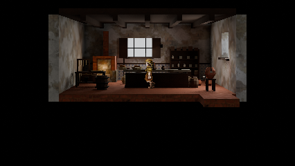
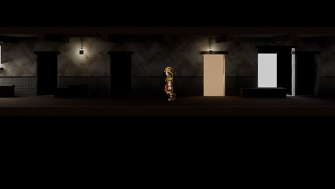

# Shared render profile audit, 2026-09-30

This is the first implementation slice of #871, not completion of the Blender-wide audit. Quality settings now have one bpy-free authority consumed by room staging, EEVEE atlas beauty projection, package photographs, wide-screen review and town source photographs. Native review is the default; environment supersampling is explicit. Camera calibration, actor scale, lighting records and data-pass encoding retain their existing authorities.

## Observed proof

Four profile tests passed, including a real Blender 5.2.2 render that checks saved PNG dimensions and preserves the calibrated camera through every profile. Seven real-export backend tests passed: both backend package contracts, geometry parity, illumination, cutout alpha and flipped-source-UV opacity. Environment source manifest validation and diff whitespace checks passed.

Padaria draft and corridor review were rendered at 426 x 240, 0 EV, supersample 1. Both reported Walker height 47.999997 pixels. These are tool smoke views, not gameplay or owner visual acceptance. Corridor source SHA-256 was identical before and after: `B8A9C3C1EF30B941FE9B3564D3EEA61C7459429C260365E1304F0CBA0FF23787`.

## Remaining boundaries

| Path | Current disposition |
| --- | --- |
| `town_environment_pipeline.py` Cycles bake | Explicit comparison backend; retained pending retirement evidence. |
| `study_eevee_atlas.py` Cycles render | Deliberate comparison experiment; retained. |
| `live_bridge/server.py` game-camera capture | Still inherits source engine; needs temporary profile application with complete state restoration. |
| Asset/model study and contact-sheet tools | Custom dimensions and study controls; not claimed migrated by this change. |
| Atlas supersampling | Source export records still select their existing supersampling. Shared quality does not silently change shipping bake recipes. |
| Room lamp scaling | Existing staging defaults still scale main/accent lights; this is a lighting audit seam, outside quality-profile authority. |

The owner rejected the grass candidate's visual value: 1,500 extra triangles and approximately 88,000 allocated atlas texels produced an overly subtle effect. It remains unadopted in draft #1293. This supplies an audit example, not a general automatic visibility threshold. The next audit slice should compare fixed native on/off images together with geometry, atlas occupancy and timed rendering; resource counts alone do not establish value.

#871 stays open for the remaining presentation/profile boundaries and representative visual comparisons. This change does not retire Cycles, modify adopted source files, promote new scene content, or recapture goldens.

Agent-Signature:
  platform: Codex desktop
  model: platform-selected/unknown
  role: implementation
  task: "Shared Blender render quality profiles, first slice of issue 871"
  base: 3acc8c1eae5dce07815554373ceba22a946d17a8
