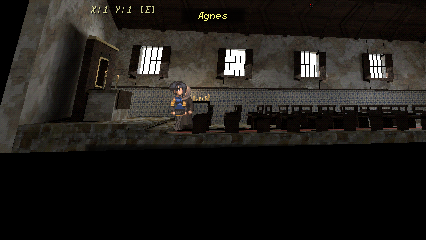
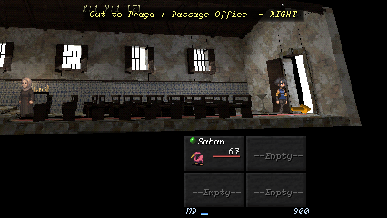

# Chapel integration audit, 4 October 2026

Map 22 previously shipped a 2D plate even though the new chapel scaffold was
already on main at 8ddde62d. The owner requested integration and improvement
of its roof and retable recess.

The scaffold had a flat beamed ceiling. The retable had a dark panel over a
solid wooden board, rather than an opening with depth. The revised scaffold
uses a reusable pitched timber ceiling with paired rafters, a ridge and two
closed masonry gables. The altar builder now leaves an actual opening through
the front assembly with a backing approximately 20 cm behind its face. The
niche remains empty: no religious imagery or new lore was inferred.

The revised source was built while its record was still scaffold, then adopted
after native review. Its material images are packed so moving the source does
not break texture dependencies. Further edits must be made directly to the
adopted Blender document. The Cycles export retains its bake manifest beside
the runtime package: 4,000 triangles and a 1024-square atlas.

Map 22 uses the reviewed side-on camera, tracking and anchors. Both original
events and their command trees are retained unchanged. Its exit points right
and returns to the existing town chapel anchor. The initial candidate's lane
ended at 14.8 while its exit was at 15.4; the unit suite caught this and the
shipping lane now reaches the exit. Agnes remains at the repaired chancel.

Native runtime review covers positions 3.6, 6, 10 and 14.8 on Classic, 4:3,
Wide and device surfaces. Altar-end and entrance frames were inspected, with
both pew banks, masonry, sloping timber roof and open entrance legible.
Device captures are desktop simulations, not physical-phone acceptance.

Validation: G1, G2, G3, G4, save/load, the staged unit suite, 21 Blender grammar
tests, seven candidate-staging tests, source-record checks and the 53-builder
catalogue check passed. Seven native Effekseer world-effect assertions were
unavailable because this worktree has no native shim. Owner PLAYED acceptance
is not claimed. No golden references were regenerated.

Absolute G5 remains red. A clean-main stage at 8ddde62d was captured through
the same recorder on the same machine: both stages produced the same 76
Classic and 39 Wide differing/new frames, with identical decoded RGBA pixels
and identical differing-frame sets. The candidate adds no G5 delta within
that recorder's coverage. This local comparison is not the hosted A/B repeat
control and does not establish absolute correctness. Existing reference debt
is tracked in #1331 and #1365. The chapel itself is covered by the native lane
captures above, rather than the frozen-room G5 scene set. G6 was not run:
this change does not alter Studio or its frozen fixture.

