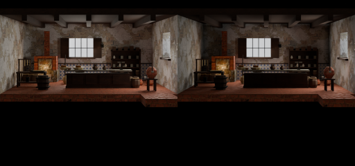

# Neutral EEVEE workflow (2026-09-30)

The owner chose neutral 0 EV and lighting corrections instead of exposure gains fitted to Cycles. Room plates and both atlas exporters now default to EEVEE; Cycles remains explicit for comparisons. The test-scene records retain probe density and lighting shims, with all exposure gains reset to zero. Room plates consume these same records. Zero exposure is applied even when a source document carries a different exposure.

The same source, camera and default light settings were rendered through stage_room_model.py with --no-walker. EEVEE uses its source record (two probe cells per metre, emissive companion lights and fixture shadow release). These are tool-rendered comparison views, not gameplay acceptance. Source documents and shipping packages were not modified by this workflow change.

Validation: environment-source records check, backend and source-record suites passed. The backend fixture exercises the default EEVEE exporter as well as explicit Cycles; both retain the package contract. CI supplies the remaining repository gates. Dark foliage alpha handling remains #1290.
