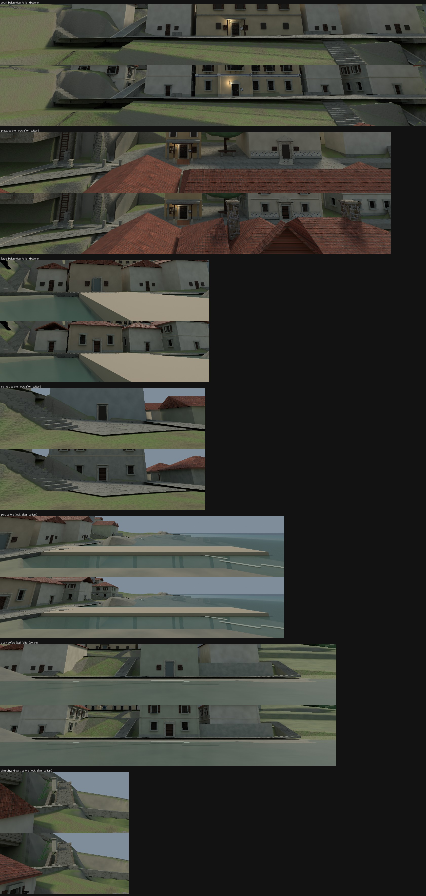

# St. Maria island exteriors: every building rebuilt with the house grammar, 6 October 2026

The island's buildings were flat limewash boxes under plain prism roofs, with dark decal
doors, windows and shutters laid on the walls, while the interiors had been authored with real
depth. `tools/blender/rebuild_island_exteriors.py` rebuilds all 19 building masses with the
house grammar at the **same footprint, base height, door positions and roof zone**, so no
lane, transfer, anchor, approach or collision changes.

Every building gets: a stone plinth, one or two storeys by height, projecting bands and a
cornice, stone-surrounded windows (grilled at the ground, shuttered above, iron balconettes
on the street face of the houses), recessed panelled doors, quoin piers, and a hipped or
gabled tile roof with eaves. Each building keeps its own limewash material. The decal doors,
windows, shutters, lintels and jambs the grammar replaces are removed; approaches, landings
and the Bakery's rear upper door are left alone.

- **Passage House** keeps its bespoke recipe: recessed flanks, a gabled entrance pavilion with
  a civic door, a blue azulejo frieze across the front, a balconied gallery window and two
  chimneys. The Passage House mark (leaf, plaque, lantern) is retained; the leaf drops into
  the new reveal.
- **Chapel** and **Praca east frontage (Registry)** use the civic register (deep reveals,
  pedimented upper windows). The Chapel takes a front gable; the belfry and the Registry's
  porch piers, coping and tablet are kept.
- **Forge, Pub, Bakery** are the shop register; sheds are the service register.

The tool writes a new revision of the adopted island source `st_maria_core.blend` (images
packed so the file travels) and never touches the original in place. The revision was
promoted over the adopted source.

## Plates

The exterior packages are layered 2D plates rendered from that source with their recorded
cameras. Rendering is deterministic (an unedited re-render matches the shipped plates to a mean
difference under 0.15/255 on eight of nine; the churchyard differs by 0.55 from its grass blades).
Seven plates show rebuilt buildings and were produced as **shipped plate + (new render -
unedited render)**, so everything outside the buildings' footprint, light and shadow is
byte-identical to the approved plates. The churchyard and threshold plates show no rebuilt
building (the new render differs from the unedited one by 0.05 and 0.015/255) and are left as
shipped, with their manifests still naming the earlier source. The seven changed manifests
carry the new source hash and `sourceRevision: island-exteriors-20261006`. No foreground
cutout lies under a changed pixel (two pixels on the stair plate), so `foreground.png` is
untouched.

No frame of G5 or G6 shows these plates. Played acceptance is not claimed.
