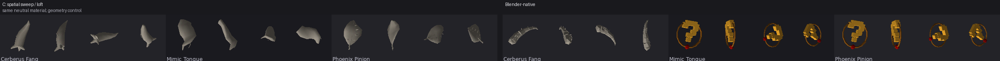
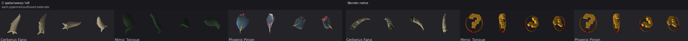

# Controlled item-grammar study: spatial sweep vs Blender-native

This study compares **the same three item identities** authored independently by the C spatial-sweep grammar and by the unrestricted Blender-native found-object lane. It does not regenerate either side and it does not change canonical gameplay data.

## Presentation controls

Both variants were rendered through the real `item_model_sheet.lua` / `presentation.item_model_view` path at the same four yaw/tilt pairs. A neutral-material pass temporarily assigns the same diffuse material to both sides so color and material vocabulary do not masquerade as geometry differences. The as-authored pass is retained separately because material language is itself useful evidence.





## Runtime compatibility result

The controlled render found a **producer/runtime contract failure before it found a complete visual winner**.

- The sweep versions of Cerberus Fang, Mimic Tongue, and Phoenix Pinion all load through the authoritative item viewer.
- The Blender-native Cerberus Fang also loads normally.
- The pinned Blender-native Mimic Tongue and Phoenix Pinion do **not** load through `presentation.item_model_view`. The runtime reports `mesh contains a degenerate face` for each and substitutes the normal fallback model.

Therefore the Blender-side Mimic Tongue and Phoenix Pinion cells in the two comparison boards are **fallback geometry, not the authored Blender models, and must not be judged artistically**. Their offline OBJ metrics and silhouette measurements below still describe the authored files, but the authoritative four-angle visual A/B is valid only for Cerberus Fang until those two exports are repaired and rerun.

This is itself an important pipeline result. `engine/geometry/model.lua` rejects a triangle whose cross-product length is exactly zero even when authored normals exist. `lathe.write_obj` already performs an export-time degeneracy check because otherwise the engine would silently display a placeholder. The Blender-native producer path can currently emit a product that clears its own inspection/UV workflow but violates that runtime contract. The next pipeline fix should make Blender/shared-export validation enforce the same post-export condition rather than teaching the item viewer to accept invalid triangles.

The study deliberately preserves the invalid pinned products as evidence instead of repairing them in place.

## Measurements

`source LOC` and `geometry calls` measure only each object's recipe function. Shared helper libraries are excluded. A call inside a loop counts once, so these are authoring-surface proxies rather than runtime primitive counts or human-effort estimates.

| item | sweep vtx | Blender vtx | B/C vtx | sweep faces | Blender faces | B/C faces | sweep recipe LOC | Blender recipe LOC | sweep geom calls | Blender geom calls | silhouette IoU | runtime visual A/B |
|---|---:|---:|---:|---:|---:|---:|---:|---:|---:|---:|---:|---|
| Cerberus Fang | 126 | 179 | 1.42x | 146 | 290 | 1.99x | 22 | 35 | 3 | 4 | 0.312 | valid |
| Mimic Tongue | 151 | 268 | 1.77x | 169 | 480 | 2.84x | 42 | 62 | 5 | 6 | 0.282 | Blender fallback: degenerate face |
| Phoenix Pinion | 242 | 532 | 2.20x | 272 | 972 | 3.57x | 52 | 64 | 4 | 4 | 0.422 | Blender fallback: degenerate face |

### Cohort totals

- Sweep: **519 vertices / 587 authored faces / 116 object-recipe LOC**.
- Blender: **979 vertices / 1742 authored faces / 161 object-recipe LOC**.
- Blender/sweep ratio: **1.89x vertices, 2.97x authored faces, 1.39x object-recipe LOC**.

The ratios are still useful even for the two runtime-invalid Blender products because they measure what those recipes actually exported. They are not evidence that more geometry produced a better in-engine result.

## Cerberus Fang: the valid controlled comparison

Cerberus Fang is the one complete apples-to-apples visual comparison in this pass.

The sweep grammar spends its representation on the **continuous body of the tooth**: one hooked taper plus three root branches and a small scar gesture. It remains compact and strongly canine-like from the side/top views. The Blender-native version spends additional representation on **local narrative events**: segmented construction, root tissue, repair staples, and backward barbs. It is much longer and more artifact-like, and the low silhouette IoU of **0.312** confirms that the two authors made substantially different gross-form decisions rather than merely decorating the same mesh.

For this object Blender costs **1.42x the vertices, 1.99x the authored faces, and 1.59x the object-specific recipe LOC**. The visible thing bought by that extra freedom is not basic curvature—C already expresses the hooked body naturally—but localized damage, repair, attachments, and deliberately irregular construction.

That is evidence for a useful boundary: **continuous spatial form belongs comfortably in a Thestra-native sweep grammar; arbitrary local topology and found-object storytelling are where Blender begins earning its heavier authoring model.**

## How to read the silhouette score

The IoU score is the repository's normalized 64px three-axis silhouette comparison applied **between the two authored OBJ files for the same item**. A low score means the grammars made materially different shape decisions; a high score means they converged on a similar gross form. It is deliberately **not** a quality score, and it does not prove runtime loadability.

That last distinction matters here: the corpus parser can rasterize the Blender-native Mimic Tongue and Phoenix Pinion even though the authoritative runtime later rejects a zero-area triangle in each product. The study therefore exposes a validation gap between offline corpus analysis and runtime geometry construction.

## What this changes in the larger A/B/C investigation

The experiment strengthens the case for **multiple authoring dialects terminating in a stricter shared geometry contract**, rather than one universal modeling API.

C does not need to become Blender. Its advantage is that bend, taper, roll, section change, branching, and closed loops remain compact, explicit authoring concepts. Blender remains the high-ceiling escape hatch for booleans, arbitrary deformation, torn or damaged local topology, and individually manipulated detail. But both routes must pass the **same resolved-mesh validity contract** before an item can be considered reviewable.

In other words, the missing unification layer is increasingly not a mega-grammar. It is a **Geometry IR/finalization contract**: valid triangles, UV/material bindings, normals, provenance, and eventually junction/union rules, with A/B/C/Blender acting as frontends.

## Review prompts for the repaired rerun

1. Which representation communicates Mimic Tongue and Phoenix Pinion fastest at normal item-view size once both really load?
2. Which retains meaningful side/top/underside information rather than spending detail only on a hero angle?
3. Where does Blender's unrestricted topology create visible value that C cannot express cleanly?
4. Where does C reach the same perceptual result with a smaller or more legible recipe?
5. Which differences are geometry, and which only appear in the as-authored sheet because the material vocabularies differ?

## Reproduction

Sweep source ref: `c91471734f187e63c15cf002d6189a0929695abd`  
Blender source ref: `b060d2df66cc619a4cebe7357ad48258effb1234`

Check out the pinned Blender ref beside this checkout and run:

```text
python tools/asset-production/compare_item_grammars.py --blender-root <path-to-blender-checkout> --out-dir docs/reports/item-grammar-study
```

The four-angle PNGs were generated by temporary CI materialization through the real item viewer. The temporary workflows are not part of the intended final study branch.
