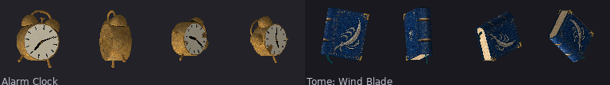

# Clock and tome: multiview volume with continuous surfaces

Two provisional items: Alarm Clock and Tome: Wind Blade. Owner acceptance is
open. Structural checks and image contribution do not establish art success.

[Before/after](before-after96.png), [identical-geometry plain controls](surface-control96.png)
and [native cardinal yaws](yaw96.png) use the actual item viewer. The first two
poses per item are gameplay poses; other poses are diagnostic. The viewer camera
is side-on: apparent high angles roll the object and are not top cameras.

[Clock correspondence](alarm_clock-reference-to-source.png) and
[tome correspondence](tome_wind_blade-reference-to-source.png) pair the original
front/right/back/top reference panels with read-only orthographic Workbench
source views. These are shape/UV evidence, not runtime lighting proof. Full
original references and all eight source views are retained here. Crops and
scaling apply only to the review boards.

Each item used two built-in image-generation calls: a matched multiview
reference, then a flat surface atlas derived from that reference and a
deterministic layout guide. [Generation provenance](generation.json) contains
all four full prompts, inputs, dimensions and SHA256 hashes. Generated pixels
remain unchanged. Production atlases are RGB/opaque, stored under the source
`_textures` folder and copied identically into shipping products. Guides are
retained as `clock-layout.png` and `book-layout.png`.

The clock's measured front diameter and side case depth control real volume.
Hollow domed bells, raised hands, feet, hammer, carry arch and winding key are
geometry; flat dial/rear artwork and a quiet brass sleeve supply colour.
Domes/case/pads are smooth; dial/rear plates are flat. The tome's measured
width/depth/spine bulge control one connected back/spine/front cover, a real
page block, curved binding, four L guards and curled bookmark. Broad cover and
paper planes are flat; rounded spine/binding/bookmark are smooth. Its 127
shared painted cover edges have zero UV coordinate delta. Cut-rim seams are
intentional. Top binding and page block share paper coordinates.

The front dial and wind-blade emblem remain readable in native cells; the
clock's bell gap and the book's page thickness provide useful silhouette cues.
The guards simplify the reference's decorative metal corners, and the native
leather/brass texture can still look busy. The brass strip ends are not
pixel-identical (mean absolute channel delta 15.08, maximum 62); its case seam
is placed underneath. Generated engraving/embossing and spine shading remain
partly baked into colour. Coordinate continuity does not make the artwork
seamless or recover unseen geometry. Generated views disagree in depth/width
and bookmark curl; [calibration](calibration.json) names the selected evidence
and authored interiors. This is manual calibrated construction, not scanning.

[Surface/source evidence](surface-evidence.json) records closed positive-volume
components after temporary audit-only positional welding, raw topology,
flat/smooth choices, UV presence/area/bounds, sampled opacity, product/source
hashes and controls. All painted faces have zero missing/collapsed/outside UVs.
Clock: 2980 vertices / 5636 triangles. Tome: 910 / 1788. Removing generated colour
and its UV gain while preserving OBJ bytes changes 4138 clock and 5005 tome
pixels across the two gameplay poses. This measures contribution only.

Independent repeats and shipping `compile --check` pass for both items; compile
and source inspection leave source hashes unchanged. A pre-fix native cover
finish changed OBJ UV aliases on repeated same-host exports while decoded
geometry stayed identical. The new production cover was materialized directly
with evaluated positions matching at seven-decimal precision and six-decimal
saved UVs. The compiler
and previous sources were untouched. [Issue #1447](https://github.com/JosephSerUSP/Second-Rite/issues/1447),
[observation](repeat-uv-evidence.json) and [read-only fixture](repro/) preserve
that deferred tooling investigation.

Four host tests, texture check, asset contract, script index (110), staged
G1/G2/G3/G4, unit and save pass locally. Seven native Effekseer world-effect
assertions were unavailable. Strict prospective corpus review against all 207
assignments finds no violation involving either pilot. Actual corpus gate is
red: 85 stale accepted keys, 2 duplicate groups, 33 UV-less models, 1 shared-file
group. Asset regression is red for 98 changed Model records across the stack.
Both surviving duplicate groups (Ether Seed/Sigil Ink and the five remaining
legacy foods) are inherited and marked new relative to the old accepted keys.
Baselines remain unchanged. Source absence is 52/207, a coverage count. G5/G6
were not run or recaptured; Linux byte stability remains unverified. Inherited
#1355/#1369, #1434, #1431 and #1436 remain outside this batch.

The [continuous-surface guide](../../../tools/blender/CONTINUOUS_SURFACES.md)
documents reusable path/sleeve coordinates, explicit seams and review criteria.
Production authority is the saved `.blend`, not the ignored scaffold. Exact
local logs and direct-edit records remain in ignored `out/work/`.
