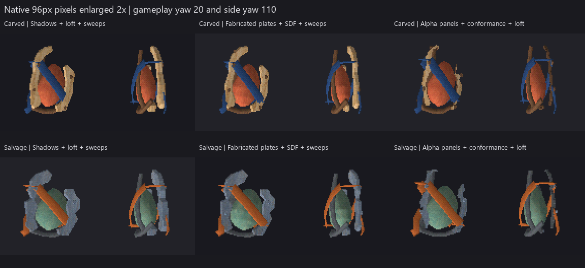

# Crossing item construction methods

Six **nonshipping studies** compare two directions and three hybrid routes for
one asymmetric containment capsule. Its rigid cheek frame, exposed organic
core, rear support and flexible diagonal binding require different shape
languages within the same object. This records a local experiment, not owner
visual approval or new shipping item coverage.



Columns are shadow intersections, fabricated plates with an SDF core, and
image-alpha panels conformed to a curved guide. Rows are carved bone/walnut/
coral/indigo and salvaged metal/teal/orange. These are real item-viewer renders:
96px pixels enlarged by nearest neighbor, not generated illustrations.

## What is crossed

| Route | Rigid structure | Organic core | Binding and support | Surface |
|---|---|---|---|---|
| Shadows | Live front/side/top silhouette intersections and beveled cut planes | Authored loft with smooth walls and flat caps | Transported anisotropic sweeps | Shared generated atlas, bounded face charts |
| SDF | Authored beveled plates | Live loft-to-SDF union with sphere seeds, one fillet, threshold zero, weld and material assignment | Same sweep control points | Same atlas, generated core face charts |
| Conformance | Separate alpha-derived left/right panels, live perimeter relaxation, Shrinkwrap to a hidden closed guide, then Solidify | Same loft construction | Same sweep control points | Same atlas on front faces; plain back and cut rims |

All techniques feed the existing read-only evaluated `.blend` -> OBJ/MTL
compiler and the actual runtime viewer. No renderer or inverse-rendering
dependency was added. Image generation supplies reference views, component
outlines and surface art; authored guides, lofts, joints and thickness supply
the geometry it cannot establish reliably.

Four built-in imagegen calls provide two multiview references, one shared RGB
surface atlas and one RGBA sheet containing four component stencils. Original
images are unchanged. Complete prompts, input paths and SHA-256 hashes are in
[generation.json](generation.json); [layout.png](layout.png) is a code-native
guide. This counts calls, not monetary, memory or rendering savings.

## Controls and limitations

Within each direction the reference, overall dimensions, atlas allocations,
viewer poses and pre-fit binding/support controls are shared. Actual dimensions
match the connected front/right reference bounding ratios: carved
`2.523711 x 1.386031 x 3.6`, salvage `3.062590 x 1.570681 x 3.6`.
The final source audit verifies this after perimeter relaxation and root fitting.
It does not verify per-vertex correspondence or recovered surface normals.

This compares whole routes. Plate construction, shading and core construction
change together, and different root fits alter common component proportions.
Texture charts share an image allocation, not exact correspondence on every
face. The multiview images contain perspective and disagree on back/top shape.
Only front/right bounding ratios determine the global envelope. The thick,
sculpted cheeks in the reference are **not reproduced faithfully** by these
slender panels. Hidden rear construction and conformance guides remain authored.

The separate [core control](core-control96.png) changes only the SDF core to
its saved loft and smooth side faces. Noncore evaluated geometry and exported
bounds stay exactly identical. Geometry and the core UV chart both change;
the atlas, materials, frame and binding stay the same. Its reconstruction script
creates disposable copies and verifies original source hashes.

The [plain controls](plain96.png) preserve exact OBJ bytes and sphere overlays,
replace atlas texture plus UV gain with allocation-mean RGB times 1.16, and keep
plain cut-rim colours. They isolate surface variation without changing geometry.
Their MTLs, plus the actual core-control OBJ/MTLs and derivative `.blend` copies,
are retained under [controls/](controls/). These are archived comparison inputs;
the six primary study documents remain the editable source authority.

## What the rendered comparison shows

The shadow route gives broad, crisp cheek planes and explicit openings. The
conformance route carries the generated component contour around a body guide,
but its slim side profile and residual sampled edge steps are still apparent.
Three boundary relaxation iterations reduce the stair steps without replacing
the saved mesh. They also shrink tips slightly; a direct root adjustment restores
the shared overall envelope.

The SDF route changes the core contour modestly in these captures. Its extra
mesh cost has no clear visual payoff at 96px here. This is an observation about
this capsule and voxel setting, not a general verdict on SDF construction.
The independent core control makes that tradeoff visible without changing its
surrounding assembly.

| Direction | Shadows | SDF route | Conformance | SDF route with loft-core control |
|---|---:|---:|---:|---:|
| Carved | 2,292 triangles | 7,764 | 2,124 | 1,712 |
| Salvage | 2,626 triangles | 7,532 | 2,304 | 1,480 |

Rounded loft walls, binding sweeps and support sweeps use smooth normals.
Cut cheek planes, caps and cut rims stay flat; carved conformed fronts are
smooth, salvage fronts flat. The generated grain remains conspicuous, and the
diagonal binding dominates the small image. Neither a closed mesh nor a
technical pass makes that composition or material direction approved.

The reusable gain is **bounded component sampling plus editable panel
conformance**. Sampling a clip retains full-original-image UV coordinates and
file bytes. Conforming only the front surface before adding thickness avoids
collapsing an already thick panel onto its guide. Generated cut rims cannot use
the front paint chart: the helper rejects image textures and UV overlays there,
while allowing sphere overlays. Its shading graph separates front and rim normals.

## Evidence and verification

- [Native 96px, four runtime poses](native96.png), [cardinal yaw](yaw96.png),
  [actual 192px diagnostic render](detail192.png), [plain controls](plain96.png),
  and [isolated core control](core-control96.png).
- [Source front lineup](source-front-lineup.png); six `*-reference-to-source.png`
  boards compare the original drawings with actual read-only Workbench captures.
  Workbench lighting is geometry/UV evidence, not runtime lighting.
- [Evidence summary](evidence.json), [evaluated source audit](source-evidence.json),
  [painted face audit](surface-evidence.json), and [core control evidence](core-control-evidence.json).
- [Saved sources](source-project/assets/authoring/items/) and exact
  [study runtime products](source-project/assets/models/items/). The `data/`
  marker is compile-only; this study Project contains no authored gameplay data.

All 84 visible evaluated components have zero raw nonmanifold edges and positive
signed volume. Assigned painted faces have no missing, collapsed or outside-region
UVs. Source, original and compiled atlases match byte-for-byte. A fresh temporary
six-source `compile --check` matches retained OBJ/MTL bytes and leaves source
hashes unchanged. This is local Windows evidence, not Linux byte-stability proof.
Closed components do not rule out intersections, projection misses or poor thickness.

The local tests comprise 10 painted-relief host cases, its existing real Blender
integration, the new real conformance integration, and 16 compiler host/validation
cases. Conformance covers guide edits, live boundary order, smooth/flat material
separation, translated-root export, original UV/source mesh preservation and
rejection of UV-dependent cut rims. Script index passes with 112 classified tools.
Readable verification logs and original byte hashes are retained in
[verification/checks.json](verification/checks.json).

Fresh canonical shipping-Project staging passes G1-G4, unit and save locally.
Those checks protect unchanged gameplay/runtime behavior; they do not validate
the six synthetic review items as shipping content. Seven native Effekseer
world-effect assertions remain unavailable. OpenAL cleanup warnings print after
successful runs; the first wrapper attempt stopped on stderr despite G1's success
marker. The corrected wrapper checks process exits and retained success markers.
No G5/G6 run or recapture, corpus baseline rewrite, asset-regression refresh,
full shipping recompile or merge was performed. Shipping assets/data and prior
adopted `.blend` files are unchanged in this branch's diff.

The first scaffold failed before its third save on an outdated Compare socket
index. Named sockets fixed that code; only the four still-missing documents were
created afterward. The saved hulls had redundant empty surface modifiers, and
conformed back/rim faces inherited invalid front UV assignments. Direct source
edits remove those modifiers, assign plain rims and set deliberate loft smoothing.
[Source](source-refinements.json), [boundary](boundary-refinements.json) and
[dimension](dimension-refinements.json) records retain before/after hashes.

## Reviewing or continuing

Start with `native96.png`, then the direction's reference-to-source boards and
`core-control96.png`. The studies leave art direction open. Fuller cheek volume,
less dominant binding and quieter material fields would improve reference
correspondence before considering a shipping item.

Set pinned `BLENDER_EXECUTABLE` and `PYTHONUTF8=1`. From the worktree root:

```text
python tools/blender/compile_item_blends.py --project-root docs/reports/item-model-hybrid-study/source-project --check
python -m unittest discover -s tools/blender/tests -p "test_painted_relief*.py"
python -m unittest discover -s tools/blender/tests -p "test_surface_conform_blender.py"
python tools/blender/script_index.py --check
```

[repro/](repro/) retains recorded scaffolding, direct source surgery and review
scripts. **Do not rerun creation or source surgery on saved documents.** Their
inputs/outputs originally lived in gitignored `out/work/`; the original scaffold
predates the stricter plain-rim helper and is historical evidence, not a current
template. Continue by opening/editing the saved `.blend`, then compiling and
reviewing derivatives. Safe source review scripts expect the recorded input JSON
under `out/work/hybrid/`; restore those files from this package as needed.

Agent-Signature:
  platform: Codex
  model: platform-selected/unknown
  role: implementation
  task: compare hybrid item construction across two art directions
  base: b2ea564e69d9f07dbe384b2bfd47fcea01efef87
