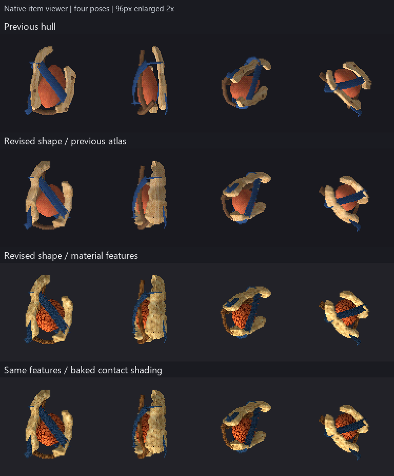
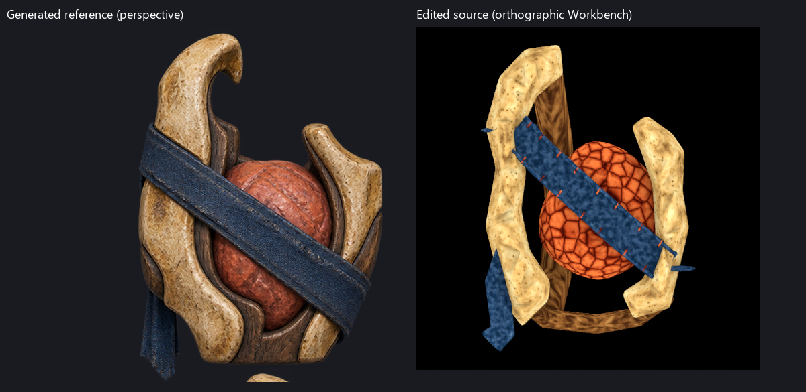

# Carved capsule: shape and baked surface revision

Owner feedback corrected the previous interpretation: the surfaces were weak,
featureless and somewhat quiet, rather than too loud. The geometry also lacked
the generated reference object's volume. This is one nonshipping revision
pilot, derived by opening and editing the saved carved hull. The previous six
study documents and original image-generation outputs remain byte unchanged.
It records a visible change, not owner approval or completed stale-item coverage.



Rows isolate the previous hull, edited geometry with the previous atlas,
material-specific feature colour, then that colour with baked contact shading.
These are actual item-viewer pixels at 96px, enlarged twice with nearest
neighbour. [192px diagnostics](comparison192.png) and [cardinal views](cardinal96/)
are retained. The last two rows differ only in texture bindings; their OBJ data
matches after normalizing the `mtllib` filename. The geometry and final bake
controls have identical triangle positions.

## What changed

The saved cheek silhouette/depth controls were edited and resolved into editable
meshes. Voxel remeshing, relaxation and a smooth cross-section contraction round
the bone away from the broad flat planks. The existing core loft was shortened,
widened and subdivided. Four screw-like fasteners were removed; the cloth now
has two raised selvages and sixteen physical stitches. No committed source was
regenerated. The two new sources became authoritative on their first save and
all later steps opened those documents for direct edits.

The initial geometry fit matched the previous envelope. Later relaxation and
rounding changed it slightly: final dimensions are 2.523711 x 1.366914 x 3.590569
in authored world units. Both final controls have the same envelope. This is
an authored interpretation of the multiview image, not recovered scan geometry.

Material features replace the uniform original atlas appearance: bone pores
and mineral variation, core veins, longitudinal support grain, cloth dye
variation and sewn edges. These are procedural shader features authored in
Blender, not a new image-generation call or reconstructed surface maps. The
original generated reference continues to guide the construction. The early
crest cut was followed by remeshing; its final readability is not established.



The left image is the unchanged generated perspective reference. The right is
an orthographic Workbench source diagnostic with cavity display enabled;
it is not the runtime or a matched-lighting comparison. The reference still
has more convincing carved hook shapes, rounded ends and organic surface
relief. The new pores and veins are colour features, not equivalent physical
sculpting. In particular, the core's cellular pattern is a stylized approximation
of the reference's wrinkled surface.

## Bake boundary

The finalized saved mesh retains `OriginalUV` for historical material recipes
and `BakedUV` for a unique 1536-square atlas. Shared `atlas_allocation.pack`
performs Smart UV projection and concave packing with an eight-texel requested
gutter; the bake dilates four texels. Cycles EMIT baking runs at 32 samples on
CPU. Two maps hold feature colour alone and the same colour multiplied by
`0.32 + 0.68 * AO`, using a 0.34-unit contact distance. No directional key light
is baked, so the shading does not imply a fixed world-facing light.

The final runtime material uses the existing RGB `map_Kd` plus the same 0.16 UV
add pass as the original carved study. It does not require a renderer extension,
PBR maps or transparency. Material recipe graphs remain in the saved source as
fake-user materials; the exported assembly uses one finalized bitmap material.
The original shadow/SDF/conformance study graphs remain intact in their sources.

The contact bake changes 2,889 pixels across the four 96px poses, with no channels
brightened relative to the feature-only control. Its visual contribution is
subtler than the new material features. This does not measure aesthetic quality.
The source audit finds 12,655 smooth polygons and 336 flat polygons; tube caps
remain flat while side walls and rounded shells are smooth.

## Verification and practical limits

| Observed check | Result |
|---|---|
| Temporary pinned-Blender `compile_item_blends.py --check` | Both new sources match committed OBJ/MTL products; source hashes preserved |
| Runtime OBJ validation | Both exports load the face contract: 10,172 vertices, 20,232 triangles |
| Saved-source topology | All 28 visible geometry-control components have zero raw nonmanifold edges and positive signed volume; joined bake mesh has zero nonmanifold edges |
| Geometry/feature/bake controls | Matching triangle positions; feature/bake only substitute PNG bindings |
| Baked UVs | No collapsed or out-of-range triangles; no interior overlap at 1536-square texel centres, excluding shared boundaries |
| Atlas utilization | About 56.67 percent triangle coverage; no subtexel-overlap proof claimed |
| Native viewer | Four standard poses at 96 and 192px; four cardinal yaws at 96px |
| Preservation | SHA-256 comparison to base confirms all six prior sources and four generated PNGs unchanged |
| Script index | 112 classified scripts pass |

This is an expensive study mesh, not a production mesh-budget result. The
20,232 triangles and 1536 atlas should be reduced after the shapes and surface
direction are accepted. No new compiler/unit behavior was implemented. Shipping
G1-G6, unit/save, hosted CI and Linux byte stability were not rerun or established
by this revision. No shipping Project assets, baseline or golden references
were changed. Art acceptance remains open.

A concrete compiler mismatch was encountered: runtime-pass collection includes
material slots on hidden construction meshes even though the exporter omits
those meshes. Clearing only hidden mask material slots made this source compile;
visible material validation was preserved. The deferred tooling fix is
[issue #1460](https://github.com/JosephSerUSP/Second-Rite/issues/1460).

## Files and continuing the experiment

`source-project/assets/authoring/items/` contains the authoritative geometry and
baked sources and texture dependencies. Its `data/` folder is only a compile
marker. `assets/models/items/` holds the canonical derived products. `controls/`
holds the material-only feature control and its bitmap. `source-evidence.json`,
`product-evidence.json`, `surface-bake.json`, `geometry-revision.json` and
`verification/` record the actual measurements and commands.

`repro/` retains historical surgery and study orchestration. It is evidence,
not a production template. Do not rerun creation, rounding or finalization scripts
on the saved sources. Open and edit the appropriate source; if changing geometry,
rebake its retained material recipes and check the new products. The retained
rebake surgery assumes this specific assembly and should not be generalized by
copying its component-size heuristics. General tooling would need explicit
material-role attributes and a production geometry/texture budget.

From the designated worktree, set the pinned Blender and UTF-8 environment, then:

```text
python tools/blender/compile_item_blends.py --project-root docs/reports/item-model-hybrid-study/revisions/carved/source-project --check
python tools/blender/script_index.py --check
```

Agent-Signature:
  platform: Codex
  model: platform-selected/unknown
  role: implementation
  task: carved capsule volume and baked surface revision
  base: 09b865f20faec85a7e4e55b9e3ea5dc8fc2090f8
