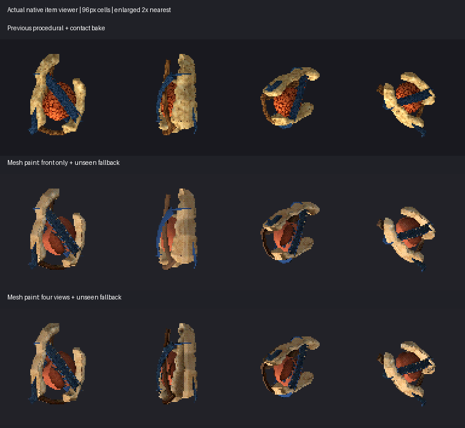
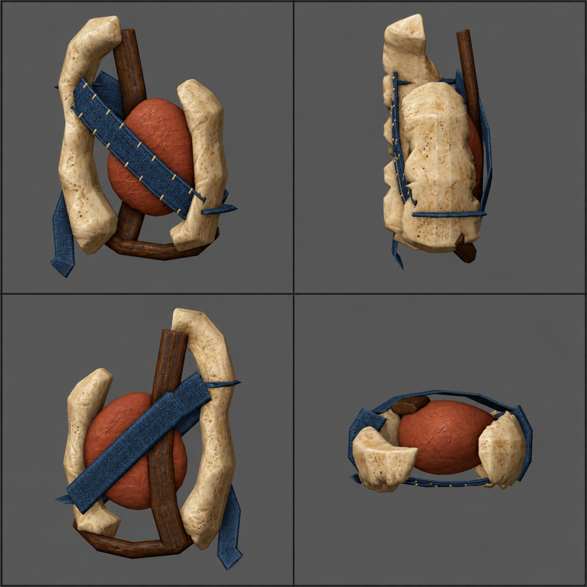

# Mesh-conditioned projection paint

The owner rejected projection from the original generated concept: the saved
mesh does not match that image's shape or internal topology. Matching the outer
bounds cannot make its straps, core and carved regions correspond. That image
now guides art direction only. The final projection uses paintovers of renders
from the actual saved geometry, with the exact render camera coordinates.

This is one nonshipping capsule pilot and a reusable authoring library, not a
successful stale-item replacement or owner-approved art direction. The previous
eight saved study sources and four original generated images remain byte
unchanged. Geometry, triangle winding and baked UV coordinates also remain
exactly unchanged from the previous capsule export.



Rows show the previous procedural surface with contact shading, front-only
mesh-conditioned paint, then four-view mesh-conditioned paint. These are actual
native item-viewer pixels at 96px, enlarged twice with nearest neighbour.
[192px diagnostics](comparison192.png) and [cardinal yaws](comparison-cardinal.png)
are retained. The single/four-view controls change only texture bindings.
The generated paintover itself is not a game render.

## Correspondence and two generation attempts

The route is saved mesh -> material/region-ID renders -> image paintover ->
alignment review -> camera projection -> unique UV bake -> native viewer.
[The tool guide](../../../../../tools/blender/VIEW_PROJECTION.md) explains the
shared library rather than prescribing a new mesh generator.

The first built-in imagegen edit of transparent renders enlarged/reframed the
objects. Its estimated silhouette overlaps were only 50-66 percent. It was
rejected and never used by the final recipe. The second edit used an opaque
gray screenshot with fixed frame/dividers and more generous object scale.
Its estimated silhouette overlaps were 96.2-97.9 percent. Visual inspection
also compared straps, holes and core boundaries; this is sufficient for a
projection experiment, not proof of pixel-perfect internal correspondence.



The [first generation record](paint-generation.json) and
[second generation record](paint-generation-v2.json) retain complete prompts,
input/output hashes, built-in edit mode and alignment measurements.
[Alignment evidence](paint-v2-alignment.png) shows shared support in gray,
generated-only support in red, and actual-only support in blue. The second
mask estimate uses colour chroma to distinguish the object from gray background,
including enclosed gaps. Whole-canvas nearest resizing is for measurement only.
These approximate masks do not establish material or geometric correspondence.

The original generated PNG bytes are preserved. Both outputs are 1254-square;
the 1024-square guide canvas is mapped with uniform whole-canvas scaling, not
independent object fitting. Four 512-square orthographic renders use camera
scale 4.0 and square pixels; the exact world camera matrices and full-image panel
coordinates are retained in [projection.json](projection.json).

The paint requests porous cream bone, a restrained terracotta core with organic
creases, walnut grain and indigo woven cloth at the existing stitches. It
improves their surface appearance without adding physical relief or changing
the hook/core silhouette. The core and shell shape remain weaker than the
original concept, and their surface shading is painted rather than recovered.

## Projection and source boundary

`view_projection.py` adds four projection UV layers and corner visibility
attributes to the finalized assembly. Parallel camera rays against the entire
receiver reject occluded samples. View weights use normal alignment to power
six, panel bounds, paint alpha, and the actual render's separate RGBA support.
This support prevents the opaque background from becoming valid paint. Samples
blend in linear light; unavailable samples use the previous `OriginalUV` atlas.
There is no automatic hidden-side mirroring or inferred geometry.

The saved source keeps both single/four-view fake-user shader recipes. Cycles
EMIT bakes at 16 CPU samples into its unchanged 1536-square `BakedUV` atlas,
with four-texel dilation. Independent green-observed/red-fallback coverage bakes
are retained. On texel centres inside actual UV triangles, about 26.8 percent
of surface texels receive front-only paint and 57.9 percent receive four-view
paint. That describes usable sample coverage, not semantic alignment or quality.
Left/bottom views and some occluded/oblique regions still need better inputs.

Final runtime output uses the existing `map_Kd` bitmap plus the same 0.16 UV
add pass as the previous control. No runtime renderer or material vocabulary
changes. Paint illumination is baked into colour and can double-light under
runtime lighting; view seams and fallback transitions remain review concerns.
This is appearance transfer, not recovered albedo, normals or PBR materials.

The new `.blend` became authoritative at its first save. Subsequent work opened
and edited it directly. Do not regenerate it or rerun historical surgery.
Unused `projection_*.png` and `reference-carved.png` files in its texture folder
are negative-control evidence from the rejected original-image projection;
the final recipe uses `mesh-paint-v2.png`, render support and fallback only.
[projection.json](projection.json) explicitly separates those rejected records.

## Observed verification

| Check actually run | Result |
|---|---|
| Real Blender projection fixture, via unittest | One test passes actual colour, coverage, two-view blend and support-mask bakes, occlusion, camera calibration and UV/vertex preservation |
| Canonical temporary `compile_item_blends.py --check` | New source matches saved OBJ/MTL products, runtime face contract passes, source hash preserved |
| Product control audit | Exact previous vertex order, triangle winding and baked UVs; single/four-view OBJ/MTL differ only in texture binding |
| Read-only source audit | Zero raw/welded nonmanifold edges; positive signed volume; 12,655 smooth and 336 flat polygons |
| Baked UV audit | No collapsed/out-of-range triangles or interior overlaps at 1536-square texel centres; no subtexel proof |
| Native viewer | Four standard poses at 96/192px and four cardinal yaws at 96px |
| Preservation | Hashes match all eight prior sources and four original generated PNGs against the parent commit |
| Script index | 113 classified scripts pass |

[Product evidence](product-evidence.json), [source evidence](source-evidence.json)
and [logs](logs/) retain the observed boundary. Workbench source images under
`source-views/` have cavity display and are diagnostics, not runtime renders.

Shipping G1-G6, full unit/save suites, hosted CI and Linux byte stability were
not established by this study. No shipping Project assets/data, corpus or asset
baselines, or golden references changed. Art acceptance remains open.
The mesh is still an expensive study: 20,232 triangles and a 1536-square atlas.
Improving shape, painting the missing views, rejecting internal drift and then
reducing the mesh/atlas are separate remaining authoring decisions.

## Saved evidence and replay

The final source and canonical products live under `source-project/`. The
front-only texture-binding control is under `controls/`. Raw native frames,
actual input render plates, both unchanged generated outputs, failed alignment
evidence and complete prompts remain beside this document.

`repro/` contains read-only guide/source/runtime audit helpers and the host
product audit. Run helpers from the repository root using `tools/blender/run.py`
for Blender scripts. `historical_edit_mesh_conditioned_projection.py` records
the one-shot direct source edit with an input-hash guard: it refuses the current
saved source and is historical evidence, not a regeneration entry point.
Use direct Blender edits and the shared library to author later revisions.

```text
python -m unittest tools.blender.tests.test_view_projection_blender -v
python tools/blender/compile_item_blends.py --project-root docs/reports/item-model-hybrid-study/revisions/view-projection/source-project --check
python tools/blender/script_index.py --check
```

Agent-Signature:
  platform: Codex
  model: platform-selected/unknown
  role: implementation
  task: mesh-conditioned projection paint study
  base: 6ecf989751e4c1f3ab6b8a1f671f32013b187713
