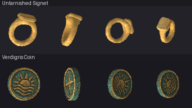

# Two items from one generated surface atlas

2026-10-07 experiment: **Untarnished Signet** and **Verdigris Coin** use one
unchanged 1536x1024 RGB generated atlas. Their saved `.blend` sources remain
independent and authoritative. One combined multiview reference call and one
surface-atlas call served both items, compared with the preceding pilot's one
reference plus one atlas call per item. This is a generation-call count, not
a latency, monetary, texture-memory or draw-call benchmark.

[Before/after](before-after96.png), [plain-material control](surface-control96.png)
and [cardinal native yaws](yaw96.png) retain real viewer output. The native
camera stays side-on; high diagnostic poses rotate the object. These captures
are evidence for review, not owner acceptance or G5/G6 goldens.

The signet has a closed variable-width D-section band, explicit finger opening,
widening shoulders and a solid beveled octagonal unmarked table. Rounded band
faces are smooth; table/bevel planes are flat. An authored 20-degree display
tilt exposes the seal in the side-only viewer. Two components, 536 exported
vertices and 1068 triangles. The coin has a closed stepped profile, recessed
front/back stamp planes, a raised rim and 64 geometric reeds. Broad stamp faces
and reeded facets are flat; rim bevels are smooth. One component, 1154 vertices
and 2304 triangles. The coin stamp's relief shading is mostly generated paint,
not reconstructed relief geometry.

## Allocation and provenance

The [shared atlas](../../../projects/hichaukitoden-game/assets/authoring/items/_textures/relic_pair_surface_atlas.png)
has separate coin front/back and blank signet face regions, plus a gold strip
consumed by both objects and a bronze strip for the coin. Source, compiler copy
and shipping PNG bytes equal the original generated output. No per-item atlas
copies, crops, repaints or independent face generations were used.

[Full prompts and original hashes](generation.json),
[combined multiview original](reference.png), [requested layout guide](layout.png),
[requested/actual allocations](actual-layout.json), [shape calibration](calibration.json)
and [surface/source/region evidence](surface-evidence.json) retain the experiment.
The guide is a deterministic allocation diagram, not generated art. Generation
moved gold from requested y=640..784 to measured y=608..762 and bronze from
y=832..976 to y=795..970. UVs follow measured original pixels with a 4px inset.
Both 512px coin allocations and the 320px signet face are retained; no region
samples a neighboring item's design. Full-atlas RGB opacity and per-painted-face
UV area/presence/assigned-region containment checks pass.

The [signet reference/source board](untarnished_signet-reference-to-source.png)
and [coin reference/source board](verdigris_coin-reference-to-source.png) compare
generated intent with actual saved geometry. Reference views have inconsistent
scales and the signet front exposes its table despite an orthographic request.
Manual opaque-body pixel spans inform construction ratios; hidden band section,
bevels and display tilt are authored. The ring hole is deliberately slightly
larger than its nominal front-view estimate for negative-space readability.
The coin's front diameter and right thickness govern nominal depth; raised rim
adds thickness. These objects are authored approximations, not scans. Actual
source cardinal PNGs are read-only Workbench texture/flat-light captures, which
prove shape and UV placement rather than runtime material response.

## Results and limits

Both sources export independently with exact repeat product bytes and unchanged
source hashes; shipping `compile --check` passes. Every evaluated component has
zero raw nonmanifold edges and positive signed volume. Native candidate/shipping
decoded RGB pixels match. Plain controls preserve exact OBJ bytes and sphere
passes while removing generated `map_Kd` and its UV gain: the first two native
cells change 3589 signet pixels and 5256 coin pixels. This measures generated
surface contribution, not visual quality.

Gold and bronze strip ends are not pixel-identical: 96-sample mean absolute RGB
deltas are 11.56 and 16.78, maximum channels 47 and 94. Their grain and baked
stamp shading remain visible; the seal simplifies the reference's more sculpted
shoulders. The atlas shares a material palette but does not guarantee seamless
art. A later shared-region edit must be reviewed on both consuming sources.
Packing more items would further trade detail pixels against generation calls.

Five host surface-atlas tests, script index (110), asset contract, texture check,
strict prospective corpus review (zero cohort findings), fresh staged G1/G2/G3/G4,
unit and save pass locally. Seven native Effekseer world-effect assertions were
explicitly unavailable. Benign OpenAL cleanup warnings did not change exit codes.
No G5/G6 run or recapture, Linux-byte claim or full-corpus compile was made.
Actual corpus check remains red: 85 stale accepted keys, two inherited duplicate
groups, 33 UV-less items and one shared-file group. Asset regression remains red
with 100 changed model records across the stack. Baselines are unchanged.
50 of 207 referenced items lack matching source names, a coverage count only.

The preceding clock/tome sources, reworked Bone Plate, Curry and Stew are untouched.
Use the [continuous-surface route](../../../tools/blender/CONTINUOUS_SURFACES.md)
for reusable pixel-edge allocation conversion and source-authority rules.
