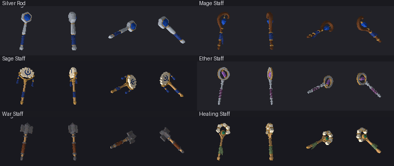
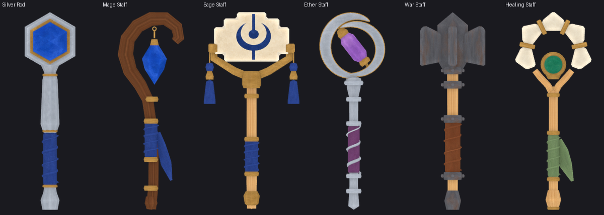

# Six casting weapons with a shared art direction

Silver Rod, Mage Staff, Sage Staff, Ether Staff, War Staff and Healing Staff
gain separate editable sources. The owner requested a larger batch and better
direction after the two complex weapons. The chosen direction is **crafted
ritual tools**: broad distinctive heads, substantial joins and grips, restrained
ivory/wood/metal colour masses, and decoration concentrated on one focal face.
This is an agent-selected study; owner visual acceptance remains open.

## Construction and visual criteria

| Item | Primary identity and actual construction | Named components | Triangles |
|---|---|---:|---:|
| Silver Rod | Fluted faceted body, closed hexagonal rim, inset six-facet sapphire, blunt pommel | 10 | 1,612 |
| Mage Staff | Thick asymmetric timber hook, suspended faceted stone, metal bindings, raised grip wrap | 13 | 2,120 |
| Sage Staff | Stepped stone tablet, open brass fork and lugs, two separate bead/tassel assemblies | 21 | 2,496 |
| Ether Staff | Two opposing closed crescent plates, angled amethyst prism, visible mounts and bridges | 15 | 2,812 |
| War Staff | Heavy iron core and four thick hammer flanges, bolted collars, leather grip | 29 | 2,484 |
| Healing Staff | Five ceramic petals, open halo, brass support/clips, low convex jade medallion, timber shoulders | 24 | 3,356 |

The review asks whether each outline remains identifiable without decorative
paint, whether heads and supporting shoulders read at 96px, whether gaps stay
open, and whether side/back views expose real thickness and attachments. Rounded
wood, grips, tubes and the jade medallion are smooth. Tablet planes, crystal
facets, crescent faces, ceramic petals, iron flanges and faceted rod sections are
flat. Cap fans are flat rather than accidentally smoothing across cut ends.
Engraved-looking tablet marks are painted, not carved relief.

[Before/after](before-after96.png), [cardinal object yaws](yaw96.png) and
[plain-material controls](surface-control96.png) use the actual runtime. The
cardinal probe changes object yaw in a disposable stage; the camera is still
the game's side view. Controls preserve exact OBJ bytes and sphere passes,
replacing the atlas and UV gain with constant allocation-mean RGB times 1.16.
Silhouettes persist; the Sage emblem supplies the largest obvious texture
contribution. Quiet colour variation changes pixels elsewhere, but changed
pixel counts are not a quality score. Fine wraps and small clips simplify at
native size; War Staff remains dark and utilitarian.

The lineup above is a source inspection view, rescaled for the board. It shows
geometry and surface correspondence; it is not runtime lighting or native-size
proof. All 112 raw evaluated mesh components are closed and positive-volume.
This does not rule out every intersection between separate components.

## Multiview and shared surface contribution

Four built-in imagegen calls served six independent constructions: one
[direction lineup](direction.png), two three-item multiview sheets
([A](reference-a.png), [B](reference-b.png)), then one original shared RGB atlas.
[Full prompts, input references, dimensions and hashes](generation.json), the
[guide](layout.png), [requested allocations](requested-layout.json) and
[measured allocations](actual-layout.json) are retained. The phrase
"approved-for-study" in the reference prompt describes the agent's selection,
not owner approval.

The unchanged generated surface is
[`ritual_staff_family_atlas.png`](../../../projects/hichaukitoden-game/assets/authoring/items/_textures/ritual_staff_family_atlas.png).
It contains fifteen material/face regions. Silver, brass, woods, indigo and ivory
are intentionally shared; the tablet has independent front/back marks, and
gem regions are quiet colour clouds rather than photographed facet shading.
No per-item image copies, repaint, upscale or texture bake were used. The atlas
was requested at 2048 square but returned at 1254 square, with displaced panels.
UVs follow the measured original with five-pixel insets; every painted face has
noncollapsed UVs inside its own permitted allocation. Strip endpoints differ;
there is no seamlessness claim, and shared edits affect all consumers.

[Independent view measurements](calibration.json) use manually bounded clips
and opaque connected-body spans. Generated side/back/top views disagree in
scale and details; disconnected gems or tassels can be excluded from a body
span. Source depths were adjusted directly toward right-view width/height
proportions while preserving front X/Z. Hidden joints, supports, bevels and
undersides remain authored. The Healing reference shows five visible petals
despite requesting six; the source follows five plus the lower jade mass.
These are interpreted multiview references, not scans.

Actual source front/right/back/top comparisons are retained for
[Silver](silver_rod-reference-to-source.png), [Mage](mage_staff-reference-to-source.png),
[Sage](sage_staff-reference-to-source.png), [Ether](ether_staff-reference-to-source.png),
[War](war_staff-reference-to-source.png) and [Healing](healing_staff-reference-to-source.png).

## Tooling and verification

The authoring summary exposed stale transform bounds: recently positioned
components could be reported at their previous matrix state. `item_kit.report`
now updates the view layer before measuring. A pinned-Blender regression test
changes child translation/rotation and parent translation after an earlier
update, then checks exact expected world bounds. That test passes.

Ether's coincident bevel-tip vertices passed a raw first repair but collapsed
again at the exporter's six-decimal precision. Direct edits of the saved source
merged only tip vertices within 0.000001 source units, leaving remaining vertex
coordinates unchanged. Export-precision triangle checks and a second independent
compile pass. [First repair](first-bevel-repair.json) and
[final source/depth refinements](source-refinements.json) preserve the evidence.
Neither the compiler nor earlier adopted sources were changed.
[Recorded study scripts](repro/README.md) retain the construction and inspection
methods; the scaffold and saved-source refinement already ran and must not be
repeated on these adopted sources.

[Surface evidence](surface-evidence.json) records source hashes, flat/smooth
faces, region containment, final bounds, exact repeat exports, identical-OBJ
controls, candidate/shipping decoded RGB equality and original/source/compiled/
shipping atlas byte equality. Sources remain authoritative after saving.

Local shipping `compile --check`, texture/asset-contract/index checks, strict
prospective cohort review, staged G1/G2/G3/G4, unit and save pass. Seven native
Effekseer world-effect assertions were unavailable. Actual baselines remain red
and unchanged: 92 accepted corpus keys no longer reproduce, two inherited
duplicate groups, 26 UV-less assignments and one shared-file group. Asset
regression reports 108 changed model records across the stack. Missing sources
are now 42 of 207 assignments; coverage is not visual acceptance. No G5/G6
run or recapture, full-corpus recompile or Linux byte-stability claim is made.
Four calls cover six items; monetary cost, draw-call savings and GPU memory
were not measured.
