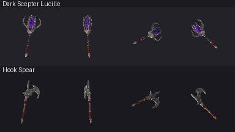

# Complex weapons on one generated atlas

Dark Scepter Lucille and Hook Spear replace two sources missing from the item
library. The owner requested a less simple batch after the signet/coin pilot.
These are independent constructions with one original shared surface image.
Visual acceptance remains open; previous items are comparisons, not a bar that
passing structure alone can meet.

Lucille has 22 named components: tapered shaft, grip and physical spiral lacing,
collars, ferrule, a closed hollow cup, a six-facet opaque crystal, four twisted
cage ribs, two wide horns and their silver ridges. Actual gaps separate the
crystal and ribs. The crystal is intentionally suspended; hidden attachment
and magical support were authored, not recovered from the image. Rounded rods
and cup walls are smooth; crystal facets, collar planes and cap fans are flat.
Its product has 3,012 vertices and 5,936 triangles.

The spear has 15 components: wood pole, heavy octagonal socket, underlays and
raised lacing, collars, butt spike, asymmetric hooked blade and four rivets.
The concave hook, secondary spur, closed blade thickness and cutting bevels
are geometry. Broad front/back surfaces and bevel planes are flat; wood,
rounded grips, lacing and rivet domes are smooth. The blade's construction
modifiers were materialized before first save. Its product has 1,790 vertices
and 3,520 triangles. Engraving is painted, not carved relief.

The Blender-free `path_sweep` library constructs curved elliptical sections
using minimum-rotation frames instead of a fixed world-axis section. Side UV V
follows path distance, U follows section angle, and flat cap fans use radial
patches. It rejects coincident points, reversals and nonpositive radii. It does
not automatically prove self-intersection clearance. Once saved, each `.blend`
is authoritative; do not run the authoring scaffold again.

## Image contribution and correspondence

Built-in imagegen made two calls: one combined front/right/back/top reference,
then one opaque 1536x1024 surface atlas from that reference and the deterministic
guide. [Full prompts and image hashes](generation.json), [guide](layout.png),
[original reference](reference.png), [measurements](calibration.json) and
[requested/measured allocations](actual-layout.json) are retained. The selected
atlas is unchanged at
[`complex_weapons_surface_atlas.png`](../../../projects/hichaukitoden-game/assets/authoring/items/_textures/complex_weapons_surface_atlas.png).

Both sources consume the same silver and leather panels. The spear has distinct
blade front/back and wood allocations; Lucille has crystal and blackened-metal
allocations. The generated panels moved relative to their requested rectangles;
UVs follow the measured original with a six-pixel inset. Every painted face
passes noncollapsed UV and assigned-region containment checks. No per-item PNG
copies, crop, repaint or texture bake are used.

Uniform four-column alpha partitions crossed some silhouettes, so those
automatic bounds are diagnostic only. Manual component spans guide the
construction. The top views differ in scale, and the scepter right view changes
the arrangement of ribs. Hidden joints, talon twist, clearance, thickness and
bevel width remain authored. These objects are not multiview scans.

Native review exposed dark frame faces blending together and silver ridges
hidden inside thicker sections. A direct edit of the saved scepter assigned
visible engraved silver faces and moved its existing ridges outward. The
adopted source was edited rather than regenerated.

## Evidence and limits

- [Before/after at 96px](before-after96.png), [cardinal yaws at 96px](yaw96.png)
  and [plain surface controls](surface-control96.png) use the actual runtime.
  Cardinal probes change object yaw in a disposable stage; the camera remains
  the game's side view. Controls preserve exact OBJ bytes and sphere passes,
  replacing the image and UV gain with constant allocation-mean RGB times 1.20.
  They test surface contribution, not artistic superiority.
- [Lucille reference/source comparison](dark_scepter_lucille-reference-to-source.png)
  and [spear comparison](hook_spear-reference-to-source.png) include actual
  read-only front/right/back/top source renders. Workbench views show geometry
  and UV correspondence; they are not runtime lighting proof.
- [Surface evidence](surface-evidence.json) records all 37 raw evaluated
  components closed and positive-volume, painted-face normals/UVs, assigned
  regions, source hashes, exact repeat exports, candidate/shipping decoded RGB
  identity and original/source/compiled/shipping atlas byte identity.
- Three meaningful host sweep tests, texture/asset-contract/index checks,
  read-only shipping compile, strict prospective corpus review, staged
  G1/G2/G3/G4, unit and save pass locally. Seven native Effekseer world-effect
  assertions were unavailable. No G5/G6 capture or Linux byte-stability claim.
- Actual corpus remains red: 86 accepted keys no longer reproduce, two inherited
  duplicate groups, 32 UV-less assignments and one shared-file group. Asset
  regression remains red with 102 changed records across the stack. Baselines
  were not rewritten. Missing sources are now 48 of 207 assignments; coverage
  is not quality acceptance.

Generated steel wear and crystal facet-like shading remain more prominent than
requested. Fine etching and lacing simplify at 96px, and the swept cage is less
ornate than the reference. Strip endpoints differ; no seamlessness claim is
made. Shared edits couple both consumers. Two calls cover two items, but cost,
latency, GPU memory and draw-call savings were not measured.
