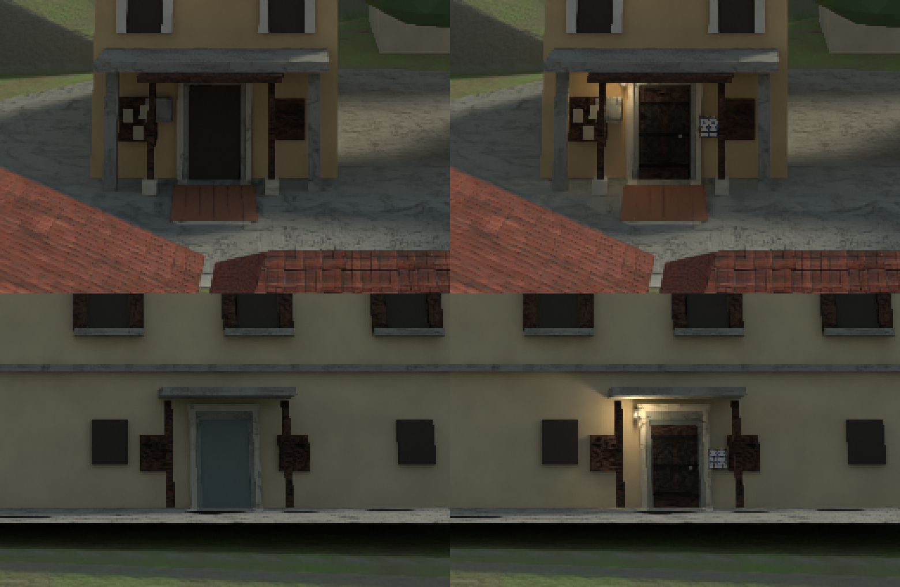

# Passage House exterior: one mark on both faces, 5 October 2026

The Passage House is one building with two street faces: the Registry front on the Praca
and the doorstep on the Cortico. Inside, the two halves already read as one house. Outside,
the doors were different buildings: a near-black leaf on the Praca and a grey-blue one on the
Cortico, with nothing in common.

`tools/blender/add_passage_house_mark.py` adds the same three things to both doors, in the
same places, from the house's own interior vocabulary:

- a dark panelled hardwood leaf with iron bands and a brass ring in the doorway;
- a small blue-and-white azulejo plaque in a stone frame, to the screen right of the door;
- a wrought-iron lantern with a real warm light, to the screen left of the door.

The tool writes a new revision of the adopted island source `st_maria_core.blend` (images
packed so the file travels between folders) and never touches the original in place. The
revision was promoted over the adopted source.

## Plates

The exterior packages are layered 2D plates rendered from that source with their recorded
cameras. Re-rendering the **unedited** source reproduces the shipped Praca plate to a mean
difference of 0.09/255, and two unedited renders differ by at most 1 level, so rendering is
deterministic. Only the two plates that show these doors changed, and they were produced as
**shipped plate + (edited render - unedited render)**: every pixel outside the edit's own
light and geometry footprint is byte-identical to the plate that was approved, so the
unrelated grass-blade differences between renders do not enter. `foreground.png` is
untouched (the additions sit on the facade, behind the actor).

The other seven plates were re-rendered from the new source and compared. They differ from
their shipped versions only by the existing ground-cover variation (a band of grass blades
in the churchyard, a few dozen pixels on the stair and quay), not by this edit, so they were
left as shipped. Their manifests still name the earlier source hash, which is accurate for
how they were rendered; the two changed manifests carry the new hash and
`sourceRevision: passage-house-mark-20261005`.

No frame of G5 or G6 shows these plates. Played acceptance is not claimed.
