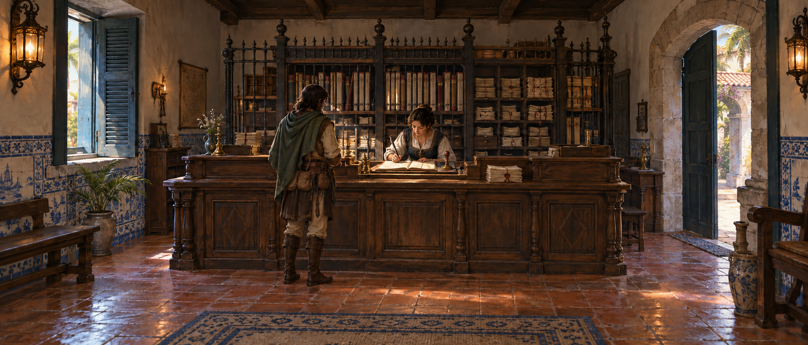
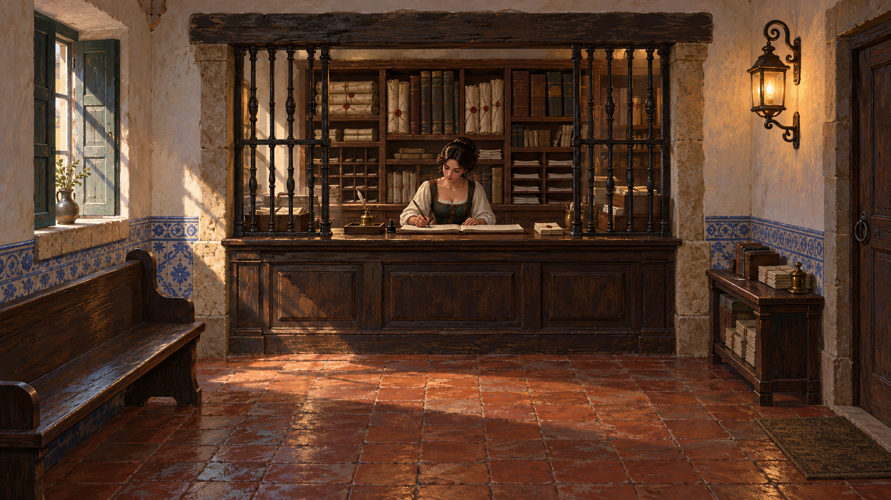
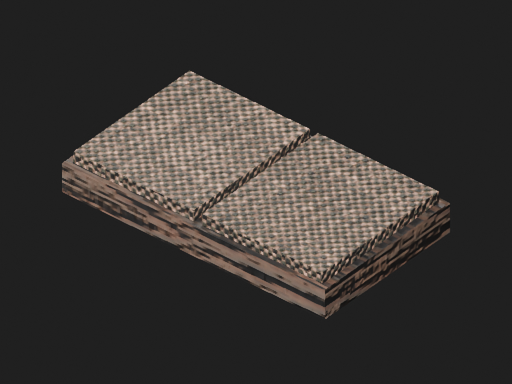
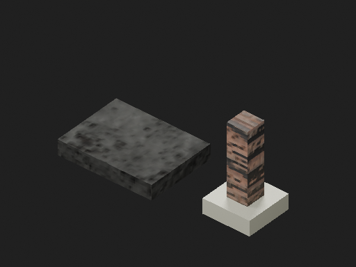

# Registry identity: concepts and individual source parts

The owner rejected the first Registry composition because it reads as another
room. Its domestic table, closed cabinet and almost invisible book cannot carry
the identity of a civic registration office. The new concepts explore an
architectural service point and visible organized records, grounded in Celina's
authored dialogue: she takes a Summoner's seal, records it in a narrow ledger and
issues a Crossing Writ. The current page is sparse; the previous page is full.

## Two distinct composition proposals

The built-in image generation tool produced separate images, retained under
`projects/hichaukitoden-game/assets/authoring/candidates/passage_office/concepts/`.
Exact generation prompts and the targeted correction are in `prompts.json` there.
These are exploratory images, not rendered game frames, measured camera contracts,
historical documentation or accepted Blender source. The model initially inserted
a wall cross into the first image; a targeted edit removed it because this is a
civic office.

**Public service counter.** A substantial panelled counter separates visitor
space from clerical work. Ledgers, document bundles and pigeonholes give the rear
wall a functional silhouette; the bright working ledger makes Celina's activity
the focal point. A restrained archive screen distinguishes it from a shop. The
panoramic composition explores what side space can reveal on a nominal 21:9
surface. Its detailed ironwork and paper texture cannot simply be copied into
runtime geometry; their visibility must be tested at Classic resolution.

**Recessed service hatch.** Thick masonry, a broad inset counter and restrained
side grilles make the service point part of the building. Ordered records are
visible behind Celina; a waiting bench and document tray support the workflow.
This is the stronger direction for the next Blender composition: fewer large
shapes can communicate its purpose at 256px. The counter must sit behind the
walk strip so it does not become a player-occluding foreground board. Door and
arrival anchors still need deliberate placement. The concept's perspective,
figure scale and framing are inspiration; actual runtime camera calibration wins.

## The actual new parts, inspected separately

`inspect_environment_parts.py` rendered six existing furnishings in front,
oblique and top views, each with actual materials and with clay: 36 separate
images. Neutral studio lighting exposes the construction; it does not validate
the room's lighting. `out/registry-workflow/parts-r3/index.html` is the complete
individual-part viewer, and `parts.json` records source hash, dimensions,
materials, triangle counts and native projected bounds.

| Part | What the inspection shows | Consequence for the next authoring pass |
|---|---|---|
| Writing desk | Ordinary tabletop, rectangular legs and minimal rails | Build a substantial service counter and a deliberate inset writing station; its silhouette must identify the office |
| Open ledger | Flat rectangular slabs, cloth texture on pages, timber cover | Paper needs a page block, binding/fold and restrained ruled marks; the cover needs to read as bound material |
| Previous ledger | A thin stack of timber and woven slabs | Give closed registers coherent spines, page edges and varied use/wear |
| Seal and pad | Square stick grip, square plate, no identifiable die | Use a turned grip, neck and circular brass die; keep tiny engraving in a texture where useful |
| Archive cabinet | Generic closed cupboard, contents invisible | Show organized registers, bundles or pigeonholes; storage should explain its function |
| Waiting bench | Short table with no back or distinctive bracing | Give it a supported seat/back and coherent joinery so it reads as waiting furniture |

The open ledger's projected bounds in the captured Classic camera are about
11.04x1.65 pixels; the closed register is 10.61x2.61; the seal-plus-pad assembly
8.22x3.82. These are projected geometric bounds, including occluded geometry,
not measured visible pixel counts. Their narrative significance cannot substitute
for strong room-scale visual identity. The book should be a pale working accent;
the counter, service aperture and archive masses must do the first recognition.
The existing shared wood texture is also too conspicuous on some small pieces
and poorly aligned with their intended joinery/grain; adding polygons alone
will not resolve that material problem.

## Dependency repair and verification

The earlier handoff copied revision 2's `.blend` as raw bytes to a deeper
directory without rebasing relative image paths. The first isolated beauty
inspection consequently reported missing texture files and is marked invalid
under `out/registry-workflow/parts-r2/INVALID.txt`; those images are not evidence
for actual material appearance. The original source under `out/` still resolves
its dependencies. It was opened, validated and saved as a new packed revision:
`assets/authoring/candidates/passage_office/passage_office_r3.blend` inside the
game Project. The local ownership manifest supersedes the broken copy and records
the new source as scaffold/workflow evidence; rejected room art is not adopted.

Revision 3 embeds all 24 used image dependencies and preserves the original file
and upstream texture files. Corrected part inspections completed without missing
images and verified that the source hash was unchanged. The new dependency guard
also runs before room export and source review. A real Blender regression fixture
proves that moving a source with missing relative images fails and that a packed
source succeeds after relocation. The new packing tool refuses an existing
destination or linked libraries and writes dependency provenance beside the source.

The packed source was exported successfully through the existing Cycles pipeline.
Collision and material-library bytes match the earlier working export. OBJ
differences are the two group labels carrying the revision filename; geometry
and UV lines match. The atlas is not byte-identical: 36 pixels differ by a maximum
of one channel value out of 255. This small measured residual is retained in
`out/registry-workflow/packed-source-export-parity.json`; it is not concealed as
byte identity or used to recapture a golden. Packing repairs dependency closure;
it does not turn the rejected composition into an accepted Registry.
