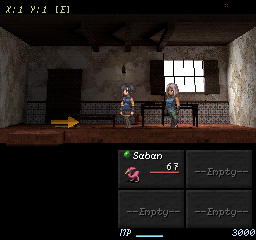
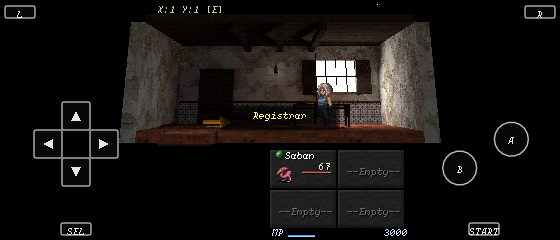

# Passage Office / Registry workflow experiment

The Registry has a new editable scaffold candidate and a repeatable staged review
workflow. The retained document is
`projects/hichaukitoden-game/assets/authoring/candidates/passage_office/passage_office_r3.blend`.
Its local source manifest records scaffold ownership. It has not been adopted or
connected to shipping geography. Further authoring belongs in this document;
the recipe is a first-scaffold tool, not a replacement for hand edits.

Owner feedback rejected the composition as a generic room. The concept and
individual-part review are recorded in
[the follow-up](passage-office-concepts-and-parts-2026-10-02.md). Revision 2's
retained copy also had broken relative image paths after relocation; revision 3
is saved from the working original with those dependencies packed. The timings
and frames below came from the working original under `out/`, not that broken
copy. They remain historical workflow evidence, not accepted art.

The composition comes from Registrar Celina's authored commands in map 17 and
the arrival walkthrough: a narrow ledger, seal registration and the Crossing Writ.
The room includes a writing desk beneath a shuttered window, an archive cabinet,
a visitor bench and an outward exit threshold. Shared `ledger` and `seal_stamp`
furnishings extend the existing room grammar. No new gameplay semantics were
invented. The stage reuses Celina's actual commands and retained sprite.





## What the experiment changed

The first scaffold placed the writing desk opposite its window. Revision 2 was
edited from that existing source, preserving revision 1 separately, to move the
desk beneath the window and the waiting bench opposite it. The first-scaffold
recipe now describes that layout. The room remains an early visual study: the
desk, book and seal have weak native-size prominence, and the cabinet reads very
dark. Passing data and runtime tests is not acceptance of those choices.

The reusable capture tool now emits the actual runtime camera records, at each
position and surface, and source review consumes those records. Older room
previews used the fixed calibration while this staged interior uses its authored
pitched camera; comparing those views confounds camera and bake differences.
Native captures use Classic 256x240, 4:3 320x240, Wide 426x240 and the runtime
device resolver with a supplied nominal 2100x900 host, yielding 560x240.
That last view includes touch controls in the added side space. It is desktop
simulation of 21:9, not evidence from the owner's Galaxy Note 20 Ultra, its real
viewport, safe insets, touch response or Android performance.

The runner also requires a fresh run directory, hashes the source before/after,
restores temporary native capture hooks in `finally`, pins presentation settings
without writing the owner's preferences, and forces Python failures to produce
a nonzero Blender exit. Capture safety tests exercise refusal of a shipping root
and restoration after a subprocess failure.

## Matched atlas comparison

Both alternatives use exactly the same revision 2 source, Cycles GPU/OPTIX on the
GTX 1650, 64 samples, neutral exposure, packed UV allocation and chart-isolated
OIDN. Source SHA-256:
`ca04918d40ca0c15a4c432dd80f9f6cdcb91260d1b552420e3ce97e8931eb24a`.

| Atlas | Whole export process | Reported package bytes | Triangles / vertices |
|---|---:|---:|---:|
| 1024 | 24.903 s | 1,783,490 | 760 / 496 |
| 512 | 17.253 s | 521,549 | 760 / 496 |

These are one fresh Blender process per alternative, not repeated cold/warm
statistics. The smaller package is about 71% smaller and its measured export
about 31% faster. The pipeline reports package bytes; this is not a total archive
or installed-storage measurement. Across 20 unobstructed frames the mean absolute
RGBA channel difference averaged 1.923 on a 0-255 scale. This descriptive
measurement is not a fidelity threshold or visual gate. Native inspection found
texture/edge changes, while the composition and geometry remained the same.
512 is useful for a faster explicit lookdev pass; the maintained export default
remains 1024. More atlas resolution does not fix weak furniture prominence.

## Evidence and reproduction

`out/registry-workflow/revision2-1024/` and `revision2-512/` retain each package,
stage, source beauty/clay, 40 native frames, per-step logs, timings and review HTML.
`out/registry-workflow/comparison.json` retains decoded-frame differences;
`out/registry-workflow/compare.html` presents the alternatives and camera views.
Those paths are local run evidence; the retained source and representative images
are versionable artifacts. Desktop UI captures were subsequently repeated with
explicit pinned settings under each run's `review/ui-pinned/`; earlier captures
remain separately preserved. Source cameras and unobstructed comparisons are
unchanged by that settings correction.

To reproduce from the preserved source, set `BLENDER_EXECUTABLE` to the pinned
Blender 5.2.2 executable and run:

```powershell
python tools/blender/registry_workflow.py --source projects/hichaukitoden-game/assets/authoring/candidates/passage_office/passage_office_r3.blend --output out/registry-next-review --exit-y 1.0833 --npc-y 5.5333
```

Use a different new output directory and `--atlas-size 512` for the alternative.
`--device WIDTH HEIGHT` accepts a measured usable viewport for a later device
review. This is a Registry-specific staging wrapper over reusable capture and
source-review tools; it is not yet a general environment-authoring front end.

G1 passed for both atlas candidates. The full staged unit suite passed on the
original and revision 2 1024 stages; the native Effekseer assertions were enabled
(161 Map Transfer assertions passed). Two capture-safety tests, Python syntax,
Node syntax, source-authority checks and vendored-library hash checks passed.
Shipping map/content files and adopted environment sources were unchanged;
no golden references were recaptured. Owner visual/traversal acceptance, physical
phone testing and shipping integration remain separate from this workflow proof.
