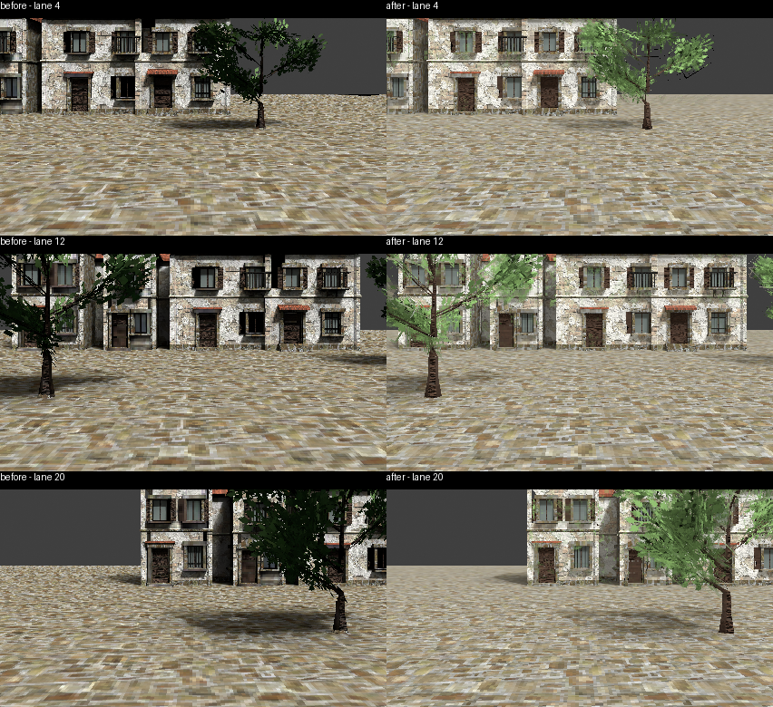

# Praca foliage alpha correction (2026-09-30)

The EEVEE projection previously wrote alpha 1 across the entire atlas. Its opaque UV override also hid the geometry behind alpha cards. Cycles flat baking set transparent bounces to zero, which removes direct light through transparent cards. A small checker-cutout and transparent-occluder control measured mean RGB 0.285 with zero transparent bounces versus 0.360 with eight, with the same source, lights and receiver.

`atlas_alpha.py` now preserves source UVs and evaluates Principled opacity independently of beauty. A temporary mesh in atlas UV space rasterises opacity with EEVEE; this adds no Cycles dependency to the EEVEE exporter. The projection UV pass uses binary coverage at the runtime discard threshold so surfaces behind leaf gaps can contribute their own texels. Both backends receive the same cutout alpha; Cycles flat beauty allows eight transparent bounces. Package photographs and study atlas materials share the alpha-aware unlit renderer.

The shipping Praca render atlas is regenerated at 2048 square, EEVEE, 0 EV, supersample 3. Only render artifacts, bounds/stats and bake provenance are promoted; shipping anchors, collision, material and plate settings are preserved. The adopted Blend is unchanged. This is a backend transition as well as an alpha correction, so the full image difference is not attributed solely to alpha. These are same-camera package photographs, not owner gameplay acceptance or absolute G5 sign-off.

Validation: real exporter fixture proves cutout coverage for both backends and unchanged package geometry; a flipped-atlas-UV control proves original-UV coverage and rejects geometry-dependent alpha. Backend plus exterior-source suites passed 18 tests before the final UV-pass threshold adjustment; the final backend suite passed seven tests. Final-package G1 and the staged full-unit suite passed. Native Effekseer remains unavailable locally (seven world-effect assertions unexercised); CI supplies repository gates.

The opacity adapter supports UV-based Principled alpha. Geometry-dependent alpha and Transparent-BSDF graphs fail explicitly rather than being exported as opaque.
