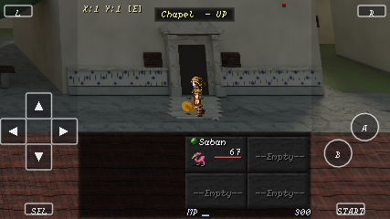
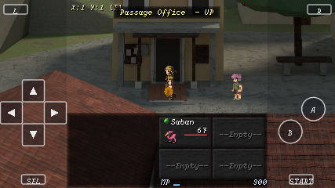
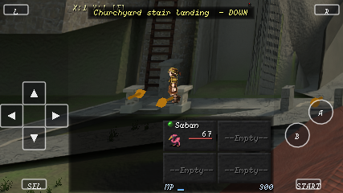

# Praca entrance pass, 4 October 2026

The chapel, Passage Office and churchyard stair mouth were difficult to distinguish
while walking. Their entrances relied on similar dark door rectangles and thin
approach bands. This pass edits the adopted `st_maria_core.blend` directly.

The chapel has a limestone portal with a small pediment, a blue-and-white ceramic
dado and pale forecourt slabs with dark stone insets. The Passage Office has a
timber porch, clay paving and a noticeboard. The churchyard stair mouth has two
low limestone piers. The separate tall wooden service ladder remains visible.
Both forecourt patterns follow their existing physical approach lines.

The camera, walking profiles, transfer positions, solid 3D arrows and event
commands are retained. No new navigation screen is added. The island source
retains its earlier scenes and objects; the additions are grouped under
`Praca architectural approaches`. The source SHA256 is
`5182e990e8c1c81cfb3264b2eb5ed096389fd2fb4a4f3fe58f98c16468d69f44`.

All nine exterior packages were rendered from that source using their existing
`provenance.plateRecord` cameras, Cycles draft quality (64 samples, seed 3201)
and the source lighting. Their dimensions are unchanged, and all nine manifests
record the new source hash. The preserved B18 study contract remains historical
evidence; it has not been rewritten to describe this revision.

The first stone-pier placement intersected the walking strip in the clearance
probe. Moving the piers 0.63 metres toward the camera cleared all 275 sampled
points, with centre and four 0.25-metre offsets at three body heights. This is a
static authoring probe, not a swept runtime-body claim.

Native review covers five Praca positions across Classic, 4:3, Wide and a
simulated device surface. The phone transfer harness also captures all 33
directed zones and passes 104 radius-boundary checks. The progression route
passes 31 transfers through all six public interiors, Agnes's greeting, the pub
conversation, preparation, Labyrinth entry/return and save/load. The seven Laura
dialogue paths pass.

G1-G4, the full staged unit suite (including native Effekseer world assertions),
save/load, town connectivity and adopted-source/package checks pass. Absolute G5
is red on the base and candidate: the same 68 Classic and 31 Wide differing
frames have identical decoded RGBA pixels. Existing reference debt remains
#1331/#1365; no references were recaptured. These G5 scenes do not capture the
new town plates; the native captures provide that review. G6 was not run because
Studio is unchanged. Physical-phone play and final art acceptance remain open.

This branch includes main's developer CRT addition from PR #1373. Its public
output choices and the authored town cameras are unchanged.

