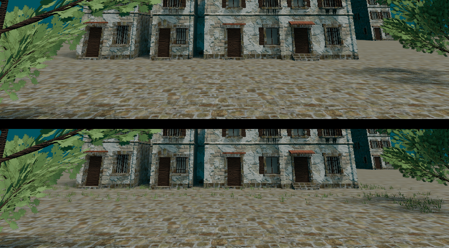
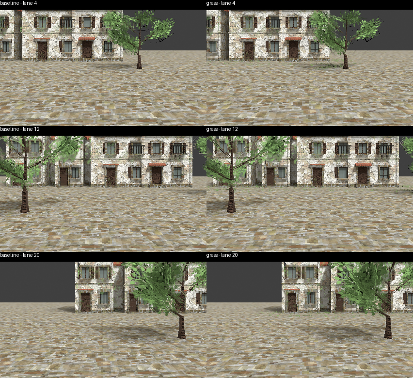
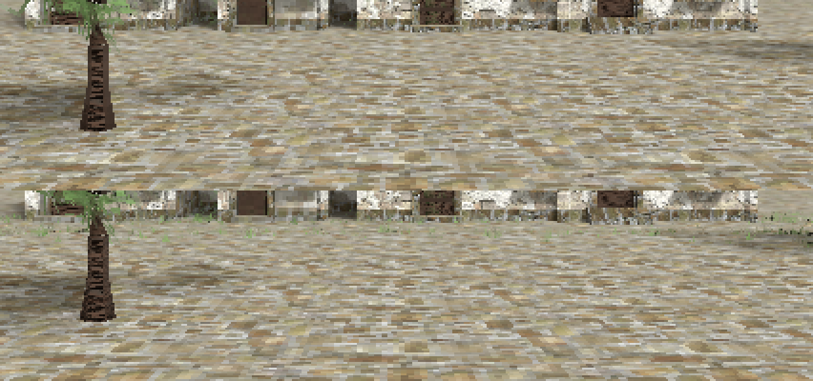

# Adopting the ground cover into the Praça: the evidence (2026-09-30)

Layout **E** (building bases, tree rings and lane edges), 375 tufts, chosen by the owner. The recipe
(`tools/blender/recipes/adopt_praca_ground_cover.py`) was run on a **copy** of
`st_maria_praca_modelled.blend`; the adopted document in the repository is unchanged, and adopting
into it needs the owner's sign-off on the result below (#1270).

## Plate comparison at the camera contract

`praca-ground-cover-adoption-2026-09-30/plate_zoom_before_after.png`: the right-hand lane at 3x,
before and after, plate camera at 906 x 240, EEVEE, native size, no film filter, the rows the menu
covers dimmed. `plate_before_after.png` is the whole frame with a difference strip. Cover shows
along the building bases and the lane's back edge above the menu, and as a tree ring in the menu
band. The whole-frame difference is small by construction (mean 0.94 of 255; 2.5% of pixels differ
by more than 8): 375 tufts of 0.34 m are about 9 px each.

## The full bake

Two exterior bakes, same Blender (5.2.2), same arguments (the exporter's defaults, 2048 atlas, 24
samples Cycles), one on the unmodified document and one on the adopted copy. The baseline
reproduces the shipped package, which is what makes the comparison mean anything.

| | shipped | baseline (no cover) | with cover |
|---|---:|---:|---:|
| triangles | 5,854 | 5,854 | **7,354** (+1,500) |
| vertices | 5,084 | 5,084 | **8,084** (+3,000) |
| atlas non-black | 43.5% | 43.5% | 43.2% |
| atlas texels with alpha < 255 | 9.47% | 9.47% | **11.34%** |
| package size | | 5.00 MB | 5.25 MB (+250 KB) |
| bake time | | 1,130 s | about the same |

- **Geometry:** the baseline's vertex positions equal the shipped package's exactly. Every one of
  the baseline's 5,084 vertices is present in the cover bake, plus 3,000 new ones (375 tufts x 8),
  all between z = -0.22 and 0.31, i.e. on the ground. The vertex *order* differs (the cover sorts
  ahead of the studies in the join), so the file does not extend the old one line for line.
- **UVs:** adopting the cover repacks the whole atlas, because the exporter regenerates the layout
  on every bake (the ground-share step and the packer run again with a different total). Nothing
  keeps a texel where it was. The baseline's UV count differs from the shipped one by 11 (9,344 v
  9,355) though every position and face matches: the OBJ writer's UV de-duplication moved between
  the Blender that baked the shipped package and 5.2.2, and is not the cover.
- **Alpha:** the grass cards' transparent gaps survive the bake. Texels with alpha < 255 rise from
  9.47% to 11.34%, the gaps between blades; unreached texels stay opaque black as designed.
- **Atlas budget:** the 1,500 cover triangles take **7.5% of the atlas** by UV area (about 315k
  texels of 4.2M). That is more than the ground (3% by design) for 375 tufts, because the cards are
  unwrapped at the same texel density as a facade. Worth knowing before adding more cover.
- `environment.mtl` and `collision.obj` are byte-identical across baseline and cover, and the mtl
  equals the shipped one.

## Checks and gaps

- `test_ground_cover_adoption` (7 tests, Blender): the real document is never touched, nothing that
  existed changes, only cover datablocks are added, a second run writes nothing, and every tuft is
  inside the budget, out of the lane, out from under the buildings and inside the frame.
- The first full bake of this work **did not contain the cover**: the recipe had linked its
  collection to the scene rather than under `TH_SOURCE`, which the exporter walks. Nothing in the
  bake log complained; the triangle count did not move. The test now asserts membership.
- Not run: G5/G6 (no golden frame shows the Praça 3D package; the plate is the 2D image and does
  not change), and the game window. The shipped package is not regenerated by any of this.

Agent-Signature:
  platform: Claude Code (desktop)
  model: Sonnet 5.5
  role: implementation
  task: "#1270 adoption evidence"

## EEVEE candidate after the alpha correction (#1270)

Built from main at `3acc8c1e` with the current exporter, after #1292. The owner authorized a candidate on a copy; the adopted source and shipping package remain unchanged. The copied source is under `out/praca-grass-candidate/source/st_maria_praca_modelled.blend`; its relative asset references were remapped while making the copy, and unused authored datablocks were retained. Layout E_mixed, seed 1, budget 375.

| Measurement | Current shipping | Candidate |
|---|---:|---:|
| triangles | 5,842 | 7,342 |
| vertices | 4,979 | 7,979 |
| atlas dimensions | 2048 square | 2048 square |
| tufts | 0 | 375 |
| grass triangles | 0 | 1,500 |
| grass island texels | 0 | 87,903 |
| transparent grass texels (alpha below 0.1) | 0 | 48,557 |

All 375 tufts are inside the source plate frame: 238 above the menu band, 137 inside it. None are inside the walkable lane or under buildings. Every existing render-mesh vertex is retained, with exactly 3,000 added vertices. The grass has lit green texels and cutout gaps; it is subtle at native size. The recipe is idempotent and remains surgical, as checked by the existing adoption suite.

Both package views use neutral-EV EEVEE atlases and the same nearest-sampled unlit camera. The source plate uses the existing placement-study preparation and authored camera; it is a source illustration, not the shipping 2D plate. Atlas repacking changes some baseline texels, so the complete image difference is not solely added grass.

The raw regenerated manifest carries source anchors that differ from the shipping anchors, and its collision differs as well. `out/praca-grass-candidate/review-package` therefore combines only candidate render artifacts, bounds/stats and bake provenance with shipping metadata, collision and material. That review package was installed only in an isolated canonical Project stage: G1 passed and the full staged unit suite passed. Fourteen ground-cover/adoption tests passed, including idempotency and unchanged source hash. The adopted Blend SHA-256 is unchanged. Seven native Effekseer world-effect assertions remain unexercised locally. No runtime visual/owner PLAYED acceptance or golden recapture is claimed.

Placement/alpha metrics and artifact hashes are beside the images. The candidate Blend and full packages remain local under `out/praca-grass-candidate`; this draft PR records evidence only and does not adopt or ship them. Per #1270, the next step is owner visual sign-off before source adoption.

Agent-Signature:
  platform: Codex desktop
  model: platform-selected/unknown
  role: implementation
  task: "#1270 EEVEE grass candidate on a copy"
  base: 3acc8c1e
