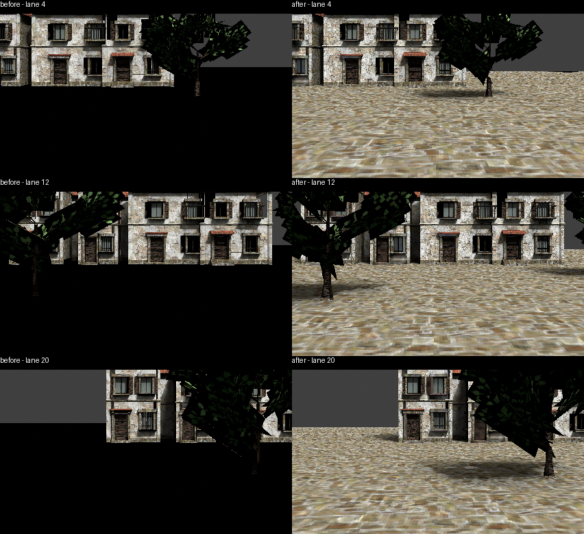

# Praça ground package verification (2026-09-30)

The regenerated Cycles package from `out/praca_regen2/praca` replaces only the shipping render mesh and atlas, plus manifest bounds and stats. This regeneration is covered by the owner instruction to fix #1287. Shipping anchors, collision, material, provenance and plate settings are preserved. The adopted source Blend was not edited.

Both packages were photographed with `photograph_room_package.py`, Blender 5.2.2, the same unlit nearest-sampled material and lane cameras. Paving is visible in all three after views. These are package photographs, not gameplay acceptance or absolute G5 evidence. Foliage remains dark in the Cycles atlas.

Validation: G1 `VALIDATE OK`; full staged unit `ALL UNIT TESTS OK`, including 64 baked-environment-package checks and 260 bounded-lane checks; environment source records check passed. Native Effekseer was unavailable, so seven map-transfer world-effect assertions were not exercised. The new backend and ground exporter tests passed in the branch's previous item-source CI run; CI is rerun on the installed package commit.

EEVEE remains opt-in. Praça exposure, source ground-cover adoption and material specular decisions are deferred to the owner.
