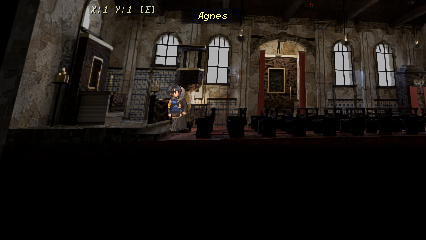
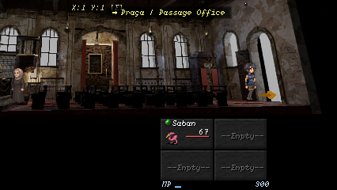

# Church plate on map 22, 4 October 2026

The owner rejected the rectangular chapel and asked for a better one. The result
replaces the baked 3D chapel on map 22 with a pre-rendered `layered_2d` plate of
a new church, in the dim "vigil" grade, drawn from the oblique runtime camera.
Both layouts and four lightings were reviewed as contact sheets before this one
was chosen; the layout is the owner's and is not to change.

## The room

`tools/blender/recipes/st_maria_church.py` (masonry helpers in `church.py`). A
cruciform plan: the far wall steps back into a transept chapel under a segmental
arch, so its gilt-framed altar is the one retable seen front-on. The nave wall is
an arcade of round-headed windows between pilasters under a cornice, over an
azulejo dado; the chancel carries a tall azulejo panel, a communion rail and a
pulpit. Red drapes frame the transept, a confessional stands by the arched main
door, and brass lamps hang from tie beams under the pitched roof. Terracotta nave
floor, stone chancel. Both retable recesses stay empty, as in the first chapel.
The source is `st_maria_church.blend`, adopted (packed, so it moves cleanly).

## Plate and foreground

- **The plate camera is the runtime camera.** Tracking only slides a projection
  window across a fixed camera, so the plate is that camera at 582 px wide
  (426 plus the +/-78 px tracking range). The record comes from
  `presentation.world_camera_calibration`, in engine lane space, and is mirrored
  into Blender space (`engine_y = 8 - blender_y`) for rendering. Nothing is
  approximated.
- **Two layers.** `background.png` is the whole room. `foreground.png` is a
  transparent cutout of the front pew bank (`stage_room_model.py --matte
  pew_front_`; the rest of the room is holdout, so it still bounces and shadows
  light). The runtime draws it after the player, who walks behind the pews.
- **`build_layered_package.py`** writes the manifest and derives the player
  projection from the same record. The runtime places the actor with the map
  camera's real projection, so the oblique plate stays consistent with it.

## Scale

The player is solved to 48 px at the mean of the walk (lane Y 3.6 to 15.4), not
at the middle of the hall. Distance and yaw are unchanged; the lens became
`fovDegrees` 41.1625 with `projectionWindowOffsetY` -58.508. Along the walk the
player measures about 53 px at the altar end, 48 at the mean and 44 at the door
end. That spread is expected: the aisle cannot run parallel to the picture
plane, because the pews bound it. Plate mode draws the player at a constant size,
so the plate varies around that rather than the reverse.

## Verification

Native frames at lane Y 3.6, 6, 10 and 14.8 on classic, 4:3, wide and device
surfaces. Desktop simulations, not phone acceptance. Owner PLAYED acceptance is
not claimed.

