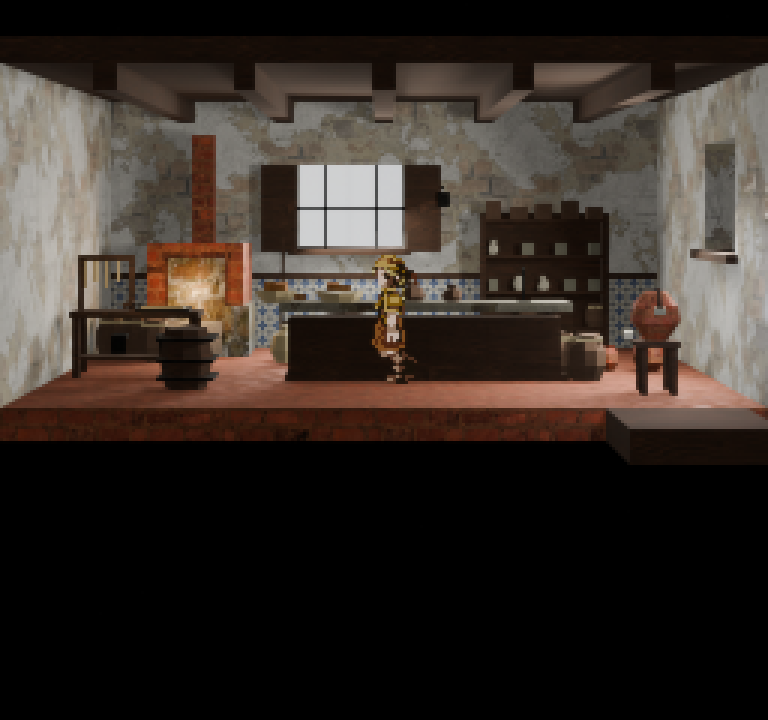
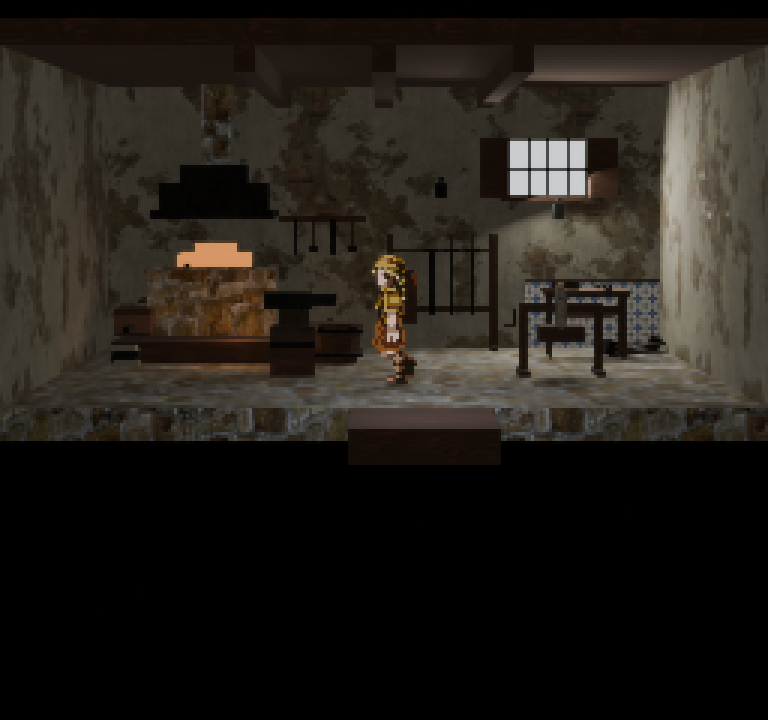
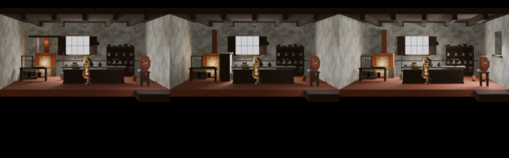
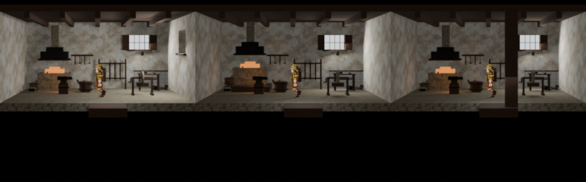
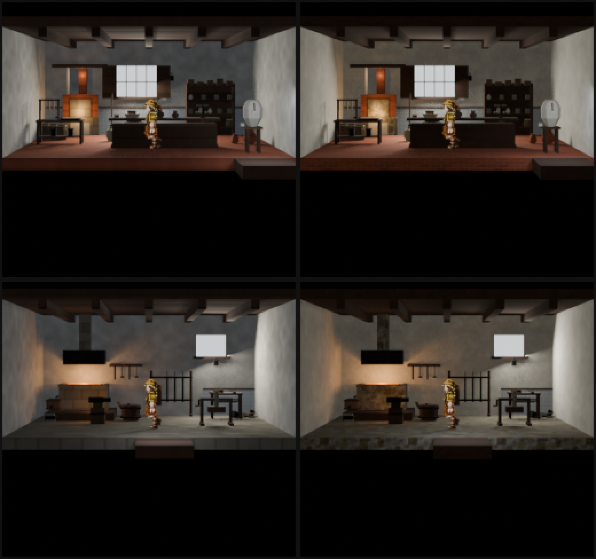
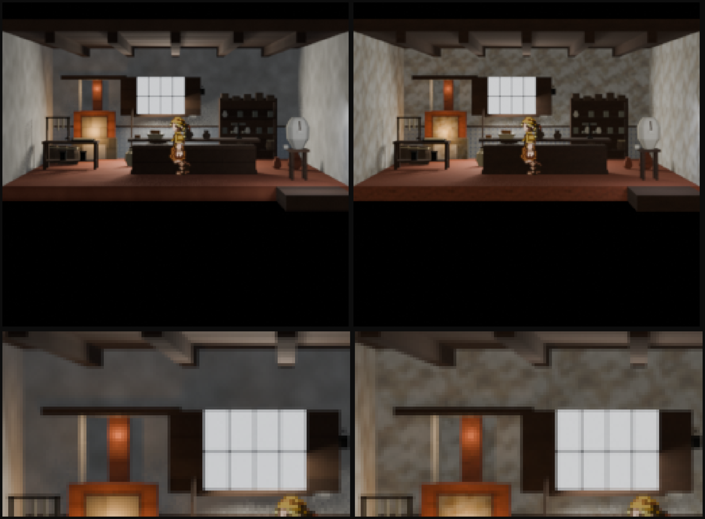
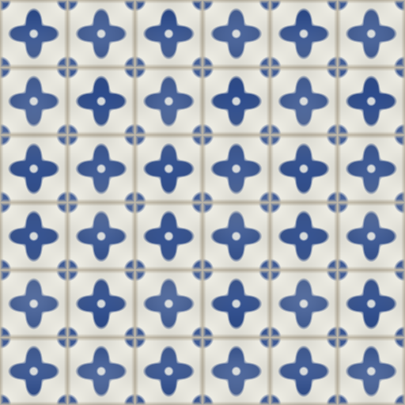
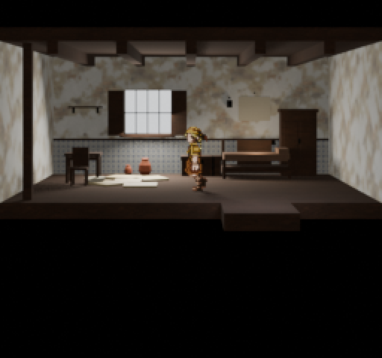
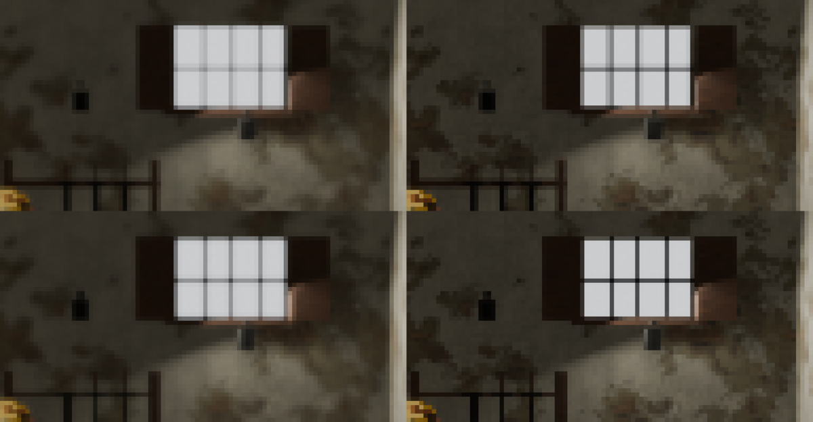

# Alicia's Padaria and Laura's smith — authoring report, 26.08.2026

Two authored interiors, and a materials pass that turned out to be the larger
half of the work. Both maps are built and their `.blend` documents are in
`projects/hichaukitoden-game/assets/authoring/environments/`.

The design context for the two places is
[`docs/design/st-maria-shop-briefs.md`](../design/st-maria-shop-briefs.md).
The grammar they are written against is
[`docs/design/st-maria-interior-authoring.md`](../design/st-maria-interior-authoring.md).

| | Alicia's Padaria | Laura's smith |
|---|---|---|
| Recipe | `tools/blender/recipes/alicias_padaria.py` | `tools/blender/recipes/lauras_smith.py` |
| Axis spent | **side window** | **platform** (raised hearth) |
| Plan | 8.27 × 6.8 m, ceiling 3.7 | 8.27 × 6.4 m, ceiling 3.9 |
| Floor | terracotta | stone |
| Walls | `whitewash` | `old_limestone` — soot, not limewash |
| Key light | oven mouth + raking daylight | the fire, and almost nothing else |

---

## 1. How the axis was chosen

Three variants of each map were built, differing by **exactly one axis** and
otherwise running the identical furnishing program, so a comparison measures
the axis rather than the dressing. All six were rendered at Classic 256×240 and
put through `tools/design-critique/critique_renders.py` head to head.

- **Padaria — side window won.** The alcove read best for the oven but left
  the room a museum of three prop zones; the partition was called "image A with
  one slab added… a dark unreadable silhouette that eats the left third".
- **Smith — platform won.** The raised hearth gave the fire mass; the
  foreground post "becomes the loudest character" and cost more frame than it
  returned.

Both results agree with the grammar doc's own ranking of the axes, which was
measured the same way. Raw replies with model provenance are in
`out/shops/critique-*.json`.

### The review that mattered most

The round-2 smith review could not tell the smith from the bakery: *"The
forge/oven form is ambiguous: it could be a bread oven, smith forge, or
fireplace."* That is the pair failure the brief exists to catch, and it was
worth more than either axis verdict. What fixed it was not a prop:

- the smith's walls went to `old_limestone` — **the colour of the largest
  surface in the frame is the cheapest thing that tells two rooms apart** at
  256 px;
- ceiling beams 5 → 3, the same grammar reading as a different roof;
- the anvil was staged forward, enlarged and put in the fire's throw, because
  an anvil on its stump is the one silhouette that says *smith* unaided.

---

## 2. The materials pass

The placeholders carried material *family* and nothing else, which is why every
St. Maria interior read flat. Nine materials are now real: eight sourced from
**ambientCG** under **CC0-1.0** with source, licence, retrieval date and
per-file hashes recorded, and azulejo authored in-repo.

Tooling: `tools/materials/fetch_cc0_materials.py`,
`tools/materials/make_azulejo.py`. Validate with
`python tools/blender/material_library.py check`. Whole library: 5.8 MB.

### The semantic ID owns the colour; the sourced set owns the structure

`Plaster004` averages a mid grey (155, 154, 150) because it was shot on an
overcast day, while `whitewash` is declared warm off-white (232, 228, 218).
Bound raw it turned every limewashed wall into grey concrete — the first thing
the colonial Portuguese vocabulary says not to do. Every map is now
**mean-matched** to what `materials.json` already declares, so the photograph
keeps all of its variation and only its average moves.

Contrast is separately flattened per material where a source's patching would
fight the props: relief and baked occlusion keep full strength, only the paint
stops shouting.

### No normal maps, deliberately

Everything is box-projected from **world position** with no UVs anywhere in the
vocabulary, so a tangent-space normal map has no tangent basis to be
interpreted against — it would look bumpy and mean nothing. The
projection-independent equivalent is **displacement through a Bump node**,
which is what `height` is here. AO is multiplied into base colour, per the
standing rule that contact darkening is baked into the texture and never spent
as direct light. Sets that ship no AO get a cavity map derived from their
displacement, recorded as derived.

### What relief can and cannot do here — measured

Three things were tried against rendered comparisons. **Two did nothing:**

| Change | Result |
|---|---|
| Bump strength 0.85 → 4.0 | No visible change |
| Halving tile size on a smooth material | No visible change |
| Choosing a material that *has* structure | The whole difference |

The vocabulary is keyless by design ("no sun, no key"), so lighting is close to
uniform and a perturbed normal barely changes what a surface reflects. Bump is
nearly free here and nearly useless. `Plaster004` is smooth plaster with a
nearly flat displacement — there were no crevices to deepen.
`PaintedPlaster016` is limewash over masonry and its coursing survives to the
frame.

So crevice depth comes from **albedo and its baked occlusion**, at a tile size
that keeps features above a pixel.

### These are backdrop textures, not live-environment textures

**This section is a correction.** An earlier pass of it reasoned about feature
size alone, got the balance wrong, and made the problem worse. The owner's
observation is what fixed it: textures for low-resolution pre-rendered
backgrounds operate on different logic from textures for live environments, and
the proof is that these looked *good on close inspection* and turned to fog at
native size.

The measurement that settles it is **texels per screen pixel**. At 27.4 px/m:

| material | m/tile (before) | texels per screen px | feature px |
|---|---:|---:|---:|
| whitewash | 2.80 | 6.7 | 7.7 |
| terracotta | 1.40 | **13.3** | 3.8 |
| dark_wood | 1.00 | **18.7** | 2.7 |
| azulejo | 0.90 | **20.7** | 2.5 |

Seven to twenty-one stored texels behind every pixel that reaches the frame.
Mipmapping then averages all of it away. The detail was real; it never
survived. A backdrop texture wants **one to three texels per screen pixel** and
its carrying feature at **eight to fifteen pixels**.

Raising `worldSizeMetres` moves all three the right way *at once*: the feature
grows on screen, the texel density falls toward one, and the tile repeats fewer
times across the wall. Architectural surfaces now sit at 3.2–4.6 m and props at
1.6–2.0 m, because world-space projection gives one scale to a whole wall and
to a jar alike.

**The mistake worth recording:** when an adversarial review called the wall
*"generic chevron wallpaper"*, the tile was made SMALLER and its contrast
flattened to 0.38. That treated the symptom. The repetition was visible
*because* the features were too small to read as anything else, and flattening
then removed what little the surface had left. Bigger features at full contrast
fix both — the wall now crosses in under two tiles.

Two supporting steps, since a photo downsampled this hard arrives with its
contrast averaged out of it: contrast is scaled per material and may **boost**
as well as flatten, and an unsharp pass restores the local contrast the resize
removed, because a soft edge at three pixels is no edge at all.

Contrast is tuned per material rather than per scale, and the pair proves why:
at full strength `PaintedPlaster016`'s exposed-masonry patches become brown
continents that read as damp on Alicia's wall — while the identical mottling on
Laura's sooted walls reads as soot and is left alone.

### Azulejo is authored, not sourced

Every blue tile a CC0 library offers is modern bathroom or pool tile. Azulejo
is the most identifying surface in a colonial Portuguese room, and a generic
blue tile there reads as a bathroom — worse than the placeholder.

On screen the dado is about **five pixels tall**, so the motif will never be
resolved and what survives is the band's average colour. The old placeholder
averaged (199, 210, 217), a hair off white, and disappeared against limewash —
which is why no render in the first pass showed a dado at all despite every
room having one. The cobalt is now laid at real strength and coverage; the mean
is (178, 184, 192) and the band reads.

---

## 3. Grammar and capability added

- **`Interior.surface(z)`** — build *on* something. Every furnishing places
  from its footprint centre and builds up from z=0, so nothing could ever stand
  on anything and every counter had a bare top. Blocks nest.
- **Six furnishings**: `wax_bench`, `cloth_bundle`, `stock_shelf`,
  `water_stand` (bakery); `scrap_heap`, `grindstone`, `fine_bench` (forge).
- **`_revolved(tilt=)`** — lets a solid stand on its edge, which is the only
  way this vocabulary can make a **wheel**. The grindstone is the one curve in
  it that reads in elevation rather than in plan.
- **`counter(top_mat=)`** — a stone slab. A dark carcass with a dark top is one
  unbroken mass across the middle of the frame and anything on it disappears.
- **The forge's fire is visible.** A flat ember bed is a horizontal plane seen
  edge-on from a level lens 18 m away: it lit the room and was itself
  invisible. The coals are heaped proud of the rim now, which is also what
  banked coke looks like. The hood is a taper rather than a slab, so it catches
  the firelight instead of reading as a black bar.

---

## 4. Traps found, worth not re-finding

- **The `.blend` freezes its material node graph.** `build_material` runs at
  recipe time. Re-fetching textures changed the image files and showed up
  immediately; changing the node graph did nothing until the `.blend` was
  rebuilt. This made the first two relief experiments read as false null
  results.
- **The baseline fill was blue** — (0.62, 0.66, 0.74) — which is why interiors
  read cold grey whatever colour the limewash was. It is the largest light in
  any of these rooms, so its cast is the room's cast. A shuttered, thick-walled
  interior is not lit by open sky. Now warm, and overridable with `--fill` for
  exteriors, where blue is right.
- **A weak judge invents the roll.** Round 1 was reviewed by `gpt-4o-mini`,
  which reported "Image B: Laura's smith" in a contest whose three images were
  all the Padaria. Its complaints were useful and agreed with the other judge;
  its verdict was worthless. Treat a review that misnames the roll as void.
- **A reasoning model returns an empty review** if its token budget is spent
  thinking, which reads as a silent provider failure. The harness now budgets
  for both and asks for low reasoning effort — this is a picture to look at.
- **Ambient 0.13 is too dark** for these two rooms; they are staged at 0.20.

---

## 4b. Room 3 improved without being touched

The library is shared, so the interior that already existed got better for
free. Nothing in `passage_house_room3` was edited:

Its azulejo dado is visible for the first time. Note what it did **not** get:
its `.blend` still carries the node graph it was built with, so it has no AO
multiplied into base colour and the old bump strength. Only the texture FILES
reached it. Rebuilding it would pick up the rest — and that is a maintainer
decision, not a passing one, because a `.blend` is hand-editable source
authority and the recipe refuses to overwrite it for exactly this reason.

## 4c. Consolidating `codex/st-maria-shops-authoring`

A parallel pass authored the same two shops on `codex/st-maria-shops-authoring`
(188bef04). It forked at `a19a7d3e`, **four commits before main**, so measured
against current main it would have removed the four-axis grammar, the grammar
test suite and its probe, and `critique_renders.py` -- all of which landed
after its fork. Most of what it adds (`bread_crust`, `forge_scale` and
`charcoal` semantic IDs and their placeholder maps) is already on main by
another route.

**Salvaged from it, and it was worth the read:**

- **The floor apron -- taken, then REJECTED on review.** It called this a
  `foreground_floor`: the ground continues below the character floor limit so
  the translucent menu does not sit over black. Two independent adversarial
  reviews of *this* branch had reported that band as a set "floating above
  nothing", which is what made the idea persuasive.

  It is wrong indoors, and the owner caught it: **the front edge of an interior
  is the fourth wall**, and floor may not run past it. Ground outside the room
  it belongs to is a geographic impossibility, not a fix. The black band is the
  black backdrop doing exactly what section 3 of the brief specifies -- the
  camera-facing wall is deliberately absent. Both reviewers were reporting a
  convention they could not see the reason for, and I imported a stranger's
  geometry on their authority without checking it against the vocabulary.

  `floor(apron=)` survives, defaulting to **off**, documented for the case
  where it is genuinely right: an **exterior**, where the ground really does
  continue and there is no wall to violate.
- **The `.blend` adoption state.** `AGENTS.md` said a `.blend` is source
  authority and must never be regenerated, which is not what either pass
  actually did -- both regenerated freely while iterating, correctly, because
  nobody had adopted the documents yet. Its wording distinguishing *scaffold
  output* from *adopted source authority* is better and is now in `AGENTS.md`.

**Not taken, with reasons:**

- Its recipes, `interior.py` and `furnishings.py`: superseded, and taking them
  reverts the axis grammar.
- `tools/blender/town_shop_critique.py`: a narrower duplicate of
  `critique_renders.py` -- fixed to exactly two images, no panel, no scale
  control -- and the committed version is **broken**: in `call_openai`, the
  `content = [...]` assignment sits after the `return` inside `if not key`, so
  `content` is undefined whenever a key is present and the call raises
  `NameError`. Its own recorded evidence contains a real OpenAI reply, so a
  working version existed and a later edit regressed it.
- Its regeneration of `passage_house_room3.blend`: that document is adopted
  source authority, and main already carries a deliberate regeneration of it.
- Its `make_placeholder_materials.py` change deletes the `hammered_iron` field
  and the `wrought_iron` placeholder recipe.

### What the apron cost while it was in

It silently defeated an existing rule: a threshold extrudes along the axis of
travel, and with ground continuing past it, an extrusion into more floor is
invisible. Both rooms lost their "way out" entirely, and that only surfaced by
cropping the threshold band and looking at it.

Removing the apron restores the threshold for free -- it projects into black
again, which is the condition the rule was written for. `exit_threshold` keeps
an optional `mat`, because the contrast problem is real wherever a tab does
*not* project into black, which is precisely the exterior case the apron is
still there for.

**The reusable lesson is about the review, not the geometry.** An adversarial
review reports what a viewer sees, and a viewer cannot see the status menu, the
black-backdrop convention, or the reason for either. Two of them agreeing made
a wrong reading feel like evidence. A review is evidence about the PICTURE; it
is not evidence about the vocabulary.

## 4d. Antialiasing: three approaches, measured

EEVEE resolves a 256x240 frame poorly on thin geometry -- a grille bar or a
chair leg lands on a fraction of a pixel and comes out as a soft grey smear
that reads as blur rather than as a thin object. Three approaches were rendered
against the same `.blend` and compared, both by eye and by measurement.

*Top-left native · bottom-left snap · top-right supersample · bottom-right both.*

| variant | gradX | gradY | edge-ramp px |
|---|---:|---:|---:|
| native | 2.503 | 2.953 | 995 |
| vertex snap | 2.548 | 2.973 | 908 |
| supersample 3x | 3.276 | 3.689 | 1403 |
| **both** | **3.384** | **3.772** | 1145 |

`gradX`/`gradY` are mean absolute neighbour differences -- higher means harder
edges. "edge-ramp px" counts pixels sitting between two strong gradients, i.e.
partial-coverage pixels: fewer means edges land on pixel boundaries.

- **Supersampling** (render at 3x, area-average down) is the large win: +31% on
  horizontal edge contrast. It *raises* the ramp count, which is correct -- it
  is replacing aliased steps with real coverage values.
- **Vertex snapping** alone barely moves edge contrast (+1.8%) but is the only
  one that *removes* partial coverage (-9%). It can only help edges that are
  axis-aligned on screen: two snapped vertices still have a sloped line between
  them, and most of what is on screen is texture rather than silhouette.
- **Both together is the best of each**, and this was the owner's call rather
  than a result I predicted: the highest edge contrast of the four, with 18%
  fewer ramp pixels than supersampling alone. Snapping puts the geometric edges
  on pixel boundaries; supersampling then resolves everything that cannot snap
  -- the actor, receding edges, and all the texture detail.

Both are on by default in `stage_room_model.py` (`--no-snap-vertices`,
`--supersample 1` to disable). Two things worth knowing:

- Snapping is **destructive and camera-specific**, so the stager refuses to
  write a `.blend` while it is on; otherwise a rounding would be baked into the
  source document and the next snap would round the rounded copy.
- It projects through the **calibration record**, not Blender's
  `world_to_camera_view`. An earlier attempt used the latter and walked the
  whole set: `view_frame` returns its corners at z = -0.9722 rather than -1, so
  every unprojection was scaled by that factor. The record math agrees with
  `thestra_camera.project_world_point` to within 0.001 px.

## 5. What is still open

- `bread_crust` and `charcoal` are still procedural placeholders; seven
  semantic IDs have no texture at all (`bone`, `wax`, `oxidized_bronze`,
  `ritual_gold`, `crystal`, `smoked_glass`, `wet_residue`).
- `materials.json`'s `baseColorSrgb` for `azulejo` still reads (198, 210, 226),
  the pre-authoring value. The texture overrides it so nothing renders wrong,
  but the two disagree. It was left alone deliberately: that file is pinned
  `eol=lf` and its bytes are mirrored into the item-model toolkit, so changing
  it drags a vendor sync behind it.
- Neither map is placed in a map yet; these are authoring documents rendered
  through the stager, not a playable scene.
- The reviews still score the pair around 4–5/10 on character-specific
  content. The props are present and legible now, but nobody has yet reviewed
  a pass where the reviewer was told what to look for and could still not find
  it — which is the next honest test.
