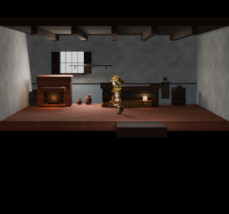
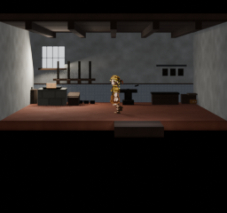
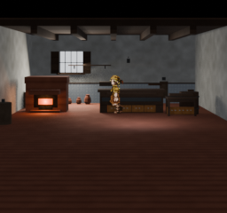
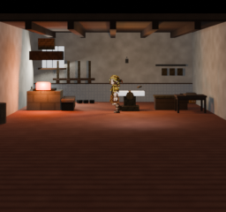
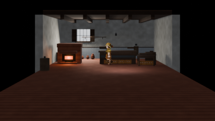
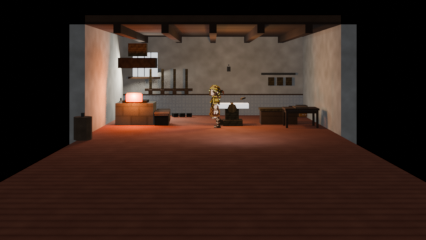
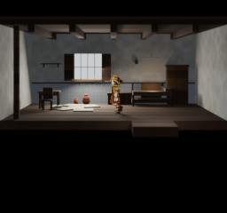
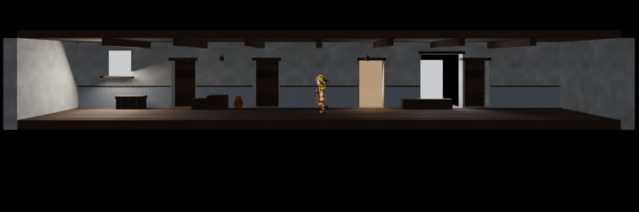

# St. Maria shop interiors — authoring report (2026-08-26)

This pass adds two authored indoor environments for the opening town: Alicia's
Padaria and Laura's smith. The source documents are the recipe-generated
Blender files under `projects/hichaukitoden-game/assets/authoring/environments/`;
the recipes are the repeatable grammar, not a second runtime scene.

## Story briefs and contest pitches

The briefs were taken from the opening walkthrough and common events:

- Alicia sells baked goods, staples and summoner supplies, keeps water at hand,
  prepares Laura's bread/cheese/bruised-pear lunch, and hides a summon lantern
  under the counter during the Vigil.
- Laura sells equipment, repairs lantern frames, receives Alicia's lunch, and
  works a forge whose light and heat can be absent during the Vigil.

Two deliberately different pitches were carried through the shared shell:

| Pitch | Visual promise | Authored proof |
|---|---|---|
| Warm Provision Counter | A working bakery rather than a generic shop: heat, stock, water and a customer-side display form Alicia's working triangle. | `forno`, counter and bread display, pastry table, water barrel/dipper, flour sacks, jars, lunch bundle, apron and hidden summon lantern. |
| Iron Workflow | A smithy is a chain of use, not a weapon showroom: forge → anvil → quench → tool bench, with the Vigil lantern-frame work embedded in the wall. | `forge_hearth`, bellows, readable anvil and tools, quench trough, weapon rack, lantern-frame rail, coal/scrap stock, lunch bench and motivated forge/anvil lanterns. |

The final head-to-head review selected **Iron Workflow (Laura's smith)** as the
visual winner, while retaining both rooms as the complementary pair. The
winner is a critique result, not a request to remove Alicia's room.

## Shared grammar added

- `bread_crust`, `forge_scale` and `charcoal` semantic materials, with fixed
  procedural placeholder maps and provenance in the material library.
- A causal `foreground_floor` extension so the authored ground continues below
  the character floor limit instead of ending at the menu overlay.
- Reusable furniture primitives in `tools/blender/recipes/furnishings.py`:
  masonry oven, scored loaf/display, sack, barrel, anvil, forge hearth,
  bellows, quench trough and weapon rack.
- `firelight` and work-lantern sources are authored beside the objects that
  motivate them; no hard key was added to the interior staging rig.

## Adversarial review loop

The same rubric and the same two rendered frames were sent to both providers by
`tools/blender/town_shop_critique.py`. The rubric explicitly rejects generic
boxes, dark unreadable silhouettes, floating props, unmotivated light and set
edges. It also includes the story constraints above.

The first review found the bakery too sparse and the smith too generic. The
revision moved the hero stations into the actor's depth band, added meaningful
foreground work surfaces, brightened the forge/anvil relationship, and made the
two workflows legible at native size. The final review evidence is retained in
[`critique-final.json`](st-maria-shops/critique-final.json):

- OpenAI `gpt-4o-mini-2024-07-18`: Padaria 6/10, smith 7/10.
- OpenRouter free pool: `dots-studio/dots-3-note-preview:free` (Gemma pool
  attempts were recorded as rate-limited before the free fallback succeeded).

The critique runner reads `OPENAI_API_KEY` and `OPENROUTER_API_KEY` only from
the environment; no key is stored in the repository.

The visual history is retained, not just the winner. The first pass exposed the
failure mode that drove the revision: props were pushed against the back wall,
the foreground was an empty slab, and Laura's forge read as an unmotivated
glowing box.





The final pass moved both working lines into the actor's depth band, added
causal foreground stations, replaced the generic forge silhouette with a
forge/anvil/quench workflow, and added the shared food/iron/charcoal material
grammar used by the recipes.

## Render evidence

Classic is the acceptance composition. The wide frames are overscan checks;
the rooms intentionally remain self-contained at Classic width.









## Verification record

All renders used the calibrated town camera and the real Walker billboard:

| Asset | Parts | Authored lights | Bounds (X × Y × Z) | Walker |
|---|---:|---:|---|---|
| `alicias_padaria.blend` | 95 | 5 | 17.52 × 9.2667 × 4.10 | 48 px, feet Y=128 |
| `lauras_smith.blend` | 83 | 6 | 18.02 × 9.5483 × 4.25 | 48 px, feet Y=128 |

The Room 3 correction was staged again at Classic and at 426 width: the Walker
remained 48 px tall with feet at Y=128, and both room boundaries remain inside
the Classic composition. The unchanged corridor was staged with `--full-map`;
the whole 721 px lane shows both endpoints. Reference frames are included for
review:





Checks run:

```text
python -m py_compile tools/blender/recipes/interior.py tools/blender/recipes/furnishings.py tools/blender/recipes/alicias_padaria.py tools/blender/recipes/lauras_smith.py
python tools/blender/material_library.py check
python -m unittest discover -s tools/blender/tests -p "test_*.py"
```

Both recipes were rebuilt explicitly with `--force` under the owner's
confirmation that the existing Room 3 scaffold had never been hand-edited.
After adoption, the `.blend` files are source authority and must be edited in
Blender rather than regenerated casually.
