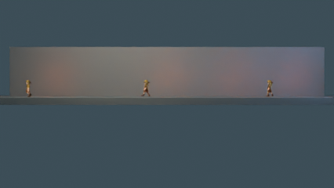
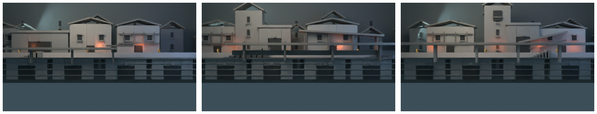
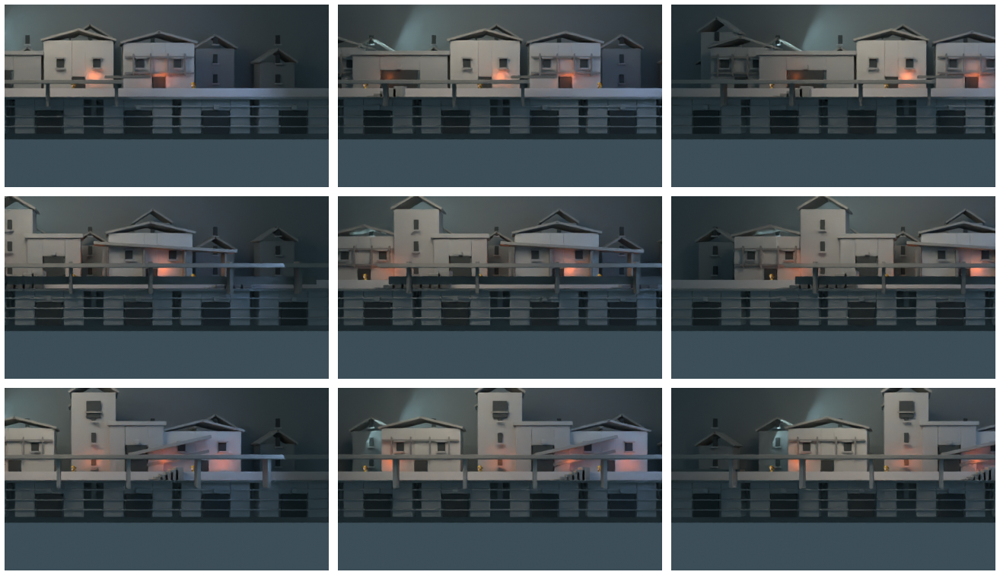
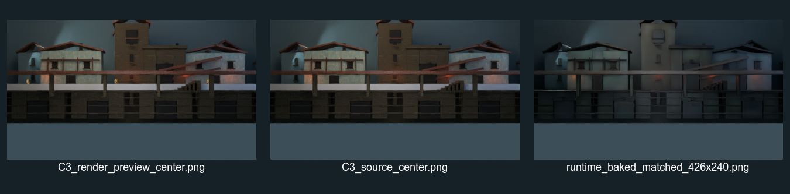
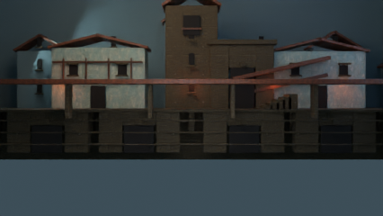
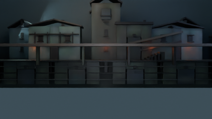
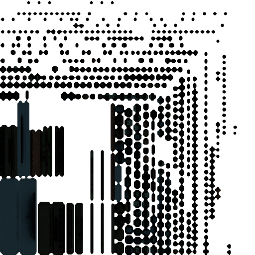
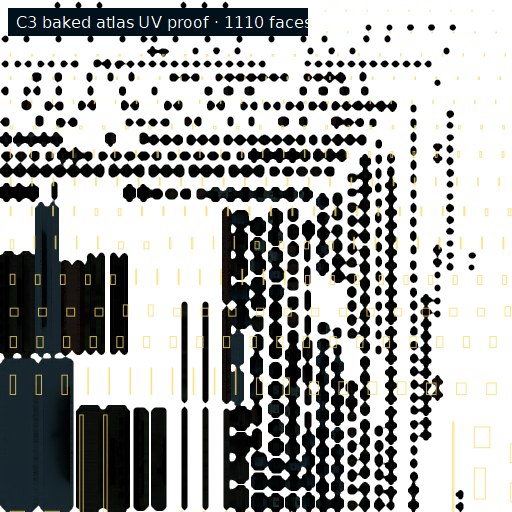

# Second Gate town gauntlet — C3

Status: fresh visual research package on branch `codex/second-gate-town-gauntlet-20260820`; not merged.

The work follows the side-view town boundary: a continuous walk lane with ordinary environment anchors, no jump/platformer grammar, fixed camera eye, and projection-window movement. The only pre-existing repository visual input was `projects/hichaukitoden-game/assets/character/walker.png`. All façade concepts, material inputs, source geometry, renders and package files in this report were created or retrieved for this run.

## Presentation gate

The acceptance target is 426×240, with 256×144 as the base/native scale. The camera is perspective, pitch 0°, eye `(0, -37.333332, 1)`, lens `43.2676mm`, `fovHalfX=0.25`, and principal point around native y=110. The eye remains fixed; -96/0/+96 are projection-window offsets. Walker is rendered as a 24×48 native frame at world height 1.75 with feet anchoring.

Preview settings are intentionally light: Cycles, 4 samples, denoising enabled, max bounces 2, diffuse 1, glossy 1, transmission 0, Standard view transform.

## Independent lineages

| Lineage | Proposition | Result |
| --- | --- | --- |
| A | Canal arcade, connected houses, foreground canal roof | Clay continuity pass; not selected |
| B | Civic stair, covered market passage, foreground balcony | Clay continuity pass; not selected |
| C | Bell tower, gate passage, diagonal canopy/stairs, foreground bridge roof | Selected and textured |

The first clay ground treatment read as a clipped platform and was rejected. The revised pass moved the continuous ground mass deeper, enlarged the lower arcades, added stone courses and horizon overscan, and was then checked at center and both projection-window offsets.

## Textured survivor

C3 uses procedural stone courses, wood grain, roof rhythm, grime and walk-surface variation; a fresh CC0 Stone Brick Wall 001 source from [Poly Haven](https://polyhaven.com/a/stone_brick_wall_001); and a fresh generated old lime-plaster albedo. The generated albedo is flat and shadow-free; height/roughness treatment is derived in Blender rather than trusting generated tangent-space normals.

## Source-to-runtime proof

The selected source was authored in `TH_SOURCE`, with coarse real geometry in `TH_RENDER`, collision in `TH_COLLISION`, anchors in `TH_ANCHORS`, and Walker previews isolated in `TH_PREVIEW_ACTORS`. The generic pipeline joined the render target, packed non-overlapping UVs, performed a 4-sample Cycles Combined selected-to-active bake from `TH_SOURCE`, and exported the runtime package. Preview actors were not baked.

The baked package is 2,220 triangles / 1,480 vertices with a 512×512 atlas. The atlas is sampled as `Non-Color` scene-linear data in the Blender proof render; that metadata is recorded in `environment.json` and `bake_proof.json`.

## Package and playability anchors

- Source `.blend`: `projects/hichaukitoden-game/assets/authoring/environments/second_gate_c3_20260820/second_gate_c3_20260820.blend`
- Material provenance and hashes: `projects/hichaukitoden-game/assets/authoring/environments/second_gate_c3_20260820/material_provenance.json`
- Runtime package: `projects/hichaukitoden-game/assets/environments/second_gate_c3_20260820/`
- Anchors: `spawn_player`, `walk_start`, `walk_end`, `doorway`, `npc_anchor_01`, `npc_anchor_02`, `foreground_landmark`
- Runtime collision is exported separately as `collision.obj`; preview actors are absent from the package.

The runtime artifact keeps real geometry/depth/silhouette structure and a single source-derived atlas; it is not a camera-space screenshot plane or screenshot atlas.

## Verification

`tools/blender/thestra_camera.py`, the gauntlet builder, bake runner and UV proof script compile successfully. The package manifest, provenance JSON, OBJ/MTL exports, collision export, atlas, source/runtime renders and camera-check JSON were inspected. No `data/` files were edited, and no game gate was rerun because this work does not change engine data or gameplay code.
