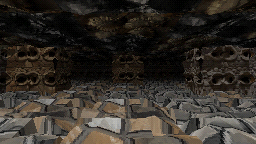
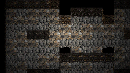
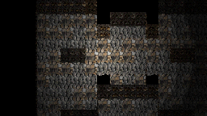
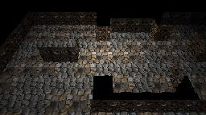
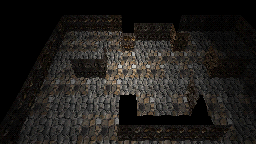
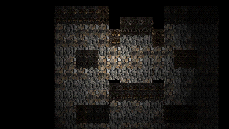
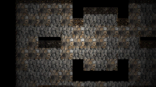
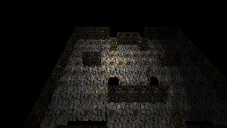
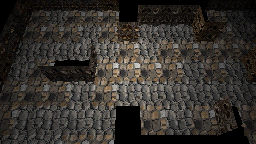

# Runtime world-camera projection spike — 2026-08-15

Experimental evidence for #589 from the real `preview-map` / `viewport_3d` path on hosted Windows, LÖVE 11.5 and llvmpipe. **Not G5/G6 references.**

Same developer Map 12 and deterministic preview position throughout. Overhead frames temporarily use the existing `authoring` structural visibility profile so the solid walkable ceiling does not cover the room; this is a comparison aid, not the future runtime-overhead visibility decision.

Fog now follows the resolved view policy: first-person preserves camera-forward depth fog, while all overhead profiles use XY ground distance around the followed gameplay target. Projection therefore does not implicitly choose the fog model.

## 45° A–E

| A first person | B ordinary ortho | C RPG ortho |
|---|---|---|
|  |  |  |

| D ordinary perspective | E RPG/anamorphic perspective |
|---|---|
|  |  |

## Corrected pitch study

| 35° | 45° | 60° |
|---|---|---|
|  |  |  |
|  |  |  |

Unresolved: winning aesthetic, authored Scene/Map/RTP ownership, overhead play visibility/cutaway policy, and any canonical golden change. Refs #589 #590 #592.
