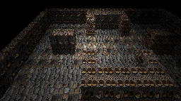
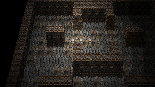
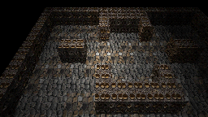
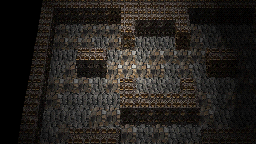

# Telephoto RPG-perspective comparison — 2026-08-15

Experimental evidence for #609 generated from the real `preview-map` / `viewport_3d` runtime after the Phase 4 framing implementation. **Not G5/G6 references.**

All four frames use developer Map 12, RPG/anamorphic perspective, `play-overhead` structural visibility, capture-only Wall Top atlas art, and the same **18-tile target framing**. Only pitch and lens differ.

| Pitch | Phase-3 wide (~73.74°) | Phase-4 telephoto (26°) |
|---|---|---|
| 35° |  |  |
| 45° |  |  |

Because `tilesAcross` is fixed at 18, the optical-target tile scale is held constant. Narrowing the lens therefore pulls the camera back rather than zooming the scene in. This isolates **perspective distortion / depth compression** from framing.

The Wall Top assignment is capture-only and restored before this evidence commit is published. No production camera selection, tileset art, Map data, or G5/G6 reference changes are included.
