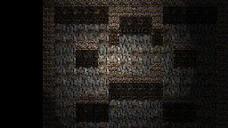
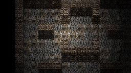
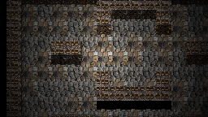
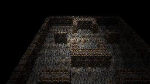
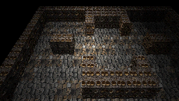
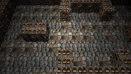
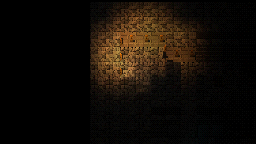
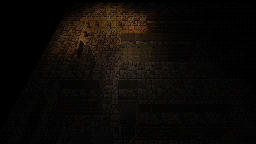

# Live overhead Wall Top projection evidence — 2026-08-15

Experimental evidence for #604/#606 from the real `preview-map` / `viewport_3d` runtime path on hosted Windows, LÖVE 11.5 and llvmpipe. **Not G5/G6 references.**

Unlike the earlier #595 projection spike, these overhead frames do **not** inject the editor `authoring` visibility profile. The four overhead camera families now resolve the runtime `play-overhead` policy from #603: walkable ceilings are omitted, wall tops are visible, and exterior shell faces are retained.

Capture-only tileset edits give the new Wall Top role a known-valid existing atlas cell `[0,1]`. They are restored before the evidence commit and are **not** a production art-direction choice.

- Map 12 (`dungeon_ffxii_depth_explore`) demonstrates the corrected C/E camera families over the richer image-authored room with an authored atlas Wall Top.
- Map 2 (`dungeon_default`) uses its real atlas-parallel height map plus `heightMapScale.wallTop = 0.08`, exercising displaced authored Wall Tops in the live viewport.

## Map 12 — C / RPG orthographic

| 35° | 45° | 60° |
|---|---|---|
|  |  |  |

## Map 12 — E / RPG-anamorphic perspective

| 35° | 45° | 60° |
|---|---|---|
|  |  |  |

## Map 2 — real atlas-height Wall Top at 45°

| C / RPG orthographic | E / RPG-anamorphic perspective |
|---|---|
|  |  |

This evidence decides neither a default camera nor a dynamic near-wall cutaway. It exists to judge the static `play-overhead` policy with actual Wall Top materialization before adding another visibility mechanism.
