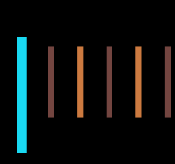
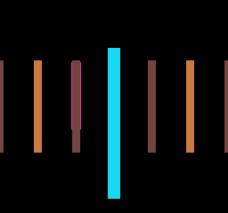
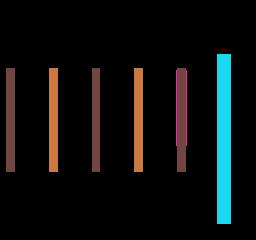
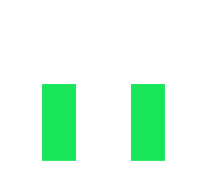
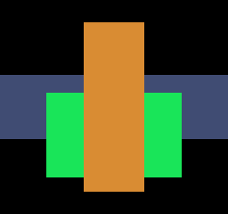
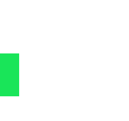
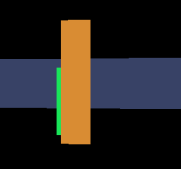
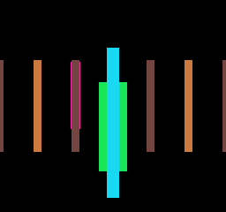
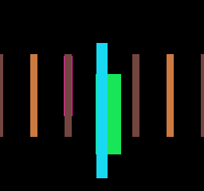

# World-presentation and spatial-ownership audit

**Date:** 2026-08-20
**Issue:** #841
**Baseline:** `main@d5a7f8d2a3095f20ef83f8a31da78f76b5344f95` (fetched; newer than the
`1db112a8` named at filing)
**Scope:** evidence only. This report proposes no schema, performs no runtime
rewrite, recaptures no golden, and implements neither #836 nor #837.

Every claim below is tagged:

| Tag | Meaning |
| --- | --- |
| **[FACT]** | Verified against current `main` source or a measured run |
| **[HISTORY]** | Rationale recovered from an in-repo comment, report or closed issue |
| **[EXPERIMENT]** | Produced by the spike harness in `tools/spikes/841/`, logs under `artifacts/` |
| **[INFERENCE]** | Architectural reading of the above — argued, not measured |
| **[OPEN]** | An owner/design choice this audit deliberately does not make |

Reproduce every experiment with:

```bash
lovec tools/spikes/841 <repoRoot> <outDir> capability
```

(cases: `capability`, `temporal`, `projection`, `cost`). The harness requires the
real `presentation.retro_mesh_shader` and `presentation.effekseer` modules off
`runtime/` and drives them from its own scene; it modifies nothing and is wired
into no gate. Raw logs and captures are in
[`artifacts/world-presentation-audit-2026-08-20/`](artifacts/world-presentation-audit-2026-08-20).

---

## 0. Headline conclusions

1. **[EXPERIMENT]** #837's projection-window pan is **already expressible** by the
   existing camera contract. The world shader's `viewportCenterX/Y` uniform is
   mathematically an off-axis frustum shift (max deviation from an equivalent
   `glFrustum(l,r,…)` formulation: **4.4e-16**), it is exactly depth-independent
   (**0.0** px spread across depths 0.5–32), and the only other world-space
   projection in the repository — Effekseer's world camera matrices — already
   consumes it and agrees to **0.0**. #837 needs no second camera system.
2. **[EXPERIMENT]** #836's stated contract of *"colour + depth advance
   atomically"* is **necessary but not sufficient**. With a moving camera, actors
   drawn on the live camera against a held colour+depth pair are misregistered by
   up to **2396 px** of a **~2574 px** actor — i.e. essentially the whole actor
   slides against its own occluders. A held environment frame must own a **camera
   and projection snapshot**, not only colour and depth.
3. **[EXPERIMENT]** #836's *"AA'd environment colour, hard ownership boundary"*
   is achievable but **not with MSAA**. An MSAA actor pass against an MSAA depth
   attachment resolves with **460 partial-alpha boundary pixels**. Supersampling
   the colour while masking the actor from a **native-resolution** depth
   attachment gives **634 anti-aliased colour pixels and 0 partial-alpha mask
   pixels** simultaneously.
4. **[FACT]** LÖVE 11.5 supports everything else the contract needs — retained
   depth attachments rebound to a different colour target, depth textures
   sampleable in a shader — with one hard limitation stated by the engine itself:
   *"Readable depth/stencil Canvases with MSAA are not currently supported."*
   One new hazard comes with the split: an actor pass that **writes** the held
   depth loses **45 %** of the next frame's actor to its own previous silhouette,
   silently.
5. **[EXPERIMENT]** #836 × #837 are **not freely composable**. A held environment
   frame holds the projection window that produced it; an actor window 8 px ahead
   of the held environment window misplaces **1616 px**. They compose only when
   the window advances at the environment cadence, or the environment refreshes
   on every window move.
6. **[EXPERIMENT]** Temporal asymmetry is **not** justifiable as an optimisation
   on current evidence. On the real maps the world *draw* is ~9 % of frame time
   (map 8: `modelDrawLoopMs` 0.333 of a 3.67 ms mean frame); the extra passes cost
   0.059 ms (actor) + 0.035 ms (composite) + 0.023 ms (post) at 256×240, and a 3×
   supersampled environment pass costs the same as a native one (0.386 vs
   0.398 ms) because fill is free at this resolution and cost is draw submission.
   It is an **aesthetic mode**, and should be argued as one.
7. **[INFERENCE]** No part of #836/#837/#838 requires redefining `Map`. The
   presentation seams that would carry them (`WorldCamera`, `surface`, the world
   shader, the Map Renderable Bundle) are already independent of grid topology;
   the grid dependency lives in `viewport_3d`'s *structure preparation*, which is
   one adapter, not the architecture.

---

## 1. Current frame / draw / canvas / depth ownership

### 1.1 There is exactly one colour+depth+stencil target per frame

**[FACT]** `runtime/main.lua:1186`:

```lua
function love.draw()
    love.graphics.setCanvas({ canvas, depth = true, stencil = true })
    love.graphics.clear(0, 0, 0, 1, true, true)
    ...
    love.graphics.setCanvas()
    love.graphics.draw(canvas, scaleX, scaleY, 0, scale, scale)
end
```

`canvas` is created once per surface-profile change at `runtime/main.lua:914`,
sized `surface.renderSize()`. Depth and stencil are LÖVE-managed attachments of
that one canvas. **World, HUD, windows, pictures, Effekseer and diagnostics all
draw into the same target.** There is no environment target, no actor target and
no post-process target in the production frame.

**[FACT]** `canvasSwitchesPerFrame` measured by `profile-3d` is **0** on maps 8,
9 and 14, and **0.19** on map 12 (composite wall-tile canvases being baked). The
production world draw performs no render-target switching at all.

### 1.2 The frame graph

```mermaid
flowchart TD
    A["love.draw()<br/>setCanvas({canvas, depth, stencil})<br/>clear colour + stencil + depth"] --> B["frame_renderer.draw()"]
    B --> C["scene_host.draw() → scene_compositor.draw()"]

    C -->|"scene draw == world"| W["world_renderer.draw('map')<br/>vertex_shading_resolver.withComposite"]
    C -->|"draw == windows,<br/>backdrop == map"| WB["vertex_shading_resolver.draw<br/>(same world path, render-surface sized)"]
    C -->|"draw == windows"| CB0[" "]

    W --> V["viewport_3d.draw → drawWorldSpace"]
    WB --> V

    V --> V1["push('all'); intersectScissor(0,0,viewportW,viewportH)"]
    V1 --> V2["drawFogBackground — flat fill + panorama layers<br/>2D, NO depth"]
    V2 --> V3["drawSkyBackdrop (ceilingStyle == 'sky')<br/>2D, NO depth"]
    V3 --> V4["setShader(worldShader) + ~30 uniforms<br/>setBlendMode('alpha'); setDepthMode('less', true)"]
    V4 --> V5["ONE depth-tested pass over a single far→near sorted list:<br/>• structural surface batches (static meshes)<br/>• placed models: fixtures, doors/openings, height surfaces, Event models<br/>• dynamic stream meshes: billboards, opening pieces, wall-top clips"]
    V5 --> V6["setShader() ; effekseer.drawWorld(camera)<br/>WORLD group, native GL, PRESERVES depth"]
    V6 --> V7["setDepthMode(); pop()<br/>setDepthMode(); setShader(); setWireframe(false)<br/>clear(false,false,1) → DEPTH DISCARDED"]
    V7 --> V8["door_transition.draw() — subtractive fade"]

    V8 --> H["renderer.drawMap HUD<br/>surface.beginComposition: minimap, coords, front-event label"]
    H --> ST["subtractive_transition.draw() over the render surface"]
    ST --> CB["surface.beginComposition()"]
    CB0 --> CB
    CB --> CB1["static backdrop image / locationArt + door fade"]
    CB1 --> CB2["pictures: image/string 'backdrop'"]
    CB2 --> CB3["dock.draw()"]
    CB3 --> CB4["window_renderer.draw()"]
    CB4 --> CB5["surface.endComposition()"]
    CB5 --> TR["scene_transition.draw() — full-surface fade + touch_gamepad"]

    TR --> BT["battle only: reticles (composition),<br/>screen flash + defeat fade (render surface)"]
    BT --> EFK["effekseer.draw() — SCREEN group<br/>native GL; CLEARS GL_DEPTH_BUFFER_BIT first"]
    EFK --> PP["composition: damage popups, pictures 'screen' then 'top'"]
    PP --> DV["dev_overlay.draw() — render-surface space"]
    DV --> OUT["setCanvas(); draw(canvas, offset, scale)<br/>integer-nearest host output"]
```



### 1.3 Every depth/stencil/canvas transition in the frame

**[FACT]**

| # | Site | Operation | Note |
| --- | --- | --- | --- |
| 1 | `main.lua:1187` | `setCanvas({canvas, depth, stencil})` | the only frame target |
| 2 | `main.lua:1188` | `clear(0,0,0,1, true, true)` | colour + stencil + depth |
| 3 | `viewport_3d.lua:2532` | `setDepthMode("less", true)` | world pass on |
| 4 | `effekseer.lua:476` → `efk_shim.cpp:439` | `efk_draw_world_group` | **preserves** depth; `GLStateGuard` saves/restores GL state |
| 5 | `viewport_3d.lua:2609/2615` | `setDepthMode()` twice | once inside `push/pop`, once outside — the attribute stack is explicitly not trusted |
| 6 | `viewport_3d.lua:2621` | `clear(false, false, 1)` | **depth discarded** so 2D layers are not depth-tested |
| 7 | `animation_player.lua:910` | `setStencilTest("greater", 0)` … `setStencilTest()` | the frame's only stencil consumer |
| 8 | `effekseer.lua:459` → `efk_shim.cpp:430` | `efk_draw_group` | **clears `GL_DEPTH_BUFFER_BIT`** before the screen pass |
| 9 | `main.lua:1206` | `setCanvas()` | back to the default framebuffer |

Outside the frame, `viewport_3d.lua:640/697` bind scratch canvases to bake
composite wall tiles and their glow twins, and `item_model_view.lua:252` binds
its own `{color, depthstencil = depth}` pair for the item turntable.

**[FACT] `item_model_view.lua` is the existing precedent** for an explicit,
separately-owned depth attachment: it creates `depth24stencil8` (falling back to
`depth16`), binds `setCanvas({ buffers.color, depthstencil = buffers.depth })`,
draws with `setDepthMode("less", true)`, and restores the previous canvas. #836
would be the second such owner, not the first.

### 1.4 Places that rely on prior draw state rather than an explicit contract

**[FACT]**

- **Depth is a frame-global resource with two independent clearers.** The world
  pass clears it (site 6) and the native Effekseer screen pass clears it again
  (site 8), each with a comment explaining why. Neither knows about the other.
  Any held environment depth must live on its **own** canvas, or the screen
  Effekseer pass will destroy it.
- **`setDepthMode()` is issued twice** because *"Depth state is canvas-global in
  LÖVE and is not reliably restored by the attribute stack on every backend"*
  (`viewport_3d.lua:2610–2614`). **[HISTORY]** this is a real defect that was fixed by
  belt-and-braces rather than by a contract.
- **`effekseer.draw()` saves and clears the active scissor** because scene windows
  legitimately leave one armed (`effekseer.lua:459–474`). It also requires a preceding
  `love.graphics.flushBatch()` — **[HISTORY]** without it, effects rendered behind
  everything LÖVE had queued (roadmap 6.5.1c; `spike-zorder-bug.png`).
- **`surface.beginComposition()` monkey-patches `love.graphics.setScissor` and
  `intersectScissor`** for the duration of a composition block, because LÖVE
  transforms geometry but not scissor rectangles. Nested blocks push only the
  transform. This is a real global mutation the world pass sits outside of.
- **Z-order is preserved by call position, not declared.** `frame_renderer.draw`
  and `scene_compositor.draw` both carry `IMPORTANT PRESERVED Z-ORDER` comments
  (#150, #199) noting that `scene_transition.draw()` also draws `touch_gamepad`,
  and that the Effekseer call must sit *between* reticles and popups.
- **The world pass draws the fog background and sky with no depth**, then turns
  depth on. The background is therefore ordinary painted colour, not part of the
  depth-resolved environment.

### 1.5 Pass membership today

**[FACT]** There is **one** world pass. Every visible world object — static
structure, doors, fixtures, height-displaced surfaces, Event sprite billboards and
Event 3D models — is appended to a single `surfaces` list, sorted far-to-near by
mean camera-forward depth, and drawn by one shader with one depth mode. The only
classification that exists is a **profiling** label on dynamic stream meshes:

| Category | Source | What it is |
| --- | --- | --- |
| `billboard` | `viewport_3d.lua:2427` | camera-facing Event sprite quads |
| `opening` | `viewport_3d.lua:2373/2383` | atlas-fallback door/arch pieces |
| `wall_top_clip` | `viewport_3d.lua:2105` | wall-cap quads that failed mesh-tree reuse |
| `dynamic` (default) | floors, ceilings, wall faces, features | clipped/streamed structural quads |

**[FACT]** measured on map 8 with forward motion: `dynamicByCategory
{billboard: 7}`, `dynamicSourceQuads {billboard: 31}`, `modelDraws: 156`,
`persistentBatchDraws: 0`, `queuedSurfaces: 163`.

**[INFERENCE]** These labels are *cost accounting*, not an ownership taxonomy.
They do not separate "environment" from "actor": a door is an `opening` or a
placed model, an Event NPC is a `billboard` or a placed model, and a decorative
fixture is a placed model exactly like a door. Nothing in the renderer currently
distinguishes them by cadence, and nothing should be promoted to a taxonomy on
the strength of these names.

---

## 2. The `WorldCamera` contract and all of its consumers

### 2.1 What the contract already resolves

**[FACT]** `runtime/presentation/world_camera.lua` (470 lines) resolves one
explicit record per frame. Fields: `projection` (`perspective` | `orthographic`),
`profile`, `x/y/z`, `angle`, `dirX/dirY`, `rightX/rightY`, `pitch`, `fovScale`,
`fovHalfX/fovHalfY`, `orthoHalfX/orthoHalfY`, `projectionScaleX/Y`, `nearPlane`,
`farPlane`, `visibilityProfile`, `playerLightX/Y`, `fogMetric`,
`fogOriginX/fogOriginY`, plus overhead-only `targetX/Y/Z`, `focusDepth`, `height`,
`groundDistance`, `tilesAcross`, `fovDegrees`.

Pure helpers, all unit-gated in `tests/test_chest_3d.lua`:
`projectionKindId`, `fogMetricId`, `fogDistanceAt`, `rpgGridHorizontalScale`,
`rpgGridVerticalStretch`, `rpgWallHeightInTiles`, `fovHalfExtentFromDegrees`,
`fovDegreesFromHalfExtent`, `focusDepthForTilesAcross`, `cameraSpaceDepth`,
`localGroundPixelScales`.

Profiles: `first_person`, `ortho_oblique`, `rpg_ortho`, `perspective_oblique`,
`rpg_perspective`.

**[FACT]** Precedence in `world_camera.resolve` is, in order:
authored `Scene.worldPresentation.camera` → `session.worldCamera*` overrides →
direct `opts`. **[HISTORY]** #609 established the Scene as the durable default
owner with temporary/session overrides above it.

**[FACT]** `Scene.worldPresentation` is validated by
`engine/project_validator_rules.lua:81` (G1), edited by
`studio/editor/js/world-presentation-studio.js`, and **authored by no Second Gate
scene today**. Only `data/scenes/map.json` declares `"draw": "world"`. The durable
Scene camera seam exists and is currently unexercised by content.

### 2.2 The complete consumer set

**[FACT]** `world_camera` is required by exactly two production modules:

| Consumer | What it takes | Where |
| --- | --- | --- |
| `viewport_3d.drawWorldSpace` | the whole record → the world shader's uniforms | `viewport_3d.lua:2480–2526` |
| `effekseer.drawWorld` | a hand-built subset → view/projection matrices | `viewport_3d.lua:2593–2607` |

Plus `viewport_3d.cameraSpaceDepth = worldCamera.cameraSpaceDepth` re-exported for
CPU visibility (`viewport_3d.lua:780`), used at lines 1211, 1726 and 2227, and
`tests/test_chest_3d.lua` as the numerical oracle.

**[FACT] There is no third projection implementation.** `player_projection.lua`
is a *window*-content projection for #375 and touches no camera. There is **no
CPU world→screen picking path**: the minimap is grid-space, the front-event label
comes from `exploration.getFrontTile` (grid), and `map_renderable_bundle` /
`map_geometry_export` export **world-space** geometry with no camera at all.

**[FACT] CPU culling is depth-only.** `quadVisible` tests
`maxDepth > nearPlane and minDepth < farPlane`;
`classifyBoundsToNear` classifies against the near plane and returns `nil` (falls
through to exact vertex classification) whenever pitch is non-zero. **There is no
lateral frustum culling anywhere.**

**[INFERENCE]** That is the decisive fact for #837. Because no CPU code culls
laterally and no CPU code projects to screen, changing the horizontal projection
centre cannot invalidate culling, picking or any cached CPU result. Only two
consumers must agree, and — see §4 — they already do.

### 2.3 The gap between the record and the shader

**[FACT]** Four projection parameters the shader consumes are **not** part of the
resolved camera record. They are computed locally in `drawWorldSpace`
(`viewport_3d.lua:1530–1537`):

```lua
local canonicalCenterX, canonicalHorizonY =
    surface.compositionToRender(compositionWidth * 0.5, 70)
local baseViewportWidth  = squareAuthoringCamera and targetWidth  or compositionWidth
local baseViewportHeight = squareAuthoringCamera and targetHeight or 144
local viewportCenterX = squareAuthoringCamera and targetWidth  * 0.5 or canonicalCenterX
local viewportCenterY = squareAuthoringCamera and targetHeight * 0.5 or canonicalHorizonY
```

`viewportCenterY` is pinned to canonical composition row **70** — the horizon.
`baseViewportWidth/Height` are the camera's *pixel scale* (256×144), divided by
the target size in the shader, which is what lets a wider or taller surface extend
the view at a fixed scale rather than re-framing it (#199).

**[INFERENCE]** This is the one genuine gap the audit found in the camera
contract: the **principal point already exists as a projection parameter but is
owned by the renderer rather than by `WorldCamera`.** Everything #837 asks for is
a value that is currently a constant.

---

## 3. The presentation-surface contract

**[FACT]** `runtime/presentation/surface.lua` owns four distinct coordinate
meanings and refuses to conflate them:

```text
canonical authored composition   256 x 240, fixed (#206 owns making it configurable)
logical render surface           classic 256x240 | four_three 320x240 | wide 426x240
composition origin               (0,0) | (32,0) | (85,0)  -- integer, centred
host-window output transform     integer-nearest scale + centred offset
```

API: `renderSize`, `compositionSize`, `compositionOrigin`, `compositionToRender`,
`renderToComposition`, `hostToRender`, `hostToComposition`, `outputTransform`,
`isComposing`, `beginComposition` / `endComposition`.

Registration validates that a profile is never smaller than the composition and
that the composition lies wholly inside the render surface.

**[FACT]** Layer assignment today:

| Space | Layers |
| --- | --- |
| Render surface | world view, fog/sky, subtractive transitions over world, battle screen flash / defeat fade, scene transitions, `dev_overlay` |
| Composition | HUD/minimap/coords, dock, windows, pictures, damage popups, battle reticles, static backdrop, location art |
| Host window | output scale/offset only |

**[INFERENCE]** An internal environment colour/depth target introduced by #836
would be a **fourth** meaning if it were registered as a surface profile, and that
would be a mistake. It is not a coordinate frame authors compose in; it is a
render target sized *from* the render surface. It should be sized by
`surface.renderSize()` and never appear in `surface.profileIds()`.
`surface.isComposing()` exists precisely because a full-cover effect must ask
"what is everything right now?" — an environment target has no such question,
because it is always exactly the render surface.

---

## 4. #837 — the smallest missing projection semantic

### 4.1 The shader already implements an off-axis frustum

**[FACT]** `retro_mesh_shader.lua:220–243`:

```glsl
float viewportCenter     = (2.0 * viewportCenterX / targetWidth) - 1.0;
float viewportCenterClipY = screenYToCanonicalClipY(viewportCenterY, targetHeight);
...
ndcX = viewportCenter
     + horizontal / (fovHalfX * safeDepth) * projectionScale.x
       * (baseViewportWidth / targetWidth);
```

The centre term is added **after** the perspective divide, i.e. it is a constant
NDC offset independent of depth. That is the definition of a principal-point
shift.

### 4.2 The four candidate representations are one representation

**[EXPERIMENT]** `projection.log` §A. Sweeping window offsets −80…+80 px against
depths 0.5–32 and lateral offsets −3…+3, the shader's `ndcX` and an equivalent
`glFrustum(l, r, …)` formulation differ by at most **4.441e-16** — floating-point
identity.

The frustum extents that reproduce the shader exactly, at `n = 1`:

| window offset | `l` | `r` | width |
| --- | --- | --- | --- |
| −80 px | −0.77930 | +1.71680 | 2.49609 |
| 0 px | −1.24805 | +1.24805 | 2.49609 |
| +80 px | −1.71680 | +0.77930 | 2.49609 |

The extents translate; the frustum width is invariant. **[INFERENCE]** "explicit
principal-point offset", "asymmetric frustum extents" and "equivalent
projection-matrix representation" are three spellings of the same projection, and
the repository already speaks the first one. Choose the NDC-centre form, because
it is the form the shader, the Effekseer matrices and the `#199` surface-scaling
maths are already written in.

### 4.3 It is a window pan, not a camera move

**[EXPERIMENT]** `projection.log` §A: the pixel displacement produced by a 40 px
window offset varies across depths 0.5–32 by **0.000e+00** px. Compare a camera
strafe, which by definition does not.

**[EXPERIMENT]** `projection.log` §C/D, rendered through the **real** world shader
with a near marker at depth 3 and a far marker at depth 12:

| offset index | −2 | −1 | 0 | +1 | +2 |
| --- | --- | --- | --- | --- | --- |
| window pan, near marker col | 31.50 | 79.50 | 127.50 | 175.50 | 223.50 |
| window pan, far marker col | (offscreen) | 37.00 | 85.00 | 133.00 | 181.00 |
| **window pan, near−far separation** | — | **42.50** | **42.50** | **42.50** | **42.50** |
| camera follow, near marker col | 42.00 | 85.00 | 127.50 | 170.00 | 213.00 |
| camera follow, far marker col | 63.50 | 73.50 | 85.00 | 95.50 | 106.00 |
| **camera follow, near−far separation** | **−21.50** | **11.50** | **42.50** | **74.50** | **107.00** |

The window pan holds the near/far separation *exactly* invariant; the camera
strafe sweeps it across 128 px of parallax.

**[INFERENCE]** That invariance **is** the alignment guarantee #837 asks for. It
is not something that has to be engineered: because the offset is a constant added
after the divide, geometry, sprites, models and depth all move by the same pixel
count by construction. Acceptance is not "the screenshot pans" — the numerical
statement is *"near−far screen separation is invariant under the offset"*, and
that is the property to gate.





The optical centre stays put: posts near the frame edges are wider and more sheared
than the centred ones, and that distortion travels with the window rather than with
the posts. This is the wide-illustration read #837 wants and explicitly must not
correct away.

### 4.4 World effects already agree

**[EXPERIMENT]** `projection.log` §B. Feeding the same camera (including
`viewportCenterX`) to the production `effekseer.worldCameraMatrices` and
projecting a world point through the resulting view × projection matrices, the
resulting NDC x differs from the world shader's by **0.000e+00** across window
offsets −60/0/+60, depths 1/4/16 and lateral offsets −2/0/+2.

**[FACT]** `effekseer.lua:150–156` derives `offsetX/offsetY` from
`camera.viewportCenterX/Y` and applies them as the projection matrix's translation
row (negated for the perspective case, to match Effekseer's right-handed −Z
convention).

**[INFERENCE]** There is no duplicated constant to keep in sync. The `#223`
world/screen split is respected automatically: the world group takes the offset,
the screen group's orthographic matrix does not and must not.

### 4.5 The one real constraint: vertex snapping

**[EXPERIMENT]** `projection.log` §E.

- With `vertexSnapPixels = 0`, a window pan of 1/4/16 px reproduces the base image
  **exactly translated** (0 differing pixels under an integer image shift).
- With `vertexSnapPixels = 1`, the same is true: **0 differing pixels**, because
  the snap grid is anchored at the composition origin and an integer pan preserves
  every vertex's sub-pixel phase.
- With `vertexSnapPixels = 1` and **sub-pixel** steps of 0.25 px, every step
  changed 312–378 pixels: each vertex crosses its own rounding boundary at a
  different phase, so the scene **shears** rather than translating.

**[INFERENCE]** A #837 window pan must advance in **whole pixels** while
`dungeon.psxRendering.vertexSnapPixels` is non-zero. This is a genuine and easily
missed coupling: it is not visible from the camera contract, and a naive
smooth-lerped window would produce crawl rather than a pan.

### 4.6 What #837 actually needs

**[INFERENCE]** The smallest addition is:

1. Move `viewportCenterX/Y` and `baseViewportWidth/Height` from
   `drawWorldSpace` locals into the resolved `WorldCamera` record, keeping today's
   values (`compositionToRender(width/2, 70)`, 256×144) as the defaults so nothing
   observable changes.
2. Let a camera profile express the centre as an offset from that default, in
   whole render pixels.
3. Nothing else. No second camera, no crop stage, no wider render target.

The "screen-space crop after a wider render" alternative should be kept only as
a **negative control** in the eventual spike: it is the implementation #837
explicitly rules out (it allocates the giant image the issue forbids), and it
usefully proves the off-axis path produces different — correct — distortion.

**[OPEN]** Whether the offset is authored on the Scene camera, driven by a runtime
follow rule, or both. This audit does not choose.

---

## 5. LÖVE 11.5 colour / depth / MSAA capability proof

All from `capability.log`, on **LÖVE 11.5 (Mysterious Mysteries)**, OpenGL 3.3.0,
NVIDIA GTX 1650, driver 591.86.

### 5.1 What works

**[EXPERIMENT]**

| Capability | Result |
| --- | --- |
| `depth16` / `depth24` / `depth32f` / `depth24stencil8` / `depth32fstencil8` / `stencil8` | all supported |
| `newCanvas(w,h,{format="depth24stencil8", readable=true})` | **ok** |
| Bind `{colourA, depthstencil = depthCanvas}`, write depth | **ok** |
| Re-bind the **same** depth attachment to a **different** colour target in a later pass, without re-rendering | **ok** |
| Actor pass with `setDepthMode("less", false)` (test, no write) against retained depth | **ok** — 7 980 actor pixels survived vs **14 440** with depth testing off |
| Post-process the environment colour through a shader | **ok** — the actor mask re-rendered afterwards is **byte-identical** (0 differing px) |
| `depthCanvas:setDepthSampleMode()` then `Texel(envDepth, uv)` in a shader | **ok** |
| System MSAA limit | 32 |

The negative control matters: 7 980 vs 14 440 proves the retained depth
attachment was actually consulted rather than the pass merely succeeding.





### 5.2 The hard limitation

**[FACT]** LÖVE 11.5 rejects a readable MSAA depth canvas with the message:

```
Readable depth/stencil Canvases with MSAA are not currently supported.
```

**[EXPERIMENT]** Consequences measured:

| Binding | Result |
| --- | --- |
| MSAA colour + MSAA depth (`readable` unset) | **ok** |
| MSAA colour + non-MSAA depth | **rejected** (sample-count mismatch) |
| MSAA depth, `readable = true` | **rejected** |

**[INFERENCE]** So on 11.5 you may have *either* an MSAA depth attachment *or* a
sampleable one, never both; and you cannot mix sample counts inside one binding.
Any design that wants both an MSAA environment and a depth texture for a
compositing shader is not expressible on the pinned engine version. Note that
the repository does **not** currently need depth sampling — ordinary retained
depth testing is sufficient (§5.1) and is the cheaper contract.

### 5.3 The retained depth attachment is read-only to the actor pass

**[EXPERIMENT]** `capability.log` §9. A held depth attachment, an actor drawn at
frame N, then the *same* attachment reused at frame N+1 with the actor moved:

| Frame N actor pass | Frame N+1 actor pixels |
| --- | --- |
| `setDepthMode("less", false)` — test, no write | **3 230** |
| `setDepthMode("less", true)` — test **and write** | **1 785** (1 445 lost, 45 %) |




**[INFERENCE]** A writing actor pass carves its own previous silhouette into the
held snapshot, and the next 60 Hz actor frame is then occluded by geometry the
environment never authorised. Under the current single-pass renderer this cannot
happen — depth is cleared every frame — so it is a hazard created *by* the split,
and it is silent: the frame still renders, the actor is simply partly missing.
`setDepthMode("less", false)` in the actor pass is a **correctness requirement of
the held frame**, not an optimisation. If actors must depth-sort against each
other, they need their own working depth attachment whose lifetime is the actor
frame, never the held environment attachment.

**[HISTORY]** This hazard was named in the parallel `agent/841-world-presentation-audit`
analysis before it was measured here; the measurement above is this audit
absorbing that finding rather than rediscovering it.

*(Placement note: the first version of this control put the two actor positions
behind the environment pillar. Their overlap was already occluded, the test
reported `0 lost`, and it looked like a clean bill of health. The control only
works where the overlap is environment-visible.)*

### 5.4 Transparency

**[FACT]** The world pass draws with `setBlendMode("alpha")` and depth **write
on**, sorting far-to-near only *"for deterministic cutout-edge ties, while the
depth buffer decides actual surface visibility"* (`viewport_3d.lua:2528`). The
fragment shader does `if (texel.a < 0.01) discard;` — i.e. the renderer is
alpha-**tested**, not alpha-blended.

**[HISTORY]** SPEC §1.25 explicitly scopes out real transparency; the material
overlay passes in `retro_mesh_shader` are documented as exact *because* both
operands are in the same fragment and no framebuffer read is needed.

**[INFERENCE]** A translucent actor is compatible with the #836 shape (it is a
blend of the actor layer over the environment layer, which is exactly what the
composite already does). A translucent **environment** surface is not, and is
already out of scope for the current renderer; nothing in this audit changes that.
#836's "one fixed translucent state when occluded" is a per-actor alpha in the
actor pass and needs no new machinery beyond a depth-test-fail read, which on
11.5 means either a second actor draw with `setDepthMode("greater", false)` or a
sampled depth compare.

---

## 6. Temporal asymmetry — a held frame owns more than colour and depth

### 6.1 The measurement

**[EXPERIMENT]** `temporal.log`. Environment redrawn every 4th frame (15 FPS
against 60 FPS actors); an actor walks behind a pillar; three variants compared
against a 60 Hz reference, and the actor layer compared in isolation.

**Static camera:**

| Comparison | Worst-frame difference |
| --- | --- |
| held env, actors on held camera vs 60 Hz reference | **0 px** |
| held env, actors on live camera vs 60 Hz reference | **0 px** |
| actor layer, held vs live camera | **0 px** |

**Moving camera (dolly + yaw every frame):**

| Comparison | Worst-frame | Total over 12 frames |
| --- | --- | --- |
| whole frame, actors on held camera vs 60 Hz ref | 7 567 px | 41 998 |
| whole frame, actors on live camera vs 60 Hz ref | 5 530 px | 31 525 |
| **actor layer, live camera vs held camera** | **2 396 px** | 10 984 |
| **actor layer, 60 Hz depth under 15 Hz colour** | **2 396 px** | **12 542** |

Actor pixels visible per frame (the occlusion silhouette):

```
held camera : 2574 2574 2574 2574 2582  495    0 1746 2298 2280 2149 2127
live camera : 2574 2591 2700 2594 2582  891    0  576 2298 2171 2128 2008
60 Hz depth : 2574 2591 2700 2594 2582  495    0 1738 2298 2171 2128 2008
```

At frame 7 the actor should be emerging from behind the pillar with 1 746 visible
pixels; on the live camera it shows 576 — a third of that.




### 6.2 Negative control

**[EXPERIMENT]** Every static-camera row is **0 px**. The metric cannot
manufacture an error where none exists; it reports non-zero only when a camera
actually moved between the held frame and the live frame. Separately, the
deliberately-incorrect "60 Hz depth under 15 Hz colour" variant is worse than the
live-camera variant by total (12 542 vs 10 984) even though its worst frame
matches, which is the signature of a *different* defect — occlusion decided by
geometry the displayed image does not show.


### 6.3 What a held environment frame must own

**[INFERENCE]** The snapshot is not `{colour, depth}`. It is at minimum:

```text
colour
depth
camera transform      x/y/z, dirX/dirY, rightX/rightY, pitch
projection            projectionKind, fovHalfX/Y, orthoHalfX/Y,
                      projectionScaleX/Y, nearPlane, farPlane,
                      baseViewportWidth/Height, viewportCenterX/Y
fog interpretation    fogMetric, fogOrigin, fogStart/Distance/Sharpness/
                      MinFactor/Bands, fogColor
player-light anchor   playerLightPosition (the world shader's per-vertex term)
target size           targetWidth/targetHeight
```

That list is, almost exactly, the current `WorldCamera` record plus the two
renderer-owned projection locals plus the resolved fog config. **[INFERENCE]** The
snapshot is therefore *"the resolved camera record and the fog record"*, which is
a strong argument for finishing §2.3 first: once `viewportCenter*` and
`baseViewport*` live on the record, the held frame's extra state is one table
reference, not a new concept.

Fog and player light matter because both are evaluated **per vertex in the world
shader** against camera-relative quantities. Actors drawn on the live camera
against a held environment would receive a different fog factor and a different
player-light contribution than the environment they stand in — a subtler defect
than sliding, and one the pixel metric above would under-report because the actor
in this fixture is unfogged.

### 6.4 Which of the four resolutions is viable

**[INFERENCE]**

| Option | Verdict |
| --- | --- |
| Actors render against the held camera snapshot | **Correct and cheap**, but it makes actors inherit the environment's temporal jitter — the actor is spatially consistent and temporally 15 FPS in *screen position*, which defeats the point of a 60 FPS actor pass under a moving camera. Viable only while the camera is static or cutting. |
| Reprojection of the held result | Needs the depth texture (available, §5.1), but produces disocclusion holes with no data behind them, and #836 forbids coverage blending which is the usual way to hide them. **Not recommended without a separate spike.** |
| Force an environment refresh on camera/projection change | **Recommended.** Cheap (§8: 0.398 ms), preserves the aesthetic exactly during the static/cut periods where it reads as pre-rendered, and degrades gracefully to 60 FPS while the camera moves — which is also when the compression artefacts are least legible. |
| Accept that the asymmetry is limited to camera-static periods | Equivalent to the above, stated as policy rather than mechanism. |

**[INFERENCE]** #836's "camera independence" requirement should be read as *"the
mode must not be restricted to fixed-camera scenes"* — which the refresh-on-change
policy satisfies — rather than *"the environment must stay at 15 FPS while the
camera moves"*, which the measurement above shows is not correct without
reprojection.

**[OPEN]** Whether a moving camera should force a refresh, or drop the environment
cadence proportionally to camera speed, is an aesthetic call for the owner.

---

## 7. #836 × #837 compatibility

**[EXPERIMENT]** `projection.log` §F. Environment held with the window at offset
0; actor drawn with the window already advanced:

| Actor window ahead of held environment window | Differing pixels |
| --- | --- |
| 1 px | 202 |
| 2 px | 404 |
| 4 px | 808 |
| 8 px | 1 616 |
| 16 px | 2 525 |

Exactly linear until the actor starts leaving the frame.




**[INFERENCE]** The projection window is part of the projection, so it is part of
the held snapshot. There is no way to slide the window over a held image without
one of the four remedies #841 names, and three of them are unattractive:

| Combination | Verdict |
| --- | --- |
| #836 alone, static camera | **Naturally compatible.** 0 px error (§6.1). |
| #836 alone, cutting camera | **Naturally compatible.** A cut forces a refresh anyway. |
| #836 alone, continuously moving camera | **Needs machinery** — refresh-on-change, or reprojection. |
| #837 alone | **Naturally compatible** with everything, at whole-pixel steps. |
| #836 + #837, window static between environment frames | **Naturally compatible.** |
| #836 + #837, window panning at 60 Hz over a 15 Hz environment | **Not compatible.** Rendering a wider master image and cropping is the only alternative to refreshing, and #837 explicitly forbids the giant image. |
| #836 + #837, window advancing at the environment cadence | **Compatible**, and visually coherent: the pan itself inherits the 15 FPS "rendered sequence" signature, which is period-accurate. |

**[INFERENCE]** The honest statement is: **#836 and #837 compose whenever the
projection window is treated as environment-cadence state.** They do not compose
if the window is treated as actor-cadence state. That is a one-line policy
decision, not a machinery problem — but it must be decided, not assumed.

---

## 8. Performance and transport

### 8.1 Current whole-frame cost on real content

**[EXPERIMENT]** `lovec <gateRoot> profile-3d <map> 120 current forward`, 120
frames after 3 warm-up motion cycles:

| Map | mean ms | p95 | max | draw calls/frame | canvas switches/frame | model draws | queued surfaces | texture bytes |
| --- | --- | --- | --- | --- | --- | --- | --- | --- |
| 8 | 3.666 | 5.560 | 8.280 | 291.0 | 0 | 156 | 163 | 746 392 |
| 9 | 1.824 | 3.574 | 7.513 | 68.8 | 0 | 37 | 40 | 918 424 |
| 12 | 2.954 | 6.426 | 15.924 | 356.3 | 0.19 | 208 | 208 | 917 512 |
| 14 | 1.949 | 3.023 | 3.716 | 56.2 | 0 | 28 | 31 | 557 064 |

Map 8, last frame's internal split: `modelDrawLoopMs` **0.333**,
`queuePlacedModelsMs` **0.779**, `modelVisibilityMs` **0.648**, `nearClipMs` 0,
`meshUploadMs` 0, `verticesInspected` 20 937, `structuralCacheHits` 231.

**[INFERENCE]** The GPU draw loop is roughly **9 %** of the frame. The rest is CPU
preparation — visibility classification, queueing placed models, and the
per-frame walk over 20 937 vertices. **Holding the environment image at 15 FPS
saves none of that unless the preparation is held too.** A #836 implementation
that only swaps render targets would buy essentially nothing; the win, if any,
comes from gating the environment *preparation* on the same cadence, which means
the split runs deeper than the compositor.

### 8.2 Cost of the pass shape itself

**[EXPERIMENT]** `cost.log`, synthetic 400-quad environment + 40-quad actor set,
120 iterations × 3 rounds, minimum reported, GPU-synchronised by readback:

| Measurement | classic 256×240 | wide 426×240 |
| --- | --- | --- |
| current shape: one pass, one colour+depth target | 0.512 ms | 0.461 ms |
| environment pass only | 0.398 ms | 0.415 ms |
| actor pass only, against retained depth | **0.059 ms** | 0.053 ms |
| composite (two full-surface blits) | **0.035 ms** | 0.019 ms |
| colour degradation post-process | **0.023 ms** | 0.020 ms |
| environment pass at 3× supersample (9× the pixels) | **0.386 ms** | 0.416 ms |
| environment pass with 4× MSAA | 0.410 ms | 0.416 ms |

**[FACT]** A 3× supersampled environment pass costs the **same** as a native one
(0.386 vs 0.398 ms), and the wide surface costs the same as classic.

**[INFERENCE]** Fill is free at this resolution; the cost is per-draw CPU
submission, which is identical in all three. This independently confirms the
reasoning already recorded in `effekseer.lua` (*"the low framebuffer does NOT buy
headroom here… the cost is CPU-side simulation and vertex generation, not fill"*)
and in #758. It also means **"expensive-looking environment shading" is nearly
free to try**: richer per-pixel work is not what the frame is spending time on.

Projected per-frame world cost at 60 Hz actors (classic):

| Environment cadence | native colour | 3× supersample | 4× MSAA |
| --- | --- | --- | --- |
| 60 FPS | 0.493 ms | 0.504 ms | 0.527 ms |
| 30 FPS | 0.294 ms | 0.311 ms | 0.322 ms |
| 15 FPS | **0.194 ms** | 0.214 ms | 0.220 ms |
| *single-pass baseline* | *0.512 ms* | — | — |

### 8.3 Render-target memory

**[EXPERIMENT]**

| Configuration | classic | wide |
| --- | --- | --- |
| environment colour + actor colour + composite + depth24stencil8 | 0.94 MB | 1.56 MB |
| 3× supersample colour + depth (additional) | 4.22 MB | 7.02 MB |

**[INFERENCE]** Negligible against the ~750–920 KB of texture memory the maps
already carry and the 2 385 MB Effekseer would cost at a naive instance budget.
Memory is not a constraint here.

### 8.4 The verdict on the optimisation claim

**[INFERENCE]** Temporal asymmetry buys ~0.3 ms of a 1.8–3.7 ms frame **only if
the environment preparation is gated too**, and the current frame already has
roughly 13 ms of a 16.7 ms 60 Hz budget spare on this machine (272–548
approximate FPS across the four maps).
**#836 must be argued as an aesthetic mode.** If it is presented as an
optimisation, the measurements above contradict it.

---

## 9. Reconciliation with existing Map architecture research, #694 and #695

### 9.1 Current grid Map facts

**[FACT]** `projects/hichaukitoden-game/data/maps/1.json` keys: `id`, `title`,
`intro`, `depth`, `tileset`, `ceilingStyle`, `music`, `image`, `layout`,
`events`, `treasures`, `encounters`, `recruits`, `category`, `generation`, `bgm`,
`safe`, `fog`, `lightObjects`, `anchors`, `paintCorrection`. `layout` is 19 rows
of `#`/`.`/`o`. Event 0's keys: `id`, `instanceId`, `x`, `y`, `sprite`,
`trigger`, `name`, `label`, `transparent`, `priority`, `spawn`, `pages`,
`commands` — integer grid `x`/`y`.

**[FACT]** Consumer census (occurrences of `session.mapGrid` / `currentMapData`
across `runtime/`):

| Consumer | mapGrid | currentMapData | What it actually needs |
| --- | --- | --- | --- |
| `engine/exploration.lua` | 10 | 23 | **traversal authority** — `row[targetX] ~= "#"`, override passability, fixture blocking, front tile |
| `engine/interpreter.lua` | 0 | 14 | event commands, transfers, `MUTATE_TILE` |
| `engine/savegame.lua` | 3 | 7 | persistence of runtime grid + overrides |
| `presentation/viewport_3d.lua` | 2 | 8 | **structure preparation** — cells → faces/models |
| `presentation/renderer.lua` | 1 | 7 | minimap + front-event label |
| `presentation/map_renderable_bundle.lua` | 1 | 3 | resolved-surface export |
| `presentation/prepared_map_cache.lua` | 4 | 2 | residency identity |
| `engine/formula.lua`, `troop.lua`, `event_actor.lua`, `event_self_state.lua`, `usability.lua` | 0 | 10 | gameplay reads of map metadata (`safe`, id, encounters) |
| `engine/map_inspection.lua`, `model_census_review.lua`, `cli_tools.lua`, editor bridges | — | — | tooling |

**[INFERENCE]** Only **two** consumers genuinely require *grid topology*:
`exploration.lua` (traversal) and `viewport_3d`'s structure preparation
(cells → geometry). Everything else reads **map metadata** (`safe`, `fog`,
`tileset`, `music`, `encounters`) or **resolved geometry**, neither of which is
cell-shaped. The minimap is grid-shaped but is a Second Gate presentation
capability, not a Thestra invariant.

### 9.2 Where the presentation seams already stop caring about grids

**[FACT]**

- `world_camera.lua` contains **no** grid concept. Its inputs are
  `session.playerX/Y/Dir` and continuous transition state; its outputs are
  continuous world-space quantities. Its only tile-flavoured parameter is
  `tilesAcross`, which is a framing convenience expressed in world units.
- The world shader consumes only world-space vertices and camera facts.
- `map_renderable_bundle.lua` is documented as *"renderer-neutral… preserves
  semantic provenance… plain Lua tables"* and owns no camera.
- `presentation/mesh.lua` / `engine/geometry` compile image-authored geometry to
  one neutral model representation shared with hand-modelled OBJ (`meshSource`
  returns nil when a variant is atlas-only, so *"every placement site asks one
  question instead of testing two fields"*).
- Event **presentation** is already decoupled from Event **anchoring**:
  `event_presentation_policy.lua` is *"the narrow seam"* between gameplay
  ownership of movement, the animation controller's semantic visual-state
  selection, and `viewport_3d`'s concrete assets. It resolves facing, not cells.

**[INFERENCE]** The pipeline the 2026-08-11 survey identified —

```text
authored semantic representation → deterministic resolver/compiler
→ resolved structural representation → renderer/GPU adaptation
```

— is **already built**, and the grid appears only in the first arrow. An
authored-3D place would supply a different first arrow. It would need:

- a traversal provider `exploration.lua` can ask "is this move legal?" instead of
  `row[x] ~= "#"`;
- a structure provider that yields the same `surfaces` / placed-model shapes
  `drawWorldSpace` already consumes;
- Event anchors expressible as world-space transforms.

None of those require `map.json` to change meaning.

### 9.3 Answering #841's question-I checklist

**[INFERENCE]**

| Question | Answer from current evidence |
| --- | --- |
| Does an authored-3D place need to *be* a `Map`? | **No evidence that it must.** It needs the Map's *metadata* role (music, safe, encounters, fog, transitions) and the Scene's camera role. Both are already separable — a Scene already owns the camera (#609) and a Map already owns place metadata that is not grid-shaped. |
| Which current Map consumers truly need one shared interface? | Traversal legality, place metadata, Event enumeration, and resolved structural surfaces. That is four capabilities, not one schema. |
| Which facts are family-specific? | `layout` characters, `overrides`, `materials`, `MUTATE_TILE`, cell-anchored `wallEvent`, the minimap, `resolveOpeningAxis`'s neighbour inference — all of these are Grid Dungeon vocabulary and belong behind the grid adapter. |
| Is `Map = playable spatial composition root` useful? | **[OPEN].** This audit finds no *presentation* pressure forcing it. Adopting it would be a decision about authoring ontology made on authoring evidence, which #695 owns. Nothing in #836/#837/#838 supplies that evidence. |
| Can the current grid Map stay byte/schema-stable beside a proof of another family? | **Yes.** No consumer above requires the two families to share a file format; `prepared_map_cache`'s identity is already computed from runtime table identities rather than a schema. |
| Minimum stable anchor concept Events need across families? | A world-space position plus a facing. **[FACT]** the presentation path already reduces an Event to exactly that: `addBillboard(image, ev.x, ev.y)` computes `centerX = x + 1.5`, and placed Event models are anchored at `(ev.x + 1.5, ev.y + 1.5)` with axis `"x"`. The `+1.5` is the grid adapter; the anchor underneath it is already continuous. |

**[INFERENCE]** The survey's warning holds unchanged: cells are a good Second Gate
capability, not a neutral Thestra primitive. This audit adds one refinement — the
*presentation* layer has already stopped depending on cells, so a second
environment family is a **structure-and-traversal provider** problem, not a
renderer problem. Nothing in #836/#837/#838 changes that conclusion, and none of
them should be used as evidence for a Map redefinition.

### 9.4 #223 reconciliation

**[FACT]** The world/screen Effekseer split is real and enforced in native code:
`efk_draw_world_group` preserves the depth attachment so world particles are
occluded by world geometry; `efk_draw_group` clears `GL_DEPTH_BUFFER_BIT` first,
with the comment that *"Effekseer owns depth relationships within this overlay
pass, but it must not inherit depth from the earlier world pass."*

**[INFERENCE]** For #836 this means:

- world-group effects belong to whichever pass owns the depth they test against —
  i.e. they are **environment-cadence** if drawn into the held frame and
  **actor-cadence** if drawn into the actor pass, and that choice is a real
  authoring decision (a torch flame reads as environment; a spell impact does not);
- the screen group must keep clearing depth, and must therefore never run while a
  held environment depth attachment is the bound depth target.

---

## 10. Invariants that should survive any implementation

**[INFERENCE]** These are stated as claims a future gate could check.

1. **One camera contract.** Any new projection parameter is a field on the
   resolved `WorldCamera` record, consumed by the world shader and
   `effekseer.worldCameraMatrices` from that record. No projection constant is
   computed independently in two places.
2. **Depth-independent offsets stay depth-independent.** A projection-window
   offset must not change the near/far screen separation of two fixed world
   points. (Measured today as exactly invariant; §4.3.)
3. **The presentation surface keeps its four meanings.** An internal render target
   is sized *from* `surface.renderSize()` and never becomes a registered profile,
   never redefines the 256×240 composition, and never appears in
   `surface.compositionToRender`'s domain.
4. **A held frame is atomic over its whole interpretation.** Colour, depth, camera
   transform, projection (including the window offset), fog inputs and the
   player-light anchor advance together or not at all.
5. **A held depth attachment is read-only to every later pass.** Only the
   environment pass may write it. An actor pass that needs its own depth sorting
   owns a separate attachment whose lifetime is the actor frame. (Measured:
   writing loses 45 % of the next frame's actor; §5.3.)
6. **The pass-ownership boundary is binary.** No pixel in the actor mask may carry
   partial alpha. Anti-aliasing lives in the colour path only.
7. **Native output resolution.** No upscale stage; a supersampled intermediate is
   downsampled by an explicit filter, never by a scaled `draw` (which point-samples
   — measured: 0 blended pixels, §11.1).
8. **Whole-pixel window steps while `vertexSnapPixels > 0`.**
9. **Grid Map stays first-class.** `layout`, integer Event `x`/`y`, `wallEvent`
   cell constraints and `MUTATE_TILE` remain supported, byte-stable, and are not
   described as historical.
10. **#223's split is preserved.** World-group Effekseer keeps the world depth;
   screen-group keeps clearing it and never runs against a held environment depth.
11. **Presentation never redefines traversal.** A camera profile, render mode or
    projection window cannot change movement or collision — the `world_camera.lua`
    header already states this rule for camera profiles and it must extend to any
    new mode.

---

## 11. Traps this audit hit, recorded so the next one does not

**[EXPERIMENT]**

1. **`love.graphics.draw(canvas, 0, 0, 0, 1/3, 1/3)` with a linear filter is not a
   downsample.** It point-samples one texel per output pixel: measured **0**
   blended pixels, versus **634** for an explicit 3×3 box filter. A "supersampled"
   result obtained this way anti-aliases nothing while costing 9× the fill.
2. **MSAA does not give you #836's boundary.** It gives 460 partial-alpha mask
   pixels. The requirement "AA'd colour" and the requirement "binary ownership" are
   satisfied by *separating* them, not by choosing an AA mode.
3. **Comparing whole composited frames against a 60 Hz reference measures the
   held background, not the defect.** The stale background *is* the intended look.
   The defect measurement is the **actor layer** against the self-consistent
   composite.
4. **A fixture where the actor is never occluded proves nothing.** The first run of
   the temporal spike placed the actor in front of the pillar; every variant scored
   identically and the harness looked healthy. Occlusion has to actually happen
   before stale depth is observable. The depth-write control in §5.3 failed the
   same way for the opposite reason — its two actor positions overlapped *behind*
   the pillar, so the contaminated region was already occluded and the control
   reported `0 lost`.
5. **Naive GPU timing measures submission, not work.** Timings only stabilised
   after bracketing each batch with a canvas readback and reporting the minimum of
   three rounds; before that a 3× supersampled pass appeared *cheaper* than a
   native one purely from ordering noise.
6. **LÖVE puts the game directory in `arg[1]`.** A spike's own arguments are the
   last entries, not the first.

---

## 12. Recommended bounded follow-ups

**[INFERENCE]** Ordered by evidence strength. Each is small and independently
verifiable; none is authorised by this report alone.

### R1 — Move the principal point onto `WorldCamera` (strong evidence, no behaviour change)

Move `viewportCenterX/Y` and `baseViewportWidth/Height` out of `drawWorldSpace`
locals into the resolved camera record, defaulting to today's values. Add a pure
unit assertion that near/far screen separation is invariant under a centre offset.
G5 must stay byte-identical. **This is a prerequisite for both #836 and #837 and
is worth doing regardless of whether either ships.**

### R2 — #837 projection-window spike on top of R1 (strong evidence)

Add an authored offset to a camera profile, in whole render pixels; capture the
comparison the issue asks for (follow vs window pan, two master FOVs); assert the
invariant separation numerically and the whole-pixel snap constraint. No new
camera, no crop stage. Keep "render wider and crop" as the negative control only.

### R3 — Environment/actor split with an explicit camera snapshot (medium evidence)

A two-target world path where the held frame owns the full snapshot from §6.3,
gated on an authored presentation policy, with **refresh-on-camera-change** as the
initial policy. Prove it with the two controls this audit used: static camera
must be pixel-identical to the single-pass path, and a moving camera must show
zero actor-layer registration error, and add the §5.3 depth-write control as a
standing check. Do **not** ship a taxonomy of
`isActor`/`isBackground` — start with an explicit per-Event/per-fixture authored
policy field and see which defaults emerge.

### R4 — AA and degradation as a bounded colour stage (medium evidence)

Supersample-and-box-downsample the environment colour, then a single colour
transform stage (quantisation + chroma treatment) between shading and compositing.
Not a second material system. Measure the artistic result before considering
anything block/DCT-shaped; §8.2 shows the cost envelope is not the constraint, so
the decision is entirely aesthetic.

### R5 — Recommend **against** a "held environment as optimisation" framing (strong evidence)

§8 shows the world draw is ~9 % of the frame and the extra passes cost ~0.12 ms.
If #836 is pursued, it should be described in its issue and its SPEC entry as a
presentation mode. Any future performance claim for it must gate the environment
*preparation*, not only the render target, and must be measured on real maps.

### R6 — Do **not** open a Map schema question from this evidence (strong evidence)

§9 finds no presentation pressure requiring a Map redefinition. #695 should
consume §9.1–9.3 and, if it wants to proceed, do so on authoring evidence: a
traversal-provider seam for `exploration.lua` and a structure-provider seam for
`viewport_3d`'s preparation are the two concrete things an authored-3D family
would need, and both can be prototyped beside a byte-stable grid Map.

### R7 — Gate the frame-graph facts that this audit had to read source to learn (weak-to-medium)

The double `setDepthMode()`, the mid-frame depth clear, the native
`glClear(GL_DEPTH_BUFFER_BIT)` in the screen Effekseer pass, and the preserved
z-order comments are all load-bearing and invisible to every current gate except
G5's pixels. A small unit assertion over the documented ordering, or a
`canvasSwitchesPerFrame`/depth-owner assertion in `profile-3d`, would convert
several of §1.4's comments into checks.

---

## Appendix — evidence index

| File | Contents |
| --- | --- |
| `artifacts/world-presentation-audit-2026-08-20/capability.log` | LÖVE 11.5 depth/MSAA/sampling probe, §5 |
| `artifacts/world-presentation-audit-2026-08-20/temporal.log` | held-frame vs 60 Hz actors, static and moving, §6 |
| `artifacts/world-presentation-audit-2026-08-20/projection.log` | frustum oracle, Effekseer agreement, rendered sweep, snap interaction, #836×#837, §4 and §7 |
| `artifacts/world-presentation-audit-2026-08-20/cost.log` | pass-shape timings and render-target memory, §8.2–8.3 |
| `capability-1/2/3/5/8/9-*.png` | environment, retained-depth actor mask, composite, MSAA boundary, AA-colour + hard-mask |
| `temporal-moving-{heldcam,livecam,desync}-f07.png` | the registration defect at its worst frame |
| `projection-window-{1,3,5}.png`, `projection-follow-{1,5}.png` | window pan vs camera follow |
| `combined-aligned.png`, `combined-window-lag-8px.png` | #836 × #837 misalignment |
| `tools/spikes/841/` | the harness itself; read-only, wired into no gate |

Primary sources consulted beyond the repository: the LÖVE 11.5 binary's own
canvas-format and MSAA diagnostics (quoted verbatim in §5.2), and the OpenGL
`glFrustum` projection definition used as the §4.2 oracle.
