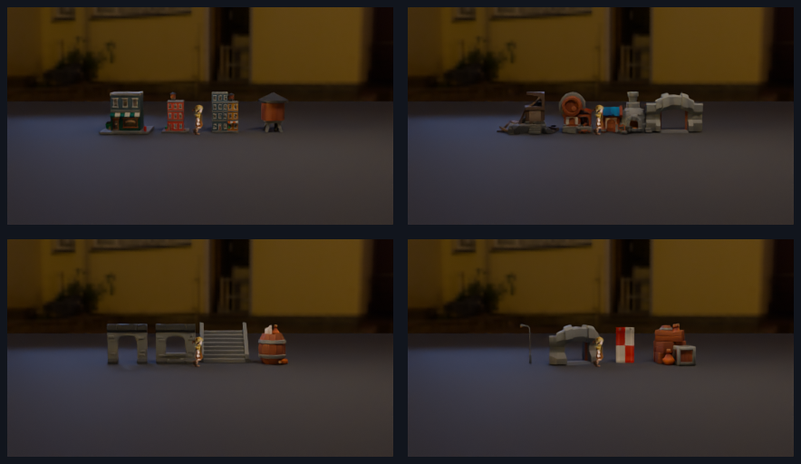

# Phase 1 — human-made kitbash sourcing

Status: complete; stopping before Phase 2 for review.

## Composition sketch used to choose candidates

The proposed Second Gate town is a narrow processional lane entering through a
thick, usable gate. The Walker action plane stays open in the middle; a gate
fragment and hanging sign/barrel cluster provide foreground occlusion; a tavern
or workshop is the primary inhabited mid-depth architecture; a damaged or
windowed structure sits behind it; and a second roofline/wall line continues
past both frame edges. The doorway should reveal a darker pocket of space rather
than read as a flat facade. The intended identity is a damp, compressed
threshold town: warm shop color and banners against cool stone, with a modest
amount of contemporary strangeness allowed only in deep background or small
props.

The search therefore prioritized, in order: gate/opening pieces, inhabitable
building masses, depth/continuation pieces, foreground occluders, then small
props. No architecture was modeled procedurally for this phase.

## Audition result

The candidates were imported as downloaded OBJ/MTL assets and rendered in four
426×240 frames through the #881 `thestra_camera.create_or_update_camera`
adapter, using the #881 `cycles-draft` profile. The Walker was created with the
#881 `create_actor_preview` helper at 1.75 world units and 24×48 nearest-filtered
sampling. The Poly Haven HDRI was used only as lighting/environment context; it
was not treated as town geometry or a background plate.

The first camera-parity fixture audition was discarded because it was a 30°
pitched diagnostic record and placed the action plane at the top of frame. The
final evidence uses the unchanged camera record from #881's
`prove_view_weighted_atlas.py::calibration_record`: 43 mm-equivalent lens,
approximately 28° horizontal FOV, 0.10 rad pitch, and 426×240 output.

## Candidate counts

| Class | Count | Notes |
| --- | ---: | --- |
| KayKit mesh candidates downloaded | 16 | 5 City Builder, 5 Medieval Hexagon, 6 Dungeon Remastered |
| Mesh candidates retained for Phase 2 shortlist | 13 | Gate/opening, inhabited, foreground, and continuation candidates |
| Mesh candidates not retained in active shortlist | 3 | City Builder `building_A`, `building_H`, and `watertower`; contemporary/weak for this town composition |
| Poly Haven lighting/material files downloaded | 4 | 1 HDRI plus 3 one-kilopixel cobblestone maps |
| AI-generated assets | 0 | No model, texture, or environment image was generated |

The shortlist is not a winner selection. It is the set allowed into the two
independent Phase 2 scene directions; selection happens only after both towns
exist and are scored.

## Source handling

- KayKit files came from direct raw downloads from the creator's public GitHub
  repositories. Each pack's own `README.source.md` and `LICENSE.txt` are kept
  beside the local files; all three packs state CC0 1.0 Universal.
- Poly Haven files came from its public asset/file API and documented download
  URLs. The API metadata snapshots are kept under `source-assets/polyhaven/`.
- Only asset files were downloaded and imported. No downloaded repository
  scripts, build files, makefiles, or add-ons were executed.
- Local SHA-256 records are in `source-manifest.sha256`.

Detailed per-asset provenance is in `PROVENANCE.md`.

## Evidence

- [candidate contact sheet](evidence/phase1/sourced-asset-contact-sheet.png)
- [native candidate group 01](evidence/phase1/candidate-group-01.png)
- [native candidate group 02](evidence/phase1/candidate-group-02.png)
- [native candidate group 03](evidence/phase1/candidate-group-03.png)
- [native candidate group 04](evidence/phase1/candidate-group-04.png)
- [audition manifest](evidence/phase1/phase1-audition.json)
