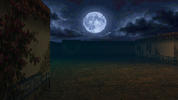

# 1. Arrival in St. Maria

**Coverage:** opening through first Labyrinth entry  
**Recommended level:** 1  
**Permanent misses:** none before first descent  
**Status:** playable opening; additional room inspections remain proposed

The opening uses three full-screen plates before control begins:

1. **Arriving carriage:** “Every few years, a Summoner comes to St. Maria.”
2. **Rain road:** the village sells food, steel, a bed and promises about what
   waits below.
3. **Labyrinth threshold:** beyond the gate souls lose their edges; Summoners
   enter by calling their own names across.

The final line—“You came for the things.”—establishes money and power rather
than prophecy as the protagonist's motive. A short black hold and **ST. MARIA /
Late Autumn** card precede the handoff to **Passage House, Room 3**. Escape
skips safely to that same room handoff, never directly into uncontextualized
movement.

> **Player commentary:** St. Maria made more sense once the first errand made me
> physically learn it. I left my room through the Passage House court, came out
> into the Cortiço, and reached the Praça to register. After Celina told me the
> gate was uphill and the shops downhill, those stopped being abstract menu
> destinations and became directions I could reuse.

## Complete route

1. Meet the already-contracted **Saban** in Room 3 and leave through its door.
2. Cross the **Passage House Arrival Court** and exit to **the Cortiço**.
3. Follow the upper route to **the Praça** and enter the **Passage Office**.
4. Register with **Registrar Celina** and receive **Crossing Writ** (item 198).
5. Decide whether to prepare before descending:
   - **Alicia's Padaria** is downhill on Market Row for provisions;
   - **Laura's forge** is farther down at the Port for equipment;
   - the **Churchyard / Labyrinth gate** is uphill from the Praça.
6. Reach the Churchyard, present the Crossing Writ, and choose **Enter Dungeon**.

The point of this route is not to make registration longer. It gives the player
one compulsory traversal that teaches the town's altitude logic before the
preparation loop becomes optional.

## Town services

| Location | Service | Opening significance |
|---|---|---|
| Passage Office, Praça | Registry | Required; grants Crossing Writ and orients the player |
| Passage House, Room 3 | Rest / inspection | Establishes persistent home and Saban |
| Alicia's Padaria, Market Row | Supplies | Recovery and expedition food |
| Laura's forge, Port | Equipment | Opening weapons and armor |
| Rusty Tankard, Quay | Information | Rumors and optional introductions |
| Chapel, Praça | Conversation | Sister Agnes; no required blessing |

The production guide must list every shop row, price, statistic and stock
condition here. A recommendation never substitutes for the complete inventory.

## Assigned-room inspections

The sign reads:

> **This'll be your home for the upcoming months.**

Proposed inspection flags include the missing picture, chipped feed bowl and
low coat hook. None blocks progression. Room 3 deliberately contains no civic
service: it is where the game can accumulate personal expedition history rather
than a second place to perform registration.

> **Player commentary:** On my first run I assumed the feed bowl was disposable
> flavor text. The Floor 3 room made me regret not paying attention. This is
> player knowledge, not something the Summoner narrates in-world.

## Starting companion: Saban

The opening room contains a common Moa whose contract already bears the
individual name **Saban**. The previous owner's name has been scraped away.
Saban is in the party before control begins.

| Opening fact | Mechanical effect | Later coverage |
|---|---|---|
| Saban is actor 61, level 3 | Occupies one active slot | Enables survival/loss reactions |
| His contract is already named | Name persists through save/load | Distinguishes him from later Moa |
| The old owner was erased | No immediate answer | Gives the Passage House a quiet suspicion |
| Saban has MPD 1 | Dangerous battle activation starts at 65 MP in the current playtest baseline | Establishes the expedition-cost language before heavier companions |

Celina's opening explanation is intentionally specific: ordinary walking does
not consume the seal; fully channeling manifested creatures into a dangerous
fight does. This keeps the town/dungeon walk itself from punishing attachment
while making party weight matter at the moment danger commits the player.

## Progression and state

- Registration grants item **198: Crossing Writ**.
- Entering the Labyrinth records first departure.
- Town exploration and shopping do not advance the Vigil.
- Town Portal use does not count as a completed physical return.

## What this section must accomplish

- **Fantasy:** the player is an outsider buying into a dangerous local economy,
  not a chosen hero.
- **Place:** the first civic errand teaches Room 3 → Cortiço → Praça, then gives
  actionable uphill/downhill directions for Gate, Padaria and Port.
- **Attachment:** the rented room and a named starter can acquire history.
- **Decision:** opening money can favor equipment, supplies, or Saban's safety.
- **Content debt:** full shop tables; room inspection flags; Saban provenance;
  first-return dialogue conditioned on individual party survival.

Next: [The First Three Incursions](02-first-three-incursions.md).
