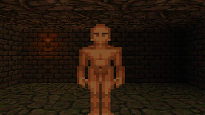
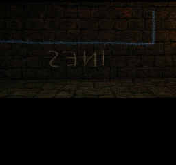
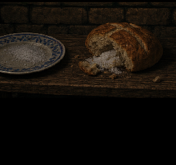
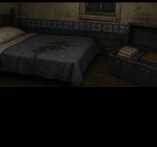

# 2. The First Three Incursions

**Coverage:** Floors 1–3 and three physical returns  
**Recommended level:** target TBD  
**Permanent risks:** individual creature loss; missed history branches  
**Status:** floor ramp and first contract playable; later discoveries proposed

The first three floors teach the dungeon in layers. Floor 1 is a compact
17x17, 3--4-room threshold; Floor 2 expands to 23x23 and 5--7 rooms; Floor 3
reaches the ordinary 27x27, 7--9-room scale. Layouts remain stable while
retracing stairs or using Town Portal.

## Completion checklist

- [ ] Complete three returns through the Floor 1 entrance.
- [ ] Contract the optional Cerberus on Floor 1.
- [ ] Find the Ines mark on Floor 1.
- [ ] Inspect the salt table on Floor 2.
- [ ] Reach the Rusted Choir and borrowed room on Floor 3.
- [ ] Report each discovery to all available respondents.
- [ ] Record the living, dead and never-recruited Saban variants.

## Floor reference

| Floor | Generated envelope | Recruitment | Physical return |
|---|---:|---|---|
| 1 | 17x17; 3--4 rooms | Optional Cerberus | Floor 1 |
| 2 | 23x23; 5--7 rooms | Ordinary floor pool | Floors 2 to 1 |
| 3 | 27x27; 7--9 rooms | Ordinary floor pool | Floors 3 to 2 to 1 |

## Floor 1: the first contract

Floor 1 has no random recruitment nodes. Its Cerberus is an authored,
optional event, presenting the player with high starting combat power versus an enormous MPD 6 traversal cost.

| Choice | Result | Guide note |
|---|---|---|
| Offer a contract | Recruit Cerberus (MPD 6); set `first_recruit_complete` | Traversal drain increases 6x for Cerberus |
| Leave him space | No recruitment; event remains available | Preserves Saban-only high efficiency return |

Saban scratches at the floor while Cerberus stands in the chamber, explicitly warning of his 6 MPD drain per step. The player sees their safe distance home collapse if they contract him.

If all eight expedition slots are occupied, use **Dismiss** from a creature's
context menu before accepting a new contract. Dismiss sends the existing
instance to the first free town-storage slot; it does not kill or erase the
creature. The command cannot remove the final active party member.

> **Player commentary:** This is where logistics finally clicked. Saban
> was efficient and dependable; Cerberus was intoxicatingly powerful but consumed
> six times as much traversal MP. Contracting Cerberus made adequacy feel weak,
> but his drain made efficiency feel valuable again.

The production version adds exhaustive enemy rows—HP, MP, attributes, skills,
recruitment, EXP, gold and drop rates—and every treasure with quantity,
probability and repeatability. Missing numbers are explicitly content debt.

## Incursion 1: the Ines mark

The backward name **INES** appears at the end of an unbroken blue line. The gate
guard recalls that Ines returned three times; on the fourth, only her creatures
came back.

> **Player commentary:** I had enough MP for one more branch or a comfortable
> return. Naturally, I chose the branch. Two encounters later Saban was nearly
> dead and I used Town Portal. The clever part is that the portal gave me
> temporary safety without pretending I had completed the trip.

### Optional: Laura's lunch

After the first physical return, ask Alicia about taking Laura's lunch. This
sets `laura_lunch_carried`; entering Laura's forge completes the delivery,
sets `laura_lunch_delivered` and pays **25G**. The bundle is not an inventory
item and occupies no expedition slot.

> **Player commentary:** I expected a fetch quest and got a two-minute walk.
> The reward barely mattered. What sold it was seeing Alicia physically fold
> into embarrassment, then Laura take the parcel as though I had handed her
> something much more dangerous than lunch. On the next visit Alicia already
> knew the cloth had come back neatly folded. The town had communicated without
> me.

## Incursion 2: the salt table

The table uses an obsolete St. Maria plate and holds warm bread packed with wet
salt. This moves the mystery from ancient builders to recent observation.

The proposed sealed-reliquary event forces the treasure to occupy the same
carrying slot as emergency Bell Salt.

| Choice | Gain | Risk | Later echo |
|---|---|---|---|
| Take reliquary | Target value TBD | Retreat without Bell Salt | Celina appraises it |
| Keep Bell Salt | No reliquary | Safer retreat | Reliquary can change later |

> **Player commentary:** On my run I took the money. A complete guide still
> gives the exact values and covers the safer route I did not choose.

## Incursion 3: the Rusted Choir

Saban can reveal the proposed safe bell order. The resulting retreat creates a
fair opportunity for permanent loss without requiring it.

> **Player commentary:** I spent my final recovery on the rare recruit instead
> of Saban. He covered the next round and died. That was my playthrough, not the
> canonical outcome.

## Borrowed-room variants

| Saban state | Alicia | Celina | Room |
|---|---|---|---|
| Alive, bowl inspected | Comments on his condition | Ledger line remains open | Empty nest; Saban reacts |
| Dead, bowl inspected | Asks about unused feed | Line already ruled through | Chalk and feather in nest |
| Declined / never owned | No bird dialogue | No individual line | Generic room |
| Lost before inspection | Muted absence reaction | Line ruled through | Feather lacks bowl context |

> **Player commentary:** Alicia noticing the feed and Celina refusing to ask
> hurt more than a generic death message. A guide reader can keep Saban alive
> and still receive a complete scene.

## What this section must accomplish

- **Fantasy:** the player leads individual companions through a return journey
  as important as the descent.
- **Mechanical meaning:** greed is an inventory decision, not a morality prompt.
- **Mystery:** the copied room incorporates actual save history.
- **Content debt:** complete encounter/treasure data; carrying constraint;
  sound puzzle; persistent death; restrained town reactions; room variants.

After the third physical return, St. Maria changes without warning.

Next: [The Vigil](03-the-vigil.md).
