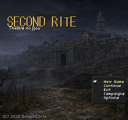

# Second Rite: Complete Walkthrough & Player Commentary

This is a **prospective complete guide** to the game we intend to make, written
as though an unusually thorough player documented it after several runs.

It combines a GameFAQs-style record of every route, item, enemy, drop, branch
and consequence with LP/RPGBlog-style commentary about surprises, attachments,
mistakes, theories and delight.

It is not limited to documenting implemented content. Its job is to fabricate
the player memories the campaign ought to produce:

> I used my last Bell Salt to save Moa, then Moa died covering the walk back
> anyway. Alicia still asks where he is.

That sentence is useful design work. It implies a loved summon, a scarce
resource, a retreat under pressure, a meaningful loss, and a townsperson who
remembers the party. Those requirements become events, data, art and tests.

## Walkthrough

1. [Arrival in St. Maria](01-arrival-in-st-maria.md)
2. [The first three incursions](02-first-three-incursions.md)
3. [The Vigil](03-the-vigil.md)

For the intended presentation—with all images loading—open
[`index.html`](index.html) in a web browser. On Windows, double-click
`userPerform/viewWalkthrough.bat` from the repository.

## The fantasy we are building

You are not a chosen hero. You are a talented, slightly desperate stranger
whose dangerous profession makes you briefly important to an isolated town.
You descend with creatures you can grow attached to, decide how much of them
to risk, and return carrying wealth, wounds and impossible evidence. St. Maria
notices what you bring back, what you fail to bring back, and what kind of
person repeated expeditions are making you.

The campaign's satisfying rhythm is:

**prepare → descend → become attached → push your luck → pay a price → return
→ be remembered → reinterpret what happened**

The Labyrinth supplies danger and mystery. St. Maria turns those events into
meaning.

## Truth labels

Because this is also a design tool, every proposed interaction is marked:

- **Playable** — verified in the current game.
- **Partly playable** — the route exists, but the authored reaction or
  presentation is incomplete.
- **Desired memory** — deliberately fictional player experience; a content
  target, not an implementation claim.

The authoritative implementation inventory remains
[`docs/ENGINE-STATE.md`](../../../../docs/ENGINE-STATE.md).

Development rules live in [Authoring the walkthrough](AUTHORING.md).
