# Furnishings catalogue

Generated from the public builders in [furnishings.py](furnishings.py). Regenerate with `python tools/blender/furnishings_catalogue.py --build`; check without Blender with `--check`.

These flat-colour orthographic illustrations show isolated construction, not native camera composition or baked lighting. Each image is fitted separately; compare the measured metres, not apparent image size. Pale context is excluded from measurements. Materials use the canonical semantic palette; custom bindings in fixtures are examples. Adopted .blend documents remain source authority.

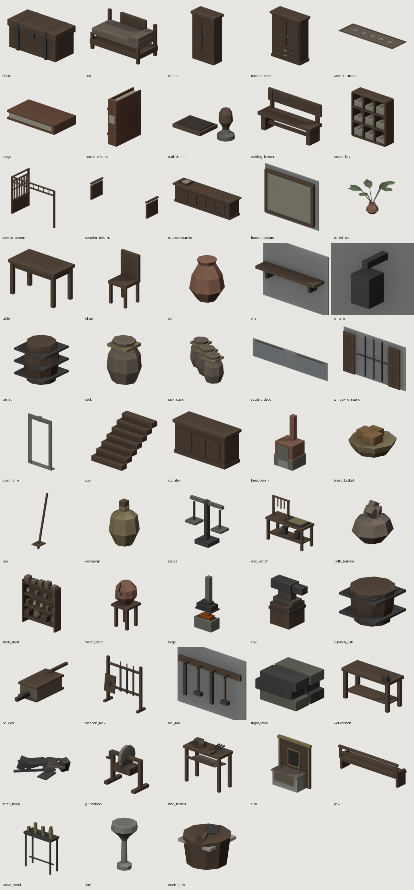

| Builder | Measured X × Y × Z (m) | Placement |
|---|---|---|
| [chest](#chest) | 0.625 × 1.200 × 0.580 | Floor at=(x,y), or use room.surface(z) for a support. +X is room depth, -Y is screen right; inspect the measured bounds. |
| [bed](#bed) | 0.990 × 1.950 × 1.050 | Floor at=(x,y), or use room.surface(z) for a support. +X is room depth, -Y is screen right; inspect the measured bounds. |
| [cabinet](#cabinet) | 0.610 × 1.140 × 1.950 | Floor at=(x,y), or use room.surface(z) for a support. +X is room depth, -Y is screen right; inspect the measured bounds. |
| [records_press](#records-press) | 1.002 × 2.320 × 2.865 | Floor at=(x,y), or use room.surface(z) for a support. +X is room depth, -Y is screen right; inspect the measured bounds. |
| [woven_runner](#woven-runner) | 1.550 × 4.700 × 0.019 | Floor at=(x,y), or use room.surface(z) for a support. +X is room depth, -Y is screen right; inspect the measured bounds. |
| [ledger](#ledger) | 0.240 × 0.431 × 0.069 | Floor at=(x,y), or use room.surface(z) for a support. +X is room depth, -Y is screen right; inspect the measured bounds. |
| [bound_volume](#bound-volume) | 0.350 × 0.104 × 0.430 | Floor at=(x,y), or use room.surface(z) for a support. +X is room depth, -Y is screen right; inspect the measured bounds. |
| [seal_stamp](#seal-stamp) | 0.130 × 0.318 × 0.150 | Floor at=(x,y), or use room.surface(z) for a support. +X is room depth, -Y is screen right; inspect the measured bounds. |
| [waiting_bench](#waiting-bench) | 0.482 × 1.750 × 1.025 | Floor at=(x,y), or use room.surface(z) for a support. +X is room depth, -Y is screen right; inspect the measured bounds. |
| [record_bay](#record-bay) | 0.460 × 1.555 × 1.705 | Floor at=(x,y), or use room.surface(z) for a support. +X is room depth, -Y is screen right; inspect the measured bounds. |
| [service_screen](#service-screen) | 1.900 × 3.920 × 2.820 | Architectural assembly: explicit front/rear and left/right extents; serving transom above 2.43 m. Align return with room joinery. |
| [counter_returns](#counter-returns) | 1.010 × 4.010 × 0.983 | Assembly behind a counter; at is the front of the return, not its footprint centre. |
| [service_counter](#service-counter) | 0.880 × 3.800 × 1.120 | Floor assembly with a separate writing station; keep the public side reachable. |
| [framed_picture](#framed-picture) | 0.075 × 1.280 × 0.950 | Back-wall mounting; at includes centre height. Bind an artwork material with its own image; preview uses plain paper. |
| [potted_plant](#potted-plant) | 1.429 × 1.413 × 0.945 | Floor or support surface. Bind foliage_mat; preview uses the semantic foliage colour without its texture. |
| [table](#table) | 0.700 × 1.250 × 0.795 | Floor at=(x,y), or use room.surface(z) for a support. +X is room depth, -Y is screen right; inspect the measured bounds. |
| [chair](#chair) | 0.440 × 0.440 × 0.980 | Floor at=(x,y), or use room.surface(z) for a support. +X is room depth, -Y is screen right; inspect the measured bounds. |
| [jar](#jar) | 0.380 × 0.380 × 0.460 | Floor at=(x,y), or use room.surface(z) for a support. +X is room depth, -Y is screen right; inspect the measured bounds. |
| [shelf](#shelf) | 0.260 × 1.300 × 0.205 | Back-wall mounting at y and z; depth is derived from room.back_x. |
| [lantern](#lantern) | 0.270 × 0.160 × 0.315 | Back-wall mounting with a separate point light; catalogue flat preview does not show its illumination. |
| [barrel](#barrel) | 0.710 × 0.710 × 0.760 | Floor at=(x,y), or use room.surface(z) for a support. +X is room depth, -Y is screen right; inspect the measured bounds. |
| [sack](#sack) | 0.441 × 0.483 × 0.580 | Floor at=(x,y), or use room.surface(z) for a support. +X is room depth, -Y is screen right; inspect the measured bounds. |
| [sack_stack](#sack-stack) | 0.841 × 1.131 × 0.580 | Floor at=(x,y), or use room.surface(z) for a support. +X is room depth, -Y is screen right; inspect the measured bounds. |
| [azulejo_dado](#azulejo-dado) | 0.060 × 6.000 × 1.210 | Wall treatment; uses room.back_x, half_width and openings. Fixture includes a doorway to demonstrate the interruption. |
| [window_dressing](#window-dressing) | 0.145 × 2.352 × 1.400 | Back-wall opening coordinates y0/y1/z0/z1; pair with the same opening used by the shell. |
| [door_frame](#door-frame) | 0.340 × 1.600 × 2.900 | Around a door opening on the back wall (lo/hi along Y) or an end wall (wall=-y/+y, lo/hi along X); pass the same span and height as the opening. |
| [stair](#stair) | 2.100 × 1.500 × 1.350 | Descending stair; geometry extends below Z=0. Review the threshold and character-floor projection in native views. |
| [counter](#counter) | 0.680 × 1.800 × 0.960 | Floor at=(x,y), or use room.surface(z) for a support. +X is room depth, -Y is screen right; inspect the measured bounds. |
| [bread_oven](#bread-oven) | 1.313 × 1.500 × 3.200 | Floor at=(x,y), or use room.surface(z) for a support. +X is room depth, -Y is screen right; inspect the measured bounds. |
| [bread_basket](#bread-basket) | 0.519 × 0.519 × 0.238 | Floor at=(x,y), or use room.surface(z) for a support. +X is room depth, -Y is screen right; inspect the measured bounds. |
| [peel](#peel) | 0.596 × 0.280 × 1.710 | Floor at=(x,y), or use room.surface(z) for a support. +X is room depth, -Y is screen right; inspect the measured bounds. |
| [demijohn](#demijohn) | 0.396 × 0.396 × 0.590 | Floor at=(x,y), or use room.surface(z) for a support. +X is room depth, -Y is screen right; inspect the measured bounds. |
| [scales](#scales) | 0.160 × 0.420 × 0.420 | Floor at=(x,y), or use room.surface(z) for a support. +X is room depth, -Y is screen right; inspect the measured bounds. |
| [wax_bench](#wax-bench) | 0.640 × 1.600 × 1.525 | Floor at=(x,y), or use room.surface(z) for a support. +X is room depth, -Y is screen right; inspect the measured bounds. |
| [cloth_bundle](#cloth-bundle) | 0.340 × 0.313 × 0.300 | Floor at=(x,y), or use room.surface(z) for a support. +X is room depth, -Y is screen right; inspect the measured bounds. |
| [stock_shelf](#stock-shelf) | 0.420 × 1.900 × 2.235 | Floor at=(x,y), or use room.surface(z) for a support. +X is room depth, -Y is screen right; inspect the measured bounds. |
| [water_stand](#water-stand) | 0.597 × 0.616 × 1.239 | Customer-reachable drinking water. Keep the stand outside the exit approach and review its silhouette with the player present. |
| [forge](#forge) | 1.139 × 1.860 × 4.510 | Floor at=(x,y), or use room.surface(z) for a support. +X is room depth, -Y is screen right; inspect the measured bounds. |
| [anvil](#anvil) | 0.520 × 0.760 × 0.896 | Floor at=(x,y), or use room.surface(z) for a support. +X is room depth, -Y is screen right; inspect the measured bounds. |
| [quench_tub](#quench-tub) | 0.736 × 0.736 × 0.560 | Floor at=(x,y), or use room.surface(z) for a support. +X is room depth, -Y is screen right; inspect the measured bounds. |
| [bellows](#bellows) | 1.732 × 0.520 × 0.435 | Floor at=(x,y), or use room.surface(z) for a support. +X is room depth, -Y is screen right; inspect the measured bounds. |
| [weapon_rack](#weapon-rack) | 0.450 × 1.670 × 1.750 | Floor at=(x,y), or use room.surface(z) for a support. +X is room depth, -Y is screen right; inspect the measured bounds. |
| [tool_rail](#tool-rail) | 0.180 × 1.300 × 0.605 | Back-wall mounting at y and z. |
| [ingot_stack](#ingot-stack) | 0.300 × 0.360 × 0.210 | Floor at=(x,y), or use room.surface(z) for a support. +X is room depth, -Y is screen right; inspect the measured bounds. |
| [workbench](#workbench) | 0.680 × 1.650 × 1.100 | Floor at=(x,y), or use room.surface(z) for a support. +X is room depth, -Y is screen right; inspect the measured bounds. |
| [scrap_heap](#scrap-heap) | 1.013 × 1.044 × 0.284 | Floor at=(x,y), or use room.surface(z) for a support. +X is room depth, -Y is screen right; inspect the measured bounds. |
| [grindstone](#grindstone) | 0.680 × 1.250 × 1.199 | Floor at=(x,y), or use room.surface(z) for a support. +X is room depth, -Y is screen right; inspect the measured bounds. |
| [fine_bench](#fine-bench) | 0.605 × 1.150 × 1.070 | Floor at=(x,y), or use room.surface(z) for a support. +X is room depth, -Y is screen right; inspect the measured bounds. |
| [altar](#altar) | 1.120 × 2.520 × 2.820 | Floor at=(x,y), or use room.surface(z) for a support. +X is room depth, -Y is screen right; inspect the measured bounds. |
| [pew](#pew) | 0.515 × 2.440 × 0.825 | Floor at=(x,y), or use room.surface(z) for a support. +X is room depth, -Y is screen right; inspect the measured bounds. |
| [votive_stand](#votive-stand) | 0.370 × 0.930 × 1.350 | Floor at=(x,y), or use room.surface(z) for a support. +X is room depth, -Y is screen right; inspect the measured bounds. |
| [font](#font) | 0.540 × 0.514 × 0.950 | Floor at=(x,y), or use room.surface(z) for a support. +X is room depth, -Y is screen right; inspect the measured bounds. |
| [mortar_tub](#mortar-tub) | 0.490 × 0.466 × 0.347 | Floor at=(x,y), or use room.surface(z) for a support. +X is room depth, -Y is screen right; inspect the measured bounds. |

## chest

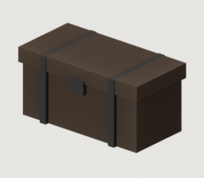

A banded chest (*arca*). The workhorse of a colonial interior: storage,
seat, and the thing a lodger actually owns.

`chest(room, name, at, *, length=1.15, depth=0.55, height=0.58)`

Floor at=(x,y), or use room.surface(z) for a support. +X is room depth, -Y is screen right; inspect the measured bounds.

Measured bounds: `[[-0.315, -0.6, 0.0], [0.31, 0.6, 0.58]]` metres. Built meshes: 1; lights: 0.

Materials: `dark_wood`, `wrought_iron`.

| Parameter | Default / required |
|---|---|
| `at` | `required` |
| `length` | `1.15` |
| `depth` | `0.55` |
| `height` | `0.58` |

Variation handles: `length`, `depth`, `height`. These are inputs to the same builder; review any changed proportions in context.

## bed

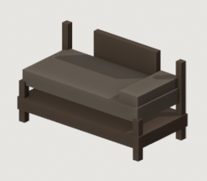

A bed with turned posts, headboard toward the back wall.

`bed(room, name, at, *, length=1.95, width=0.95, height=0.5)`

Floor at=(x,y), or use room.surface(z) for a support. +X is room depth, -Y is screen right; inspect the measured bounds.

Measured bounds: `[[-0.475, -0.975, 0.0], [0.515, 0.975, 1.05]]` metres. Built meshes: 1; lights: 0.

Materials: `aged_cloth`, `dark_wood`.

| Parameter | Default / required |
|---|---|
| `at` | `required` |
| `length` | `1.95` |
| `width` | `0.95` |
| `height` | `0.5` |

Variation handles: `length`, `width`, `height`. These are inputs to the same builder; review any changed proportions in context.

## cabinet

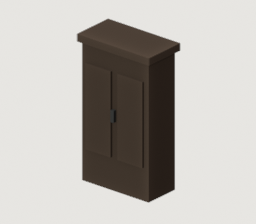

A panelled cabinet (*armario*). Tall, dark and heavy: the room's
vertical mass.

`cabinet(room, name, at, *, width=1.05, depth=0.5, height=1.85)`

Floor at=(x,y), or use room.surface(z) for a support. +X is room depth, -Y is screen right; inspect the measured bounds.

Measured bounds: `[[-0.315, -0.57, 0.0], [0.295, 0.57, 1.95]]` metres. Built meshes: 1; lights: 0.

Materials: `dark_wood`, `wrought_iron`.

| Parameter | Default / required |
|---|---|
| `at` | `required` |
| `width` | `1.05` |
| `depth` | `0.5` |
| `height` | `1.85` |

Variation handles: `width`, `depth`, `height`. These are inputs to the same builder; review any changed proportions in context.

## records_press

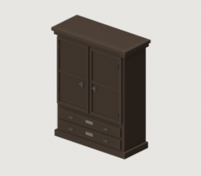

Tall civic records cupboard: framed doors, labelled drawers and stepped cornice.

`records_press(room, name, at, *, width=2.1, depth=0.82, height=2.8, panel_mat=None)`

Floor at=(x,y), or use room.surface(z) for a support. +X is room depth, -Y is screen right; inspect the measured bounds.

Measured bounds: `[[-0.542, -1.16, 0.0], [0.46, 1.16, 2.865]]` metres. Built meshes: 1; lights: 0.

Materials: `dark_wood`, `oxidized_bronze`, `paper`, `wrought_iron`.

| Parameter | Default / required |
|---|---|
| `at` | `required` |
| `width` | `2.1` |
| `depth` | `0.82` |
| `height` | `2.8` |
| `panel_mat` | `None` |

Variation handles: `width`, `depth`, `height`, `panel_mat`. These are inputs to the same builder; review any changed proportions in context.

## woven_runner

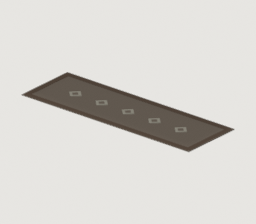

Flat decorative textile with broad borders and restrained lozenge repeats.

The lozenges repeat every 0.74 m along the length, so a long aisle runner
carries its motif end to end (the 4.7 m default keeps its five).

`woven_runner(room, name, at, *, length=4.7, width=1.55, cloth_mat, border_mat, motif_mat)`

Floor at=(x,y), or use room.surface(z) for a support. +X is room depth, -Y is screen right; inspect the measured bounds.

Measured bounds: `[[-0.775, -2.35, 0.002], [0.775, 2.35, 0.0215]]` metres. Built meshes: 1; lights: 0.

Materials: `aged_cloth`, `dark_wood`, `paper`.

| Parameter | Default / required |
|---|---|
| `at` | `required` |
| `length` | `4.7` |
| `width` | `1.55` |
| `cloth_mat` | `required` |
| `border_mat` | `required` |
| `motif_mat` | `required` |

Preview bindings: `{"border_mat": {"material": "dark_wood"}, "cloth_mat": {"material": "aged_cloth"}, "motif_mat": {"material": "paper"}}`. All other values use builder defaults.

Variation handles: `length`, `width`. These are inputs to the same builder; review any changed proportions in context.

## ledger

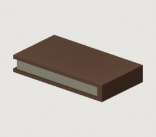

A narrow bound account book; place on a desk with room.surface().

`ledger(room, name, at, *, length=0.42, width=0.24, open_book=False)`

Floor at=(x,y), or use room.surface(z) for a support. +X is room depth, -Y is screen right; inspect the measured bounds.

Measured bounds: `[[-0.12, -0.2215, 0.0], [0.12, 0.21, 0.069]]` metres. Built meshes: 1; lights: 0.

Materials: `book_leather`, `paper`.

| Parameter | Default / required |
|---|---|
| `at` | `required` |
| `length` | `0.42` |
| `width` | `0.24` |
| `open_book` | `False` |

Variation handles: `length`, `width`, `open_book`. These are inputs to the same builder; review any changed proportions in context.

## bound_volume

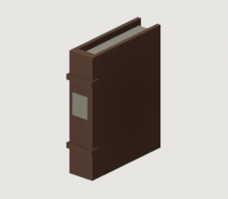

Upright ledger with recessed page block, projecting boards and visible spine.

`bound_volume(room, name, at, *, height=0.43, thickness=0.095, depth=0.34, cover_mat=None)`

Floor at=(x,y), or use room.surface(z) for a support. +X is room depth, -Y is screen right; inspect the measured bounds.

Measured bounds: `[[-0.18, -0.052, 0.0], [0.17, 0.052, 0.43]]` metres. Built meshes: 1; lights: 0.

Materials: `book_leather`, `paper`.

| Parameter | Default / required |
|---|---|
| `at` | `required` |
| `height` | `0.43` |
| `thickness` | `0.095` |
| `depth` | `0.34` |
| `cover_mat` | `None` |

Variation handles: `height`, `thickness`, `depth`, `cover_mat`. These are inputs to the same builder; review any changed proportions in context.

## seal_stamp

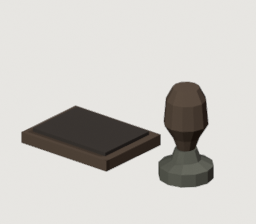

A handled brass seal beside its dark ink pad.

`seal_stamp(room, name, at)`

Floor at=(x,y), or use room.surface(z) for a support. +X is room depth, -Y is screen right; inspect the measured bounds.

Measured bounds: `[[-0.065, -0.043, 0.0], [0.065, 0.275, 0.15]]` metres. Built meshes: 1; lights: 0.

Materials: `dark_wood`, `oxidized_bronze`, `writing_ink`.

| Parameter | Default / required |
|---|---|
| `at` | `required` |

Variation handles: placement and material bindings. These are inputs to the same builder; review any changed proportions in context.

## waiting_bench

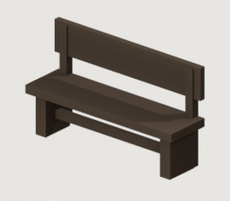

Heavy waiting bench with supported back and a lower stretcher.

`waiting_bench(room, name, at, *, length=1.75)`

Floor at=(x,y), or use room.surface(z) for a support. +X is room depth, -Y is screen right; inspect the measured bounds.

Measured bounds: `[[-0.24, -0.875, 0.0], [0.2425, 0.875, 1.025]]` metres. Built meshes: 1; lights: 0.

Materials: `dark_wood`.

| Parameter | Default / required |
|---|---|
| `at` | `required` |
| `length` | `1.75` |

Variation handles: `length`. These are inputs to the same builder; review any changed proportions in context.

## record_bay

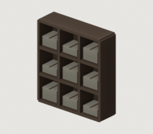

Open document pigeonholes with visible grouped paper bundles.

`record_bay(room, name, at, *, width=1.5, height=1.65, columns=3, rows=3)`

Floor at=(x,y), or use room.surface(z) for a support. +X is room depth, -Y is screen right; inspect the measured bounds.

Measured bounds: `[[-0.23, -0.7775, -0.0275], [0.23, 0.7775, 1.6775]]` metres. Built meshes: 1; lights: 0.

Materials: `book_leather`, `dark_wood`, `paper`.

| Parameter | Default / required |
|---|---|
| `at` | `required` |
| `width` | `1.5` |
| `height` | `1.65` |
| `columns` | `3` |
| `rows` | `3` |

Variation handles: `width`, `height`, `columns`, `rows`. These are inputs to the same builder; review any changed proportions in context.

## service_screen

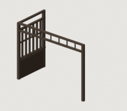

L-shaped counter joinery: an open serving transom and wall-connected return.

`service_screen(room, name, *, front, rear, left, right, panel_mat=None, height=2.78, transom_top=None, beam_spans=())`

Architectural assembly: explicit front/rear and left/right extents; serving transom above 2.43 m. Align return with room joinery.

Measured bounds: `[[-0.06, -1.96, 0.0], [1.84, 1.96, 2.82]]` metres. Built meshes: 1; lights: 0.

Materials: `dark_wood`.

| Parameter | Default / required |
|---|---|
| `front` | `required` |
| `rear` | `required` |
| `left` | `required` |
| `right` | `required` |
| `panel_mat` | `None` |
| `height` | `2.78` |
| `transom_top` | `None` |
| `beam_spans` | `()` |

Preview bindings: `{"front": 0, "left": 1.9, "rear": 1.8, "right": -1.9}`. All other values use builder defaults.

Variation handles: `panel_mat`, `height`, `transom_top`, `beam_spans`. These are inputs to the same builder; review any changed proportions in context.

## counter_returns

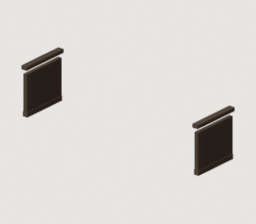

Low cabinetry returning behind a counter; no freestanding architectural frame.

`counter_returns(room, name, at, *, length=3.8, depth=0.95, height=0.92, panel_mat=None)`

Assembly behind a counter; at is the front of the return, not its footprint centre.

Measured bounds: `[[-0.03, -2.005, 0.0], [0.98, 2.005, 0.9825]]` metres. Built meshes: 1; lights: 0.

Materials: `dark_wood`.

| Parameter | Default / required |
|---|---|
| `at` | `required` |
| `length` | `3.8` |
| `depth` | `0.95` |
| `height` | `0.92` |
| `panel_mat` | `None` |

Variation handles: `length`, `depth`, `height`, `panel_mat`. These are inputs to the same builder; review any changed proportions in context.

## service_counter

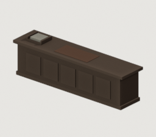

Panelled civic counter with overhanging writing surface and foot rail.

`service_counter(room, name, at, *, length=3.8, height=0.92)`

Floor assembly with a separate writing station; keep the public side reachable.

Measured bounds: `[[-0.44, -1.9, 0.0], [0.44, 1.9, 1.12]]` metres. Built meshes: 2; lights: 0.

Materials: `book_leather`, `dark_wood`, `paper`.

| Parameter | Default / required |
|---|---|
| `at` | `required` |
| `length` | `3.8` |
| `height` | `0.92` |

Variation handles: `length`, `height`. These are inputs to the same builder; review any changed proportions in context.

## framed_picture

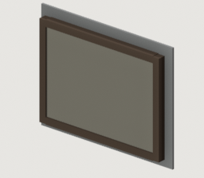

A back-wall frame with recessed canvas and explicitly mapped image UVs.

`framed_picture(room, name, at, *, width=1.15, height=0.82, artwork)`

Back-wall mounting; at includes centre height. Bind an artwork material with its own image; preview uses plain paper.

Measured bounds: `[[-0.0375, -0.64, 1.125], [0.0375, 0.64, 2.075]]` metres. Built meshes: 1; lights: 0.

Materials: `dark_wood`, `paper`.

| Parameter | Default / required |
|---|---|
| `at` | `required` |
| `width` | `1.15` |
| `height` | `0.82` |
| `artwork` | `required` |

Preview bindings: `{"artwork": {"material": "paper"}, "at": [0, 0, 1.6]}`. All other values use builder defaults.

Variation handles: `width`, `height`. These are inputs to the same builder; review any changed proportions in context.

## potted_plant

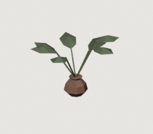

One clay pot with folded, broad-leaved foliage and separate stem silhouettes.

`potted_plant(room, name, at, *, foliage_mat, pot_mat=None)`

Floor or support surface. Bind foliage_mat; preview uses the semantic foliage colour without its texture.

Measured bounds: `[[-0.708994, -0.717243, 0.0], [0.72, 0.695315, 0.945]]` metres. Built meshes: 1; lights: 0.

Materials: `foliage`, `terracotta`.

| Parameter | Default / required |
|---|---|
| `at` | `required` |
| `foliage_mat` | `required` |
| `pot_mat` | `None` |

Preview bindings: `{"foliage_mat": {"material": "foliage"}}`. All other values use builder defaults.

Variation handles: `pot_mat`. These are inputs to the same builder; review any changed proportions in context.

## table

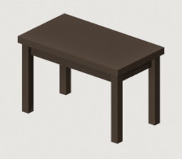

A table on turned legs.

`table(room, name, at, *, length=1.25, width=0.7, height=0.76)`

Floor at=(x,y), or use room.surface(z) for a support. +X is room depth, -Y is screen right; inspect the measured bounds.

Measured bounds: `[[-0.35, -0.625, 0.0], [0.35, 0.625, 0.795]]` metres. Built meshes: 1; lights: 0.

Materials: `dark_wood`.

| Parameter | Default / required |
|---|---|
| `at` | `required` |
| `length` | `1.25` |
| `width` | `0.7` |
| `height` | `0.76` |

Variation handles: `length`, `width`, `height`. These are inputs to the same builder; review any changed proportions in context.

## chair

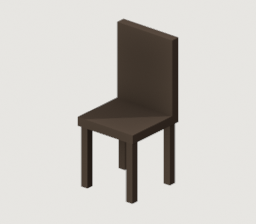

A straight-backed chair.

`chair(room, name, at, *, seat=0.44, width=0.44)`

Floor at=(x,y), or use room.surface(z) for a support. +X is room depth, -Y is screen right; inspect the measured bounds.

Measured bounds: `[[-0.22, -0.22, 0.0], [0.22, 0.22, 0.98]]` metres. Built meshes: 1; lights: 0.

Materials: `dark_wood`.

| Parameter | Default / required |
|---|---|
| `at` | `required` |
| `seat` | `0.44` |
| `width` | `0.44` |

Variation handles: `seat`, `width`. These are inputs to the same builder; review any changed proportions in context.

## jar

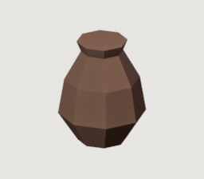

An unglazed jar (*pote*). Radial, so it breaks up an interior of
boxes.

`jar(room, name, at, *, height=0.46, radius=0.19, sides=8, mat=None)`

Floor at=(x,y), or use room.surface(z) for a support. +X is room depth, -Y is screen right; inspect the measured bounds.

Measured bounds: `[[-0.19, -0.19, 0.0], [0.19, 0.19, 0.46]]` metres. Built meshes: 1; lights: 0.

Materials: `terracotta`.

| Parameter | Default / required |
|---|---|
| `at` | `required` |
| `height` | `0.46` |
| `radius` | `0.19` |
| `sides` | `8` |
| `mat` | `None` |

Variation handles: `height`, `radius`, `sides`, `mat`. These are inputs to the same builder; review any changed proportions in context.

## shelf

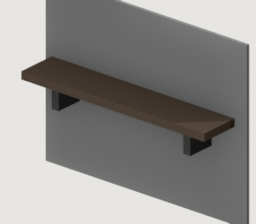

A shelf against the back wall, with its brackets.

`shelf(room, name, *, y, z, length=1.3, depth=0.26)`

Back-wall mounting at y and z; depth is derived from room.back_x.

Measured bounds: `[[3.606667, -0.65, 1.32], [3.866667, 0.65, 1.525]]` metres. Built meshes: 1; lights: 0.

Materials: `dark_wood`, `wrought_iron`.

| Parameter | Default / required |
|---|---|
| `y` | `required` |
| `z` | `required` |
| `length` | `1.3` |
| `depth` | `0.26` |

Preview bindings: `{"y": 0, "z": 1.5}`. All other values use builder defaults.

Variation handles: `length`, `depth`. These are inputs to the same builder; review any changed proportions in context.

## lantern

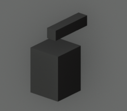

A wrought-iron wall lantern, and the light it actually casts.

The light is a separate object by necessity -- a lamp cannot be joined
into a mesh -- so it stays a sibling of the joined lantern body.

`lantern(room, name, *, y, z=2.1, energy=13.0)`

Back-wall mounting with a separate point light; catalogue flat preview does not show its illumination.

Measured bounds: `[[3.626667, -0.08, 1.99], [3.896667, 0.08, 2.305]]` metres. Built meshes: 1; lights: 0.

Materials: `sr_lamp_glow`, `wrought_iron`.

| Parameter | Default / required |
|---|---|
| `y` | `required` |
| `z` | `2.1` |
| `energy` | `13.0` |

Preview bindings: `{"y": 0}`. All other values use builder defaults.

Variation handles: `z`, `energy`. These are inputs to the same builder; review any changed proportions in context.

## barrel

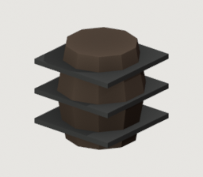

A staved storage barrel with iron reinforcement hoops.

`barrel(room, name, at, *, radius=0.32, height=0.76)`

Floor at=(x,y), or use room.surface(z) for a support. +X is room depth, -Y is screen right; inspect the measured bounds.

Measured bounds: `[[-0.3552, -0.3552, 0.0], [0.3552, 0.3552, 0.76]]` metres. Built meshes: 1; lights: 0.

Materials: `dark_wood`, `wrought_iron`.

| Parameter | Default / required |
|---|---|
| `at` | `required` |
| `radius` | `0.32` |
| `height` | `0.76` |

Variation handles: `radius`, `height`. These are inputs to the same builder; review any changed proportions in context.

## sack

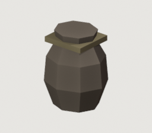

A burlap sack of flour or grain, gathered and tied at the neck.

`sack(room, name, at, *, width=0.46, depth=0.42, height=0.58, rotation=0.0)`

Floor at=(x,y), or use room.surface(z) for a support. +X is room depth, -Y is screen right; inspect the measured bounds.

Measured bounds: `[[-0.2205, -0.2415, 0.0], [0.2205, 0.2415, 0.58]]` metres. Built meshes: 1; lights: 0.

Materials: `aged_cloth`, `wax`.

| Parameter | Default / required |
|---|---|
| `at` | `required` |
| `width` | `0.46` |
| `depth` | `0.42` |
| `height` | `0.58` |
| `rotation` | `0.0` |

Variation handles: `width`, `depth`, `height`, `rotation`. These are inputs to the same builder; review any changed proportions in context.

## sack_stack

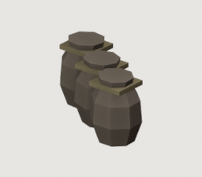

A leaning cluster of sacks. One piece, not three.

`sack_stack(room, name, at, count=3)`

Floor at=(x,y), or use room.surface(z) for a support. +X is room depth, -Y is screen right; inspect the measured bounds.

Measured bounds: `[[-0.407132, -0.546858, 0.0], [0.433645, 0.583992, 0.58]]` metres. Built meshes: 1; lights: 0.

Materials: `aged_cloth`, `wax`.

| Parameter | Default / required |
|---|---|
| `at` | `required` |
| `count` | `3` |

Variation handles: `count`. These are inputs to the same builder; review any changed proportions in context.

## azulejo_dado

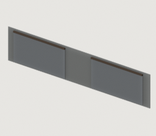

The tiled band along the back wall, broken around every opening.

Waist-high, and only ever a band. A whole wall of azulejo reads as a church
or a station, not a room somebody lives in.

Tiling is applied to a WALL, so it stops at each doorway and starts again
on the far side. Running one band across the openings makes the doors look
painted on; `room.openings` (recorded by `Interior.back_wall`) is the same
list the wall itself was built from, so the two can never disagree.

`azulejo_dado(room, *, height=1.15, y0=None, y1=None, proud=0.02, margin=0.06)`

Wall treatment; uses room.back_x, half_width and openings. Fixture includes a doorway to demonstrate the interruption.

Measured bounds: `[[3.816667, -3.0, 0.0], [3.876667, 3.0, 1.21]]` metres. Built meshes: 1; lights: 0.

Materials: `azulejo`, `dark_wood`.

| Parameter | Default / required |
|---|---|
| `height` | `1.15` |
| `y0` | `None` |
| `y1` | `None` |
| `proud` | `0.02` |
| `margin` | `0.06` |

Variation handles: `height`, `y0`, `y1`, `proud`, `margin`. These are inputs to the same builder; review any changed proportions in context.

## window_dressing

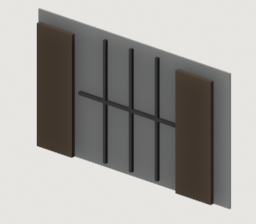

An iron grille over the opening, and shutters folded back beside it.

`window_dressing(room, name, y0, y1, z0, z1, *, grille=True, shutters=True)`

Back-wall opening coordinates y0/y1/z0/z1; pair with the same opening used by the shell.

Measured bounds: `[[3.701667, -1.176, 1.2], [3.846667, 1.176, 2.6]]` metres. Built meshes: 1; lights: 0.

Materials: `dark_wood`, `wrought_iron`.

| Parameter | Default / required |
|---|---|
| `y0` | `required` |
| `y1` | `required` |
| `z0` | `required` |
| `z1` | `required` |
| `grille` | `True` |
| `shutters` | `True` |

Preview bindings: `{"y0": -0.7, "y1": 0.7, "z0": 1.2, "z1": 2.6}`. All other values use builder defaults.

Variation handles: `grille`, `shutters`. These are inputs to the same builder; review any changed proportions in context.

## door_frame

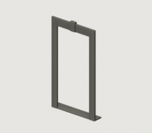

A cut-stone surround (*cantaria*) for a door.

`lo`/`hi` span the opening along its wall: Y for the back wall, X for a
side wall (`wall="-y"` or `"+y"`, the end walls of a long hall). Pair it
with the same opening used by `back_wall`/`doorway` or
`side_walls`/`side_doorway`. A colonial door is a dark panelled leaf in a
limestone frame set into limewash: the frame is what makes an opening
read as a door and not a hole. Jambs, a lintel with a keystone, a sill.

`door_frame(room, name, lo, hi, height, *, wall='back', jamb=0.2, proud=0.06)`

Around a door opening on the back wall (lo/hi along Y) or an end wall (wall=-y/+y, lo/hi along X); pass the same span and height as the opening.

Measured bounds: `[[3.776667, -0.8, 0.0], [4.116667, 0.8, 2.9]]` metres. Built meshes: 1; lights: 0.

Materials: `rough_limestone`.

| Parameter | Default / required |
|---|---|
| `lo` | `required` |
| `hi` | `required` |
| `height` | `required` |
| `wall` | `'back'` |
| `jamb` | `0.2` |
| `proud` | `0.06` |

Preview bindings: `{"height": 2.6, "hi": 0.6, "lo": -0.6}`. All other values use builder defaults.

Variation handles: `wall`, `jamb`, `proud`. These are inputs to the same builder; review any changed proportions in context.

## stair

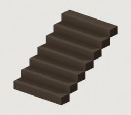

A flight of steps going DOWN, away from the floor plane.

The way out of a storey. `direction` is the axis the flight travels:
-1 steps toward the camera, +1 steps away from it. At this camera a flight
running toward the viewer disappears under the status menu almost at once,
so a visible stair down normally runs AWAY, through an opening.

`stair(room, name, *, y, x_start, steps=7, rise=0.19, run=0.3, width=1.5, direction=-1.0)`

Descending stair; geometry extends below Z=0. Review the threshold and character-floor projection in native views.

Measured bounds: `[[-1.95, -0.75, -1.35], [0.15, 0.75, 0.0]]` metres. Built meshes: 1; lights: 0.

Materials: `dark_wood`.

| Parameter | Default / required |
|---|---|
| `y` | `required` |
| `x_start` | `required` |
| `steps` | `7` |
| `rise` | `0.19` |
| `run` | `0.3` |
| `width` | `1.5` |
| `direction` | `-1.0` |

Preview bindings: `{"x_start": 0, "y": 0}`. All other values use builder defaults.

Variation handles: `steps`, `rise`, `run`, `width`, `direction`. These are inputs to the same builder; review any changed proportions in context.

## counter

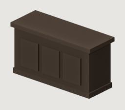

A merchant shop counter (*balcao*): heavy dark timber carcass, recessed
front panelling, overhanging top slab and a plinth.

`top_mat` gives the counter a stone slab instead of a timber top. Worth
reaching for in a shop: a dark carcass with a dark top is one unbroken mass
across the middle of the frame, and anything standing on it disappears.
A limestone top is also what a counter that gets scrubbed daily is made of.

`counter(room, name, at, *, length=1.8, width=0.68, height=0.88, panels=3, top_mat=None, body_mat=None, panel_mat=None)`

Floor at=(x,y), or use room.surface(z) for a support. +X is room depth, -Y is screen right; inspect the measured bounds.

Measured bounds: `[[-0.34, -0.9, 0.0], [0.34, 0.9, 0.96]]` metres. Built meshes: 1; lights: 0.

Materials: `dark_wood`.

| Parameter | Default / required |
|---|---|
| `at` | `required` |
| `length` | `1.8` |
| `width` | `0.68` |
| `height` | `0.88` |
| `panels` | `3` |
| `top_mat` | `None` |
| `body_mat` | `None` |
| `panel_mat` | `None` |

Variation handles: `length`, `width`, `height`, `panels`, `top_mat`, `body_mat`, `panel_mat`. These are inputs to the same builder; review any changed proportions in context.

## bread_oven

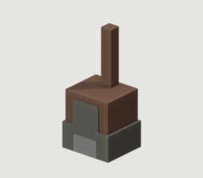

A masonry wood-fired bread oven (*forno a lenha*).

Thick stone base with a firewood niche under it, a clay baking vault over
that, an open mouth showing the ember bed, and a terracotta flue. The
embers are emissive and want a `room.light` beside them.

`bread_oven(room, name, at, *, length=1.5, depth=1.3, height=1.6)`

Floor at=(x,y), or use room.surface(z) for a support. +X is room depth, -Y is screen right; inspect the measured bounds.

Measured bounds: `[[-0.663, -0.75, 0.0], [0.65, 0.75, 3.2]]` metres. Built meshes: 1; lights: 0.

Materials: `dark_wood`, `rough_limestone`, `sr_hearth_embers`, `terracotta`, `whitewash`.

| Parameter | Default / required |
|---|---|
| `at` | `required` |
| `length` | `1.5` |
| `depth` | `1.3` |
| `height` | `1.6` |

Variation handles: `length`, `depth`, `height`. These are inputs to the same builder; review any changed proportions in context.

## bread_basket

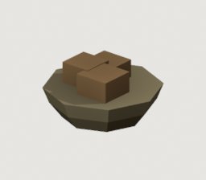

A woven basket of crusty loaves (*broas*).

`bread_basket(room, name, at, *, radius=0.22, height=0.14, loaves=None)`

Floor at=(x,y), or use room.surface(z) for a support. +X is room depth, -Y is screen right; inspect the measured bounds.

Measured bounds: `[[-0.2596, -0.2596, 0.0], [0.2596, 0.2596, 0.2376]]` metres. Built meshes: 1; lights: 0.

Materials: `bread_crust`, `wax`.

| Parameter | Default / required |
|---|---|
| `at` | `required` |
| `radius` | `0.22` |
| `height` | `0.14` |
| `loaves` | `None` |

Variation handles: `radius`, `height`, `loaves`. These are inputs to the same builder; review any changed proportions in context.

## peel

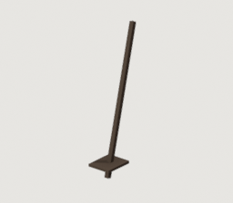

A baker's peel (*pa de forno*), leaning against the wall or the oven.

`peel(room, name, at, *, length=1.75, angle_deg=14.0)`

Floor at=(x,y), or use room.surface(z) for a support. +X is room depth, -Y is screen right; inspect the measured bounds.

Measured bounds: `[[-0.17, -0.14, -0.006048], [0.426453, 0.14, 1.704066]]` metres. Built meshes: 1; lights: 0.

Materials: `dark_wood`.

| Parameter | Default / required |
|---|---|
| `at` | `required` |
| `length` | `1.75` |
| `angle_deg` | `14.0` |

Variation handles: `length`, `angle_deg`. These are inputs to the same builder; review any changed proportions in context.

## demijohn

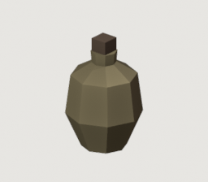

A wicker-cased glass demijohn (*garrafao*) for oil or wine.

`demijohn(room, name, at, *, height=0.52, radius=0.18)`

Floor at=(x,y), or use room.surface(z) for a support. +X is room depth, -Y is screen right; inspect the measured bounds.

Measured bounds: `[[-0.198, -0.198, 0.0], [0.198, 0.198, 0.59]]` metres. Built meshes: 1; lights: 0.

Materials: `dark_wood`, `wax`.

| Parameter | Default / required |
|---|---|
| `at` | `required` |
| `height` | `0.52` |
| `radius` | `0.18` |

Variation handles: `height`, `radius`. These are inputs to the same builder; review any changed proportions in context.

## scales

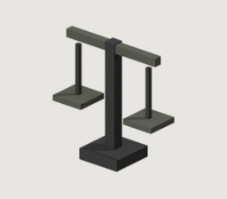

A tabletop balance (*balanca*) for weighing dry goods and coin.

`scales(room, name, at, *, height=0.42, width=0.38)`

Floor at=(x,y), or use room.surface(z) for a support. +X is room depth, -Y is screen right; inspect the measured bounds.

Measured bounds: `[[-0.08, -0.21, 0.0], [0.08, 0.21, 0.42]]` metres. Built meshes: 1; lights: 0.

Materials: `oxidized_bronze`, `wrought_iron`.

| Parameter | Default / required |
|---|---|
| `at` | `required` |
| `height` | `0.42` |
| `width` | `0.38` |

Variation handles: `height`, `width`. These are inputs to the same builder; review any changed proportions in context.

## wax_bench

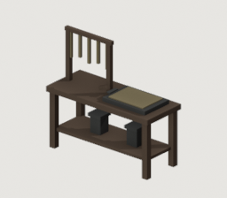

The candle bench: a wax tray, a dipping frame, and finished lanterns.

Alicia is scraping wax from a tray when the player finds her during the
Vigil, and the lantern she hides behind the counter bears no human name.
So the bakery is also where St. Maria's lanterns are made -- which is not a
coincidence but an economy: the oven is already hot, and rendering wax
wants exactly the heat that is otherwise going up the flue.

Faces the camera: the tray and the taper row read from -X.

`wax_bench(room, name, at, *, length=1.6, width=0.64, height=0.78)`

Floor at=(x,y), or use room.surface(z) for a support. +X is room depth, -Y is screen right; inspect the measured bounds.

Measured bounds: `[[-0.32, -0.8, 0.0], [0.32, 0.8, 1.525]]` metres. Built meshes: 1; lights: 0.

Materials: `charcoal`, `dark_wood`, `wax`, `wrought_iron`.

| Parameter | Default / required |
|---|---|
| `at` | `required` |
| `length` | `1.6` |
| `width` | `0.64` |
| `height` | `0.78` |

Variation handles: `length`, `width`, `height`. These are inputs to the same builder; review any changed proportions in context.

## cloth_bundle

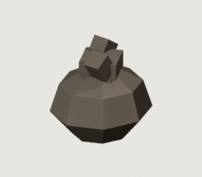

Goods tied into a cloth, ready to be carried (*embrulho*).

Alicia ties bread, cheese and a bruised pear into a cloth for Laura, and
the cloth comes back folded into a perfect square. A shop where everything
is still on a shelf has not sold anything yet; a bundle is a transaction
that has already happened.

`cloth_bundle(room, name, at, *, radius=0.17, height=0.24, rotation=0.0)`

Floor at=(x,y), or use room.surface(z) for a support. +X is room depth, -Y is screen right; inspect the measured bounds.

Measured bounds: `[[-0.17, -0.1564, 0.0], [0.17, 0.1564, 0.30043]]` metres. Built meshes: 1; lights: 0.

Materials: `aged_cloth`.

| Parameter | Default / required |
|---|---|
| `at` | `required` |
| `radius` | `0.17` |
| `height` | `0.24` |
| `rotation` | `0.0` |

Variation handles: `radius`, `height`, `rotation`. These are inputs to the same builder; review any changed proportions in context.

## stock_shelf

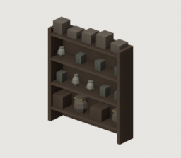

An open stock rack, loaded to the top (*prateleira*).

"Watching people leave with full bags... it means they might come back."
A shop reads as a shop because of VOLUME, not because of three
representative props, and a rack is the cheapest volume in this
vocabulary. Stock is graded by tier the way a real shop grades it: heavy
and dull below, small and valuable at eye level, overflow above the reach.

`stock_shelf(room, name, at, *, length=1.9, depth=0.42, height=2.05, tiers=4)`

Floor at=(x,y), or use room.surface(z) for a support. +X is room depth, -Y is screen right; inspect the measured bounds.

Measured bounds: `[[-0.21, -0.95, 0.0], [0.21, 0.95, 2.235]]` metres. Built meshes: 1; lights: 0.

Materials: `aged_cloth`, `bone`, `dark_wood`, `oxidized_bronze`, `wax`.

| Parameter | Default / required |
|---|---|
| `at` | `required` |
| `length` | `1.9` |
| `depth` | `0.42` |
| `height` | `2.05` |
| `tiers` | `4` |

Variation handles: `length`, `depth`, `height`, `tiers`. These are inputs to the same builder; review any changed proportions in context.

## water_stand

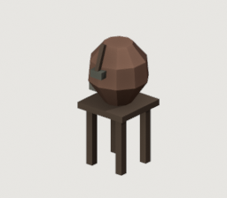

A water crock on a stand, with a dipper and a cup (*talha de agua*).

"Please drink water before you descend. People return looking like they
forgot they have bodies." It is the first thing Alicia says to the player
and the only free thing in the shop, so it stands where a customer can
reach it rather than behind the counter.

`water_stand(room, name, at, *, height=0.55, radius=0.28)`

Customer-reachable drinking water. Keep the stand outside the exit approach and review its silhouette with the player present.

Measured bounds: `[[-0.317, -0.266296, 0.0], [0.28, 0.35, 1.238976]]` metres. Built meshes: 1; lights: 0.

Materials: `bone`, `dark_wood`, `oxidized_bronze`, `terracotta`.

| Parameter | Default / required |
|---|---|
| `at` | `required` |
| `height` | `0.55` |
| `radius` | `0.28` |

Variation handles: `height`, `radius`. These are inputs to the same builder; review any changed proportions in context.

## forge

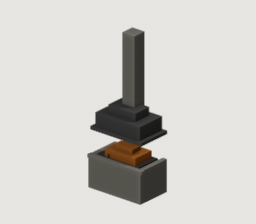

A masonry forge hearth (*forja*): stone body, a charcoal bed with
incandescent coke, an iron hood and a flue.

The ember bed is emissive but casts nothing on its own -- give it a
`room.light` so the shadows in the room come from the fire that motivates
them.

`forge(room, name, at, *, length=1.8, depth=1.1, height=0.86, chimney_h=2.3)`

Floor at=(x,y), or use room.surface(z) for a support. +X is room depth, -Y is screen right; inspect the measured bounds.

Measured bounds: `[[-0.55, -0.93, 0.0], [0.589, 0.93, 4.51]]` metres. Built meshes: 1; lights: 0.

Materials: `charcoal`, `rough_limestone`, `sr_hearth_embers`, `wrought_iron`.

| Parameter | Default / required |
|---|---|
| `at` | `required` |
| `length` | `1.8` |
| `depth` | `1.1` |
| `height` | `0.86` |
| `chimney_h` | `2.3` |

Variation handles: `length`, `depth`, `height`, `chimney_h`. These are inputs to the same builder; review any changed proportions in context.

## anvil

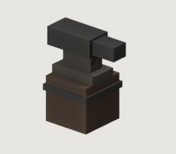

An anvil (*bigorna*) on a banded hardwood stump (*cepo*).

`anvil(room, name, at, *, horn_len=0.78, width=0.26, height=0.44, stump_h=0.46)`

Floor at=(x,y), or use room.surface(z) for a support. +X is room depth, -Y is screen right; inspect the measured bounds.

Measured bounds: `[[-0.26, -0.4446, 0.0], [0.26, 0.3159, 0.8956]]` metres. Built meshes: 1; lights: 0.

Materials: `dark_wood`, `forge_scale`, `wrought_iron`.

| Parameter | Default / required |
|---|---|
| `at` | `required` |
| `horn_len` | `0.78` |
| `width` | `0.26` |
| `height` | `0.44` |
| `stump_h` | `0.46` |

Variation handles: `horn_len`, `width`, `height`, `stump_h`. These are inputs to the same builder; review any changed proportions in context.

## quench_tub

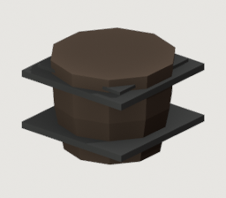

A staved slack tub (*tina de tempera*) with iron hoops, standing full.

`quench_tub(room, name, at, *, radius=0.32, height=0.56)`

Floor at=(x,y), or use room.surface(z) for a support. +X is room depth, -Y is screen right; inspect the measured bounds.

Measured bounds: `[[-0.368, -0.368, 0.0], [0.368, 0.368, 0.56]]` metres. Built meshes: 1; lights: 0.

Materials: `dark_wood`, `wrought_iron`.

| Parameter | Default / required |
|---|---|
| `at` | `required` |
| `radius` | `0.32` |
| `height` | `0.56` |

Variation handles: `radius`, `height`. These are inputs to the same builder; review any changed proportions in context.

## bellows

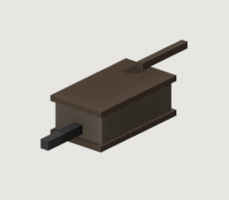

Leather and hardwood bellows (*fole*), nozzle pointing into the forge.

`bellows(room, name, at, *, length=1.1, width=0.52, height=0.38)`

Floor at=(x,y), or use room.surface(z) for a support. +X is room depth, -Y is screen right; inspect the measured bounds.

Measured bounds: `[[-0.8525, -0.26, 0.055], [0.88, 0.26, 0.49]]` metres. Built meshes: 1; lights: 0.

Materials: `aged_cloth`, `dark_wood`, `wrought_iron`.

| Parameter | Default / required |
|---|---|
| `at` | `required` |
| `length` | `1.1` |
| `width` | `0.52` |
| `height` | `0.38` |

Variation handles: `length`, `width`, `height`. These are inputs to the same builder; review any changed proportions in context.

## weapon_rack

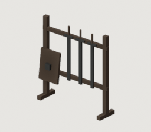

A display rack of forged blades, with a shield blank leaning on it.

`weapon_rack(room, name, at, *, length=1.65, depth=0.45, height=1.75)`

Floor at=(x,y), or use room.surface(z) for a support. +X is room depth, -Y is screen right; inspect the measured bounds.

Measured bounds: `[[-0.225, -0.825, 0.0], [0.225, 0.845, 1.75]]` metres. Built meshes: 1; lights: 0.

Materials: `dark_wood`, `wrought_iron`.

| Parameter | Default / required |
|---|---|
| `at` | `required` |
| `length` | `1.65` |
| `depth` | `0.45` |
| `height` | `1.75` |

Variation handles: `length`, `depth`, `height`. These are inputs to the same builder; review any changed proportions in context.

## tool_rail

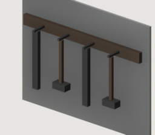

A wall batten hung with tongs and hammers.

`tool_rail(room, name, *, y, z, length=1.3)`

Back-wall mounting at y and z.

Measured bounds: `[[3.646667, -0.65, 0.945], [3.826667, 0.65, 1.55]]` metres. Built meshes: 1; lights: 0.

Materials: `dark_wood`, `wrought_iron`.

| Parameter | Default / required |
|---|---|
| `y` | `required` |
| `z` | `required` |
| `length` | `1.3` |

Preview bindings: `{"y": 0, "z": 1.5}`. All other values use builder defaults.

Variation handles: `length`. These are inputs to the same builder; review any changed proportions in context.

## ingot_stack

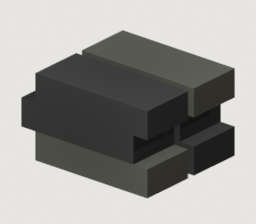

A stack of cast iron and bronze ingots.

`ingot_stack(room, name, at, rows=3, cols=2)`

Floor at=(x,y), or use room.surface(z) for a support. +X is room depth, -Y is screen right; inspect the measured bounds.

Measured bounds: `[[-0.15, -0.16, 0.0], [0.15, 0.2, 0.21]]` metres. Built meshes: 1; lights: 0.

Materials: `oxidized_bronze`, `wrought_iron`.

| Parameter | Default / required |
|---|---|
| `at` | `required` |
| `rows` | `3` |
| `cols` | `2` |

Variation handles: `rows`, `cols`. These are inputs to the same builder; review any changed proportions in context.

## workbench

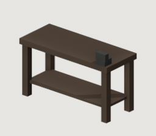

A smith's workbench with a bench vice and a tool shelf under it.

`workbench(room, name, at, *, length=1.65, width=0.68, height=0.86)`

Floor at=(x,y), or use room.surface(z) for a support. +X is room depth, -Y is screen right; inspect the measured bounds.

Measured bounds: `[[-0.34, -0.825, 0.0], [0.34, 0.825, 1.1]]` metres. Built meshes: 1; lights: 0.

Materials: `dark_wood`, `wrought_iron`.

| Parameter | Default / required |
|---|---|
| `at` | `required` |
| `length` | `1.65` |
| `width` | `0.68` |
| `height` | `0.86` |

Variation handles: `length`, `width`, `height`. These are inputs to the same builder; review any changed proportions in context.

## scrap_heap

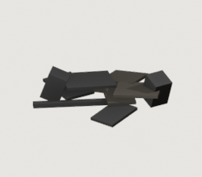

Salvage waiting to be decided about: flattened lantern frames, and
whatever the Labyrinth failed to digest.

"She is hammering old lantern frames flat for reuse." Laura's stock is not
bought, it is recovered, and this is the only disorder her room is allowed
-- everything else she has already made a decision about. Flat plates lying
at angles read as a heap at this camera where a mound of boxes does not.

`scrap_heap(room, name, at, *, spread=0.9, layers=7)`

Floor at=(x,y), or use room.surface(z) for a support. +X is room depth, -Y is screen right; inspect the measured bounds.

Measured bounds: `[[-0.585149, -0.527535, -0.021871], [0.427605, 0.516855, 0.261871]]` metres. Built meshes: 1; lights: 0.

Materials: `forge_scale`, `wrought_iron`.

| Parameter | Default / required |
|---|---|
| `at` | `required` |
| `spread` | `0.9` |
| `layers` | `7` |

Variation handles: `spread`, `layers`. These are inputs to the same builder; review any changed proportions in context.

## grindstone

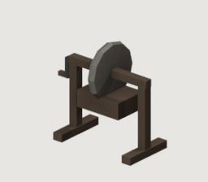

A treadle grindstone in its frame, over a water trough (*mo de afiar*).

The wheel is the only curve in this vocabulary that reads in ELEVATION
rather than in plan -- every other radial piece is a jar seen end-on. Next
to an anvil and a rack of straight bars that is worth a great deal, and it
is also the fixture that says a smith SHARPENS as well as forges.

`grindstone(room, name, at, *, radius=0.34, height=0.74, rotation=0.0)`

Floor at=(x,y), or use room.surface(z) for a support. +X is room depth, -Y is screen right; inspect the measured bounds.

Measured bounds: `[[-0.34, -0.54, -0.0], [0.34, 0.71, 1.199]]` metres. Built meshes: 1; lights: 0.

Materials: `dark_wood`, `rough_limestone`, `wrought_iron`.

| Parameter | Default / required |
|---|---|
| `at` | `required` |
| `radius` | `0.34` |
| `height` | `0.74` |
| `rotation` | `0.0` |

Variation handles: `radius`, `height`, `rotation`. These are inputs to the same builder; review any changed proportions in context.

## fine_bench

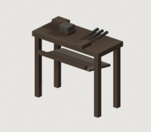

The precious-metal bench: high, small, and slung with a catch skin.

"The gold is pure... untouched." Laura takes goldwork as well as blade
work, and the two are not done at the same bench -- fine work is done
SITTING, high, close to the eye, over a leather skin that catches every
filing worth sweeping up. Putting that beside the anvil is what stops the
forge reading as one generic hammering station.

`fine_bench(room, name, at, *, length=1.15, width=0.52, height=0.92)`

Floor at=(x,y), or use room.surface(z) for a support. +X is room depth, -Y is screen right; inspect the measured bounds.

Measured bounds: `[[-0.345, -0.575, 0.0], [0.26, 0.575, 1.07]]` metres. Built meshes: 1; lights: 0.

Materials: `aged_cloth`, `dark_wood`, `forge_scale`, `wrought_iron`.

| Parameter | Default / required |
|---|---|
| `at` | `required` |
| `length` | `1.15` |
| `width` | `0.52` |
| `height` | `0.92` |

Variation handles: `length`, `width`, `height`. These are inputs to the same builder; review any changed proportions in context.

## altar

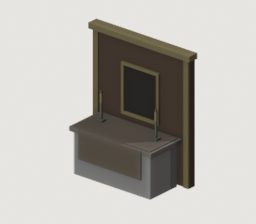

A limewashed block altar under a gilt-framed retable (*retabulo*).

A colonial chapel's altar is masonry, not furniture: a whitewashed block
with a stone slab (the *mensa*) overhanging it, a linen frontal hanging
over the face that meets the congregation, and behind it a dark timber
retable whose only gold is its frame. The centre of the retable is a deep
recess with nothing in it -- what a place keeps there is the map's
business, not the furnishing's.

`at` is the footprint centre of the block; the retable stands behind it.
The frontal faces -X; `turn=90` faces it -Y, down a hall seen side-on.

`altar(room, name, at, *, length=1.9, depth=0.8, height=1.0, retable_height=2.7, turn=0.0)`

Floor at=(x,y), or use room.surface(z) for a support. +X is room depth, -Y is screen right; inspect the measured bounds.

Measured bounds: `[[-0.48, -1.26, -0.0], [0.64, 1.26, 2.82]]` metres. Built meshes: 1; lights: 0.

Materials: `aged_cloth`, `charcoal`, `dark_wood`, `oxidized_bronze`, `ritual_gold`, `rough_limestone`, `sr_lamp_glow`, `wax`, `whitewash`.

| Parameter | Default / required |
|---|---|
| `at` | `required` |
| `length` | `1.9` |
| `depth` | `0.8` |
| `height` | `1.0` |
| `retable_height` | `2.7` |
| `turn` | `0.0` |

Variation handles: `length`, `depth`, `height`, `retable_height`, `turn`. These are inputs to the same builder; review any changed proportions in context.

## pew

A heavy hardwood bench (*banco*) facing the altar (+X).

Seen from the lane camera a pew shows its BACK, so the back rails and the
end boards are what carry it: a congregation's seats read as a row of
dark horizontals, not as chairs. The back is two rails with daylight
between them and under the seat -- a solid back and full-height ends
rendered as a row of black crates at native size.

It faces +X; `turn=90` faces it +Y, so in a hall seen side-on the pews
stand in rows across the lane and show their end boards. Those ends are
low, with only a slender post carrying the back rail: as a foreground
row in front of the player, full-height end boards were a wall of unlit
slabs that hid everyone to the waist.

`pew(room, name, at, *, length=2.4, depth=0.5, height=0.45, turn=0.0)`

Floor at=(x,y), or use room.surface(z) for a support. +X is room depth, -Y is screen right; inspect the measured bounds.

Measured bounds: `[[-0.265, -1.22, 0.0], [0.25, 1.22, 0.825]]` metres. Built meshes: 1; lights: 0.

Materials: `dark_wood`.

| Parameter | Default / required |
|---|---|
| `at` | `required` |
| `length` | `2.4` |
| `depth` | `0.5` |
| `height` | `0.45` |
| `turn` | `0.0` |

Variation handles: `length`, `depth`, `height`, `turn`. These are inputs to the same builder; review any changed proportions in context.

## votive_stand

An iron votive stand: a tray of candles, most of them burnt out.

Cold wax is the point -- the stubs, the drips on the tray, the few still
burning. `lit` candles get a flame; the rest are stubs of decreasing
height. The flames are emissive and cast nothing, so a map that lights
candles still places a `room.light` beside the stand.

`votive_stand(room, name, at, *, width=0.9, depth=0.34, height=0.95, candles=7, lit=2)`

Floor at=(x,y), or use room.surface(z) for a support. +X is room depth, -Y is screen right; inspect the measured bounds.

Measured bounds: `[[-0.185, -0.465, 0.0], [0.185, 0.465, 1.35]]` metres. Built meshes: 1; lights: 0.

Materials: `sr_lamp_glow`, `wax`, `wrought_iron`.

| Parameter | Default / required |
|---|---|
| `at` | `required` |
| `width` | `0.9` |
| `depth` | `0.34` |
| `height` | `0.95` |
| `candles` | `7` |
| `lit` | `2` |

Variation handles: `width`, `depth`, `height`, `candles`, `lit`. These are inputs to the same builder; review any changed proportions in context.

## font

A holy-water font (*pia*): a stone basin on a short column.

Radial, and placed by the door, where a visitor meets it first.

`font(room, name, at, *, height=0.95, radius=0.27)`

Floor at=(x,y), or use room.surface(z) for a support. +X is room depth, -Y is screen right; inspect the measured bounds.

Measured bounds: `[[-0.27, -0.256785, 0.0], [0.27, 0.256785, 0.95]]` metres. Built meshes: 1; lights: 0.

Materials: `old_limestone`.

| Parameter | Default / required |
|---|---|
| `at` | `required` |
| `height` | `0.95` |
| `radius` | `0.27` |

Variation handles: `height`, `radius`. These are inputs to the same builder; review any changed proportions in context.

## mortar_tub

A wooden tub of lime mortar with a trowel across its rim.

A repair in progress: the sign that somebody is mending the fabric of the
place rather than it simply being old.

`mortar_tub(room, name, at, *, radius=0.24, height=0.3)`

Floor at=(x,y), or use room.surface(z) for a support. +X is room depth, -Y is screen right; inspect the measured bounds.

Measured bounds: `[[-0.2448, -0.232819, 0.0], [0.2448, 0.232819, 0.3475]]` metres. Built meshes: 1; lights: 0.

Materials: `dark_wood`, `whitewash`, `wrought_iron`.

| Parameter | Default / required |
|---|---|
| `at` | `required` |
| `radius` | `0.24` |
| `height` | `0.3` |

Variation handles: `radius`, `height`. These are inputs to the same builder; review any changed proportions in context.
